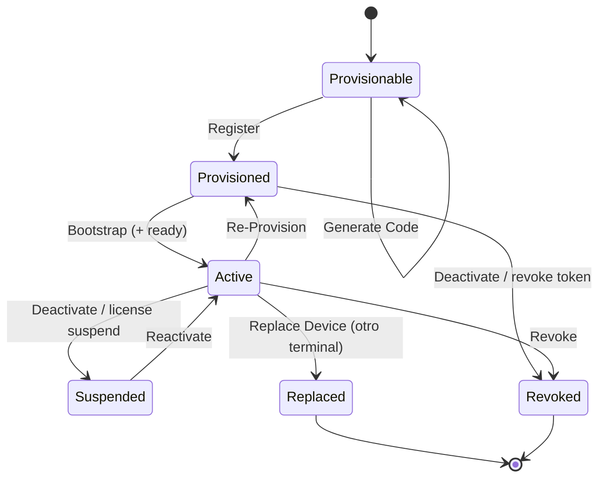

# EPosOne — Device Lifecycle Contract V1

| Campo | Valor |
|-------|--------|
| ID | **EPOSONE-DEVICE-LIFECYCLE-V1** |
| Estado | **Contrato P0** — 6 ago 2026 · sin código |
| ADR | [ADR-027](../ADR-027-EPOSONE-ONBOARDING-UNIFICADO-V1.md) · alinea [ADR-021](../ADR-021-EPOSONE-INSTALLATION-LIFECYCLE.md) |
| Actor | Device = fila `core_pos_terminal` (tablet) ligada a **Caja** (`register_ref`) |
| Implementa | LOCAL (APK) + EN1 (API/estados) |

---

## 1. Principio

El **dispositivo** no consume licencia. La **caja** sí.  
El lifecycle describe el vínculo tablet ↔ caja ↔ EN1, no el trial comercial.

---

## 2. Estados mínimos (oficiales)

| Estado | Significado | Persistencia EN1 hoy (mapa) |
|--------|-------------|-----------------------------|
| **Provisionable** | Caja lista; puede emitirse código; aún sin device activo para esa caja (o código activo pendiente) | Sin terminal activo / código `active` |
| **Provisioned** | `register` OK; token emitido; bootstrap pendiente o en curso | `core_pos_terminal` existe; install incompleto |
| **Active** | Bootstrap aplicado; instalación válida; puede operar (sujeto a licencia caja + turno) | `status=active` + (ideal) `installation_ready` |
| **Suspended** | Vínculo existe pero operación bloqueada (licencia/org/admin) | Terminal `inactive`/`maintenance` y/o license suspended |
| **Replaced** | Esta tablet dejó de ser la activa de la caja; otra la reemplazó | Terminal previo no authoritative; nuevo terminal active |
| **Revoked** | Vínculo invalidado; token no usable | Token rotado/revocado; status no active; código no reutilizable |

Estados APK de ADR-021 (`unprovisioned` → `ready`) son **vista cliente** del mismo ciclo; este contrato es la **vista de producto** estable para Manual y LOCAL.

---

## 3. Eventos oficiales

| Evento | Quién | Efecto |
|--------|-------|--------|
| **Generate Code** | EN1 (portal/BO/`/start`) | Código EN1-02 `active` para `register_ref`; revoca códigos active previos de esa caja |
| **Register** | APK → `POST /api/v1/devices/register` | Crea/reusa terminal; emite Device Bearer; código → `used`; → **Provisioned** |
| **Bootstrap** | APK → `GET /api/v1/devices/bootstrap` (+ config/license) | Descarga config operativa; hacia **Active** tras ready |
| **Restore** | APK (camino D) | Login EN1 → elegir org/POS-caja → bootstrap (sin repetir alta comercial) |
| **Re-Provision** | Mismo `device_uuid` + **nuevo** código | Rota token; re-bootstrap; típico reinstalación misma tablet |
| **Replace Device** | Nueva tablet + Generate Code + Register | Terminal anterior → **Replaced**; nuevo → Provisioned→Active |
| **Disconnect** | Admin/APK | Deja de usar token; puede quedar Suspended/Replaced según política |
| **Deactivate** | Admin EN1 | Terminal no `active`; tokens inválidos → vía a **Revoked** o **Suspended** |

---

## 4. Diagrama de estados

---

## 5. Reglas

1. Generate Code **no** crea licencia ni cambia modalidad.  
2. Register **puede** disparar trial de **caja** (política `on_first_provision`) — independiente del trial de suscripción.  
3. Replace Device exige nuevo código (single-use); no reutilizar código `used`.  
4. Restore no inventa organización: requiere cuenta EN1 autorizada.  
5. Un device **Revoked** no opera hasta nuevo Register autorizado.

---

## 6. Relación con instalación APK (ADR-021)

| ADR-021 (APK UX) | Este lifecycle |
|------------------|----------------|
| `unprovisioned` | Provisionable (vista local) |
| `registered` | Provisioned |
| `bootstrapping` | Provisioned → Active (en curso) |
| `ready` | Active |
| `blocked` / `failed` | Suspended / error de Bootstrap |

---

*P0 — contrato. Persistencia exacta de enum `Replaced`/`Revoked` en DB puede mapearse en P1 sin cambiar nombres de producto.*
