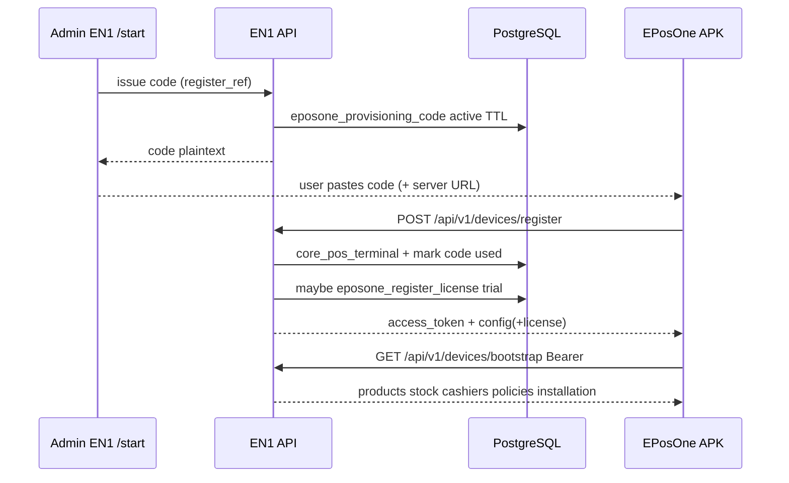
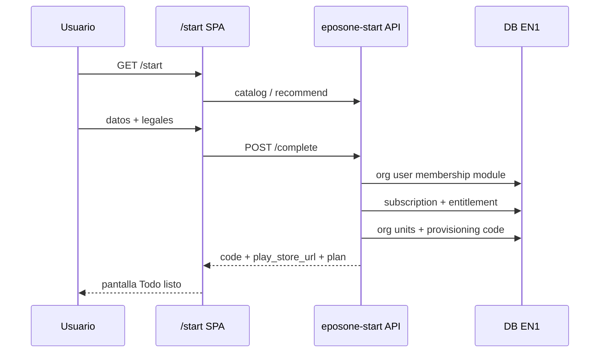
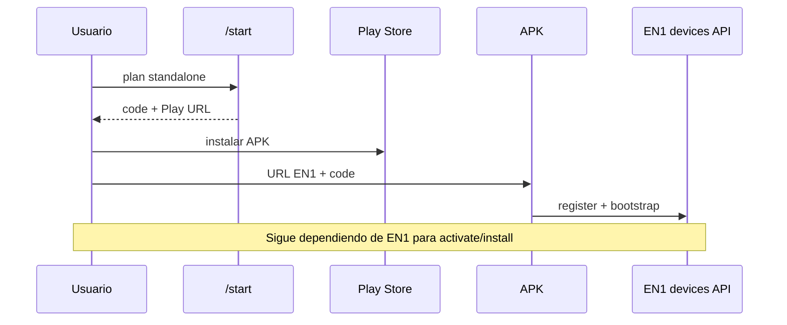
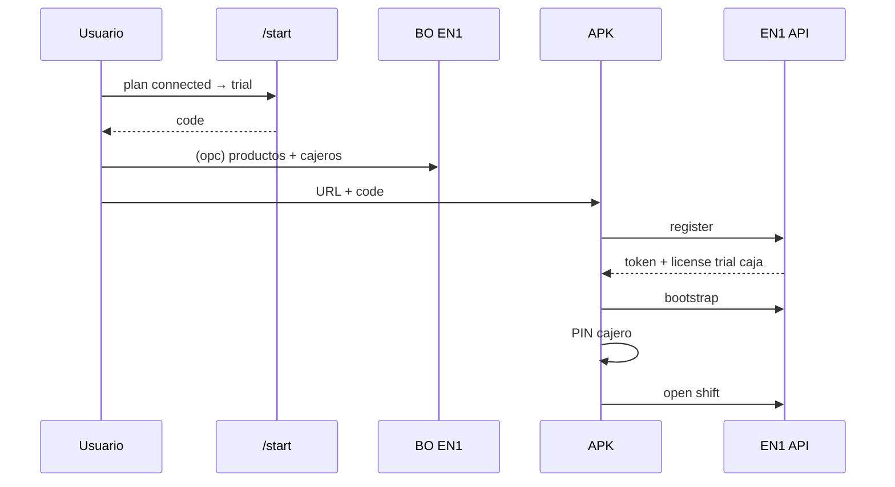
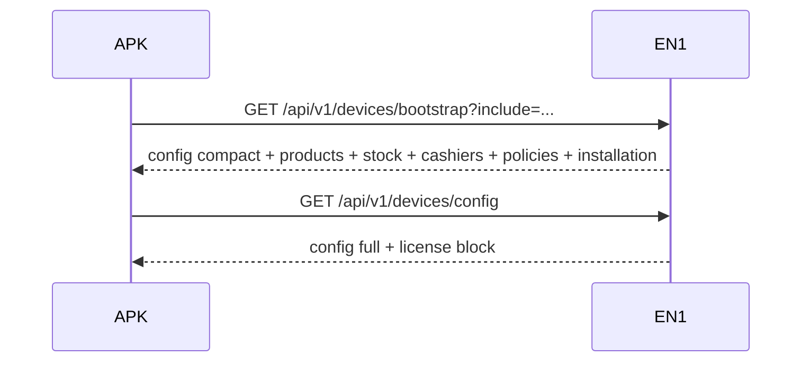
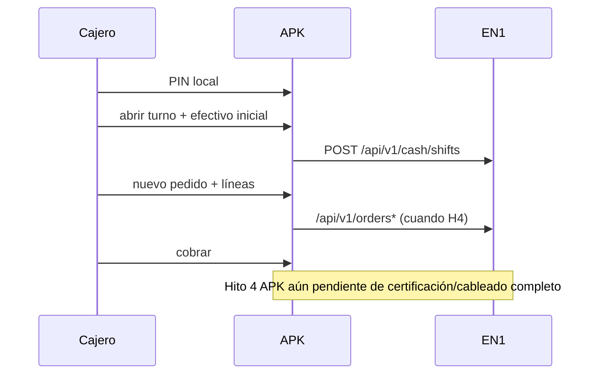

# EP1 / EN1 — Reconstrucción as-is: instalación y activación

| Campo | Valor |
|-------|--------|
| ID | **EP1-AS-IS-INSTALL-V1** |
| Audiencia | Ana · Manual Oficial de Instalación · rediseño asistente inicial |
| Estado | **Solo documentación** — sin cambios de código ni arquitectura |
| Fecha | 6 ago 2026 |
| Fuente | Implementación Dev EN1 (`/opt/easynodeone/dev/app`) + contratos vigentes |
| Alcance | EP1 (EPosOne APK, repo LOCAL) + EN1 (backend / `/start` / APIs) |

**Regla de este documento:** describe lo que **existe hoy**. No propone rediseño normativo salvo la sección 10 (UX, opiniones de reutilización, sin código).

**Nota de nomenclatura**

| Nombre | Significado en este doc |
|--------|-------------------------|
| **EN1** | Easy NodeOne — backend, BO, `/start`, APIs Device Bearer |
| **EP1 / EPosOne** | App tablet (APK); código Android **no** vive en este repo |
| **Standalone / Local** | Modalidad comercial / modo operación local |
| **Connected / Platform** | Modalidad conectada a EN1 |

---

## 1. Flujo comercial actual (EN1) — desde `/start`

### 1.1 Dónde corre

- Solo en el **host de producto EPosOne** (`product.code == 'eposone'`, p. ej. `eposone.easytech.services`). En otros hosts → **404**.
- Blueprint: `eposone_start` · templates/JS: `templates/eposone_start/`, `static/eposone_start/start.js`.

### 1.2 Pantallas web (SPA local; un solo mutate)

| # | Etiqueta | Qué hace el usuario | I/O servidor |
|---|----------|---------------------|--------------|
| 1 | Tu negocio | Bienvenida | Ninguno |
| 2 | Tu negocio | Tipo de negocio (chips) | Solo estado cliente |
| 3 | Tu recomendación | Plan recomendado | `GET /api/public/eposone-start/recommend?business_type=` |
| 4 | Tu recomendación | Otros planes | Catálogo ya cargado |
| 5 | Tu acceso | Nombre, email, password | Validación cliente |
| 6 | Tu acceso | Nombre del negocio, país (def. Panamá) | Validación cliente |
| 7 | Tu acceso | Resumen + legales | **`POST /api/public/eposone-start/complete`** |
| 8 | Todo listo | Código + CTA Play | Payload de `complete` |
| 9 | Todo listo | Guía de instalación | Mismo payload |

`?source=` (atribución ADR-024) **no** se lee en `start.js` hoy.

### 1.3 Qué ocurre en `complete_start` (orden real)

Código: `backend/nodeone/modules/eposone_start/service.py` → `complete_start`.

| Paso | Qué se crea / hace | Persistencia | Qué queda pendiente |
|------|--------------------|--------------|---------------------|
| **Cuenta** | `user` (admin org, `email_verified=False`) + hash password + `login_user` | `user` | Verificación de email / welcome mail |
| **Organización** | `saas_organization` (subdomain slug, invite_only, TZ Panama) | `saas_organization` | Onboarding fiscal rico |
| **Membresía** | Owner en org | `user_organization` | — |
| **Producto** | Implícito `eposone` (no hay selector multi-producto) | `saas_org_module` enabled | Chooser multi-producto |
| **Plan** | `plan_code` del catálogo comercial | En entitlement + metadata suscripción | Pago real / cambio de plan post-alta |
| **Trial** | Si `trial_days > 0` → `SubscriptionRegistry.create_trial` | `ets_product_subscription.status=trial` | Jobs grace, emails fin trial, TRIAL→ACTIVE por pago |
| **Pago** | **No existe** en este embudo | — | Pasarela, webhooks, checkout |
| **Suscripción** | Trial (connected) o `activate` sin cobro (standalone) | `ets_product_subscription` | Ciclo de facturación real |
| **Entitlement** | Cupos/features del plan | `ets_product_entitlement` | Enforcement completo en todos los gates |
| **Licencia de caja** | **No** se crea en `/start` | — | Se crea al **primer vínculo de tablet** (`eposone_register_license`) |
| **Unidades** | Branch → POS → Register por defecto | `core_org_unit` | Personalización de jerarquía |
| **Código install** | EN1-02 `issue_code_for_register` (TTL ~30 min) | `eposone_provisioning_code` | Recuperación de código tras salir de la página |
| **Descarga APK** | Solo URL Play (`NODEONE_EPOSONE_PLAY_STORE_URL` o búsqueda) | — | Play listing / AAB / `GO Local`; **EN1 no sirve APK** |

**Connected tras `complete`:** cuenta + org + módulo + suscripción trial + entitlement + unidades + código + sesión web. Listo para BO y (cuando haya APK) provisioning. **No pagó.**

**Standalone tras `complete`:** igual, pero suscripción `active` de inmediato (`trial_days=0`) **sin pasarela**.

---

## 2. Modalidades existentes

### 2.1 ¿Ya existe el concepto?

**Sí**, como metadato del **catálogo comercial** y copy del asistente `/start`.  
**No** como columna `modality` en org / suscripción / device / license.

### 2.2 Dónde se almacena / cómo se identifica

Fuente: `backend/nodeone/core/platform/commercial_plans.py`.

| `plan_code` | `modality` (catalog) | `trial_days` | Notas |
|-------------|----------------------|--------------|-------|
| `standalone` | `local` | 0 | Features: sin `web_admin` / sin `cloud_backup`; límites 1/1/1 |
| `starter` | `connected` | 15 | Conectado |
| `business` | `connected` | 15 | Multi POS, etc. |
| `enterprise` | `connected` | 15 | Multi branch, etc. |

Tras el alta:

| Store | Campo útil | Contiene modality? |
|-------|------------|--------------------|
| `ets_product_entitlement` | `plan_code`, `features_json` | **No** key `modality`; se infiere por `plan_code` |
| `ets_product_subscription` | `status`, `metadata_json.plan_code` | No columna modality |
| `eposone_register_license` | `plan_code` tipicamente `trial` / `eposone` | **No** alinea con `standalone`/`business` |

Identificación práctica hoy:

1. Primaria: `entitlement.plan_code == 'standalone'` ⇒ local; resto connected.  
2. Derivada: `get_commercial_plan(plan_code)['modality']`.

**Tensión doc↔código:** ADR-023 dice que Standalone es modalidad de despliegue, no un plan distinto; el código **sí** expone `standalone` como `plan_code` seleccionable.

### 2.3 ¿Cómo sabe la APK qué modalidad usar?

**Hoy: no recibe un flag `modality`.**

El payload de licencia de dispositivo (`RegisterLicenseService` → `/config`) expone tipo/status/features de **License Engine** (`sales`, `payments`, …), no `web_admin`/`cloud_backup` ni modality comercial.

En dominio First Start (doc + `first_start.py`): caminos `create_business` → `operating_mode=local` vs `connect_en1` → `operating_mode=platform`. Eso es **otro eje** (modo operación APK) y la **UI APK está pendiente** en este repo.

---

## 3. Provisioning actual

### 3.1 Proceso

```text
Jerarquía BO: Org → Branch → POS → Caja (register_ref)
        ↓
Admin emite código EN1-02 (o /start lo emite al completar)
        ↓
APK: URL servidor + código (+ device_uuid)
        ↓
POST /api/v1/devices/register  → token Device Bearer (una vez en claro)
        ↓
Código → used
        ↓
GET /api/v1/devices/config (+ license)
GET /api/v1/devices/bootstrap (catálogo, stock, cashiers, policies, installation)
        ↓
(opcional) POST /api/v1/devices/installation/ready
```

### 3.2 Detalle

| Aspecto | Estado actual |
|---------|---------------|
| **Cómo se genera** | `secrets.token_urlsafe(12)`; único global |
| **Quién** | (a) Admin BO: `POST /admin/eposone/devices/issue-provisioning-code` · (b) `/start` vía `_issue_install_code` |
| **TTL** | `eposone_settings.provisioning_code_ttl_minutes` (**default 30**) |
| **Un solo uso** | Sí (EN1-02): al register exitoso → `used` |
| **Revocación** | Re-emitir código de la misma caja → anteriores `active` → `revoked`. No hay DELETE revoke dedicado |
| **Registro dispositivo** | `core_pos_terminal` (`terminal_ref` = `device_uuid`, `register_ref`, status `active`) |
| **Bootstrap** | Productos (≤500), stock, cashiers (+ versiones), policies, config compacta, bloque `installation` |
| **Config** | Org/branch/pos/register + **license** (en `/config` y respuesta de register; **no** en config compacta de bootstrap) |
| **Estados código** | `active` \| `used` \| `revoked` \| `expired` |
| **Estados device** | `active` \| `inactive` \| `maintenance` (+ campos observational install) |

**Legacy EN1-01:** código org en `eposone_settings.provisioning_code` (reutilizable). Documentado como no usar en wizard de producto.

### 3.3 Diagrama provisioning



---

## 4. Pantalla Start (asistente web)

### 4.1 Qué hace hoy

Asistente comercial **ADR-024**: recomienda modalidad/plan, crea acceso y negocio, acepta legales, entrega **código de instalación** + enlace Play.  
**No** configura productos, impresoras, cajeros, impuestos, KDS, etc. (explícito en ADR).

### 4.2 Datos que solicita

- Tipo de negocio  
- Plan (recomendado u otro)  
- Nombre persona, email, password (≥8)  
- Nombre del negocio, país  
- Checkboxes: terms, privacy, eula  

### 4.3 Endpoints

| Método | Ruta | Rol |
|--------|------|-----|
| `GET` | `/start` | SPA |
| `GET` | `/api/public/eposone-start/catalog` | Planes |
| `GET`/`POST` | `/api/public/eposone-start/recommend` | Recomendación |
| `POST` | `/api/public/eposone-start/complete` | Alta atómica |

### 4.4 Decisiones que toma

- Plan recomendado por `business_type`  
- Trial vs active según `trial_days` del plan  
- Emisión de jerarquía default + código EN1-02  
- Login de sesión web al completar  

### 4.5 Qué entrega (a humano / indirectamente a APK)

- Código de provisioning (texto; TTL corto)  
- `play_store_url`  
- Resumen plan / trial  
- **No** entrega APK binaria ni Device Token (eso lo obtiene la tablet en `register`)

---

## 5. APK — flujo desde primera ejecución

**El código Compose/Kotlin no está en este repo.** Estado según docs EN1 + handoff Android Etapa 2.

| Pantalla / paso (concepto) | Estado EN1 docs | Estado APK (según Etapa 2 / First Start) |
|----------------------------|-----------------|------------------------------------------|
| Bienvenida / First Start | Dominio EN1 ✅ | **Pendiente** UI Sprint A |
| Crear negocio (Local) | Spec First Start | **Pendiente** UI |
| Connect EN1 / Conectar EasyNodeOne | Spec First Start | **Pendiente** UI (no hay clase `ConnectEn1Screen` en repo EN1) |
| URL servidor | Contrato Hito 1 | **Implementada** en flujo provisioning (congelado H1) |
| Código provisioning | Hito 1 ✅ EN1 | **Implementada** (H1 congelado en APK) |
| Registro device | `POST …/register` ✅ | **Implementada** (H1) |
| Bootstrap | `GET …/bootstrap` ✅ EN1 | **Implementada** (H2 congelado); E2E certificación 🟡 |
| Installation ready ACK | EN1 parcial (flag off) | **Parcial** / gate C2 pendiente |
| Login cajero (PIN local) | Contrato H2.5 ✅ EN1 | **Pendiente** Hito 4 / consumo APK |
| Apertura turno | HTTP cash ✅ EN1 | **Pendiente** cableado P2 (contrato congelado) |
| Venta / cobro | Order Domain ✅ EN1 | **Pendiente** Hito 4 |

Secuencia integrada **objetivo** (docs + APIs):

```text
First Start → (Local | Connect EN1)
  → URL + código
  → register → token
  → bootstrap (+ license vía config)
  → (ready ACK)
  → PIN cajero local
  → open shift
  → vender
```

---

## 6. Contratos / endpoints existentes

### 6.1 Comercial `/start` — terminados EN1

| Endpoint | Estado |
|----------|--------|
| `GET /start` | ✅ |
| `GET /api/public/eposone-start/catalog` | ✅ |
| `GET|POST /api/public/eposone-start/recommend` | ✅ |
| `POST /api/public/eposone-start/complete` | ✅ |
| Pago / checkout | ❌ No existe |
| Descarga APK desde EN1 | ❌ No existe |

### 6.2 Device Bearer — terminados EN1 (consumo APK variable)

| Endpoint | Estado EN1 | Notas APK |
|----------|------------|-----------|
| `POST /api/v1/devices/register` | ✅ Frozen H1 | ✅ H1 |
| `GET /api/v1/devices/config` | ✅ (+ license) | Usar para licencia |
| `GET /api/v1/devices/bootstrap` | ✅ H2+H2.5+policies | ✅ H2; cert E2E 🟡 |
| `POST /api/v1/devices/installation/ready` | 🟡 Parcial | Gate APK pendiente |
| Login HTTP cajero | ❌ (no hay) | PIN **local** |
| `GET/POST /api/v1/cash/shifts*` | ✅ Frozen | ⏸ Cable APK |
| `POST …/shifts/<id>/close` | ✅ | ⏸ Cable APK |
| `/api/v1/orders*` | ✅ H3 EN1 | ⏸ Hito 4 APK |

### 6.3 Admin BO (sesión) — terminados para operación

| Endpoint | Rol |
|----------|-----|
| `POST /admin/eposone/devices/issue-provisioning-code` | Emitir código |
| `POST /admin/eposone/devices/rotate-provisioning-code` | Legacy org code |
| `POST /admin/eposone/registers/<ref>/license` | Activar/extender/cortesía/… |
| CRUD cajeros `/admin/eposone/cashiers/*` | PIN hash PBKDF2 |
| Turnos BO open/reconcile/close | Excepción / lab |

### 6.4 Legacy

| Superficie | Nota |
|------------|------|
| `/api/eposone/*` (session) | No es el camino tablet Device Bearer |
| `GET /api/eposone/license-policy` | Stub ADR-005, enforcement disabled |

---

## 7. Standalone — con lo que ya existe

### Cómo debería operar hoy (sin inventar arquitectura)

1. Usuario completa `/start` eligiendo plan **`standalone`**.  
2. EN1 crea org + user + suscripción **`active`** (sin cobro) + entitlement `plan_code=standalone` + unidades + **código EN1-02**.  
3. Usuario instala APK desde Play (enlace) e ingresa **URL del servidor EN1** + código.  
4. `register` + `bootstrap` + licencia de **caja** (trial auto al primer vínculo, política `on_first_provision`).  
5. Admin crea cajero+PIN en BO (o flujo local First Start si estuviera UI).  
6. Cajero PIN → turno → venta (cuando APK cablee H4).

### Respuestas directas

| Pregunta | Respuesta as-is |
|----------|-----------------|
| ¿Cómo obtiene licencia? | (a) Entitlement/suscripción org en `/start`; (b) licencia **por caja** al provisionar device |
| ¿Cómo activa la APK? | Provisioning EN1-02 contra un servidor EN1 (hoy el “standalone” del catálogo **sigue hablando con EN1** para install code) |
| ¿Cómo se registra la suscripción? | `ets_product_subscription` activa sin pasarela |
| ¿Qué depende de EN1? | Alta comercial, código, register, bootstrap, license row, cajeros BO, sync |
| ¿Qué funciona completamente local? | Spec First Start `create_business` (modo local sin EN1) — **UI APK pendiente**; el plan `standalone` del embudo web **no** es aún un APK 100 % offline sin EN1 |

**Limitación clave:** “Standalone” comercial en `/start` ≠ “modo Local” First Start sin EN1. Son dos conceptos solapados a alinear en el Manual Oficial, sin cambiar código en esta etapa.

---

## 8. Connected — flujo completo hasta vender

```text
1. Entrar a host EPosOne → /start
2. Elegir tipo negocio + plan connected (starter/business/enterprise)
3. complete → org + user + trial subscription + entitlement + código
4. (Opcional) Entrar BO EN1: productos, cajeros PIN, más cajas/códigos
5. Instalar APK (Play) → URL EN1 + código
6. POST register → device token; trial licencia caja si aplica
7. GET bootstrap (catálogo, stock, cashiers, policies)
8. (Ideal) POST installation/ready
9. Login PIN cajero (local)
10. POST /api/v1/cash/shifts (abrir turno)
11. Operar pedidos/cobro vía /api/v1/orders* (cuando APK H4)
```

Hasta el paso 7–8 el camino EN1 está mayormente listo. Pasos 9–11 dependen del cableado APK (Hito 4 ⏸).

---

## 9. Licenciamiento — modelo vigente

| Concepto | Dónde vive | Notas |
|----------|------------|-------|
| **Organización** | `saas_organization` | Tenant |
| **Suscripción** | `ets_product_subscription` + `SubscriptionRegistry` | Producto `eposone`; trial/active/… |
| **Plan (comercial)** | `commercial_plans.py` → snapshot en `ets_product_entitlement.plan_code` | Cupos/features comerciales |
| **Plan (policy ADR-005)** | `core/license/policy.py` | Hoy **siempre allow / unlimited** |
| **Licencia (unidad cobrable)** | `eposone_register_license` | **1 por (org, register_ref = Caja)** |
| **Caja** | `core_org_unit` type register | Consume licencia |
| **Tablet / dispositivo** | `core_pos_terminal` | **No** consume licencia adicional; reemplazable |
| **Trial (suscripción)** | Registry al `/start` si `trial_days>0` | 15 días connected |
| **Trial (caja)** | License Engine: 15 días al primer provision | Independiente del trial de suscripción |
| **Grace** | `grace_until` en license; ADR-007 offline | Trial grace 0; paid ~7 días settings |
| **Renovación** | `RegisterLicenseService.extend` / `activate` (BO) | No hay billing automático en `/start` |

**Regla de producto:** vender / operar por **caja activa**, no por usuario ni por tablet.  
Provisioning ≠ licencia.

---

## 10. UX (sin código) — con el estado actual

### Flujo más simple para el usuario hoy

**Embudo `/start` (web) → pegar código en APK → PIN → abrir turno → vender.**  
Es el camino con más piezas EN1 ya construidas. Evita pedirle al usuario armar Org/Branch/POS/Caja a mano.

### Qué se puede eliminar / no pedir al usuario final

- Elegir Branch/POS/Caja en la APK (ya embebido en el código EN1-02) — **ya eliminado del wizard H1**.  
- Pago en el primer minuto (hoy no existe; no bloquear demo/trial).  
- Configurar productos/cajeros **dentro** de `/start` (ADR-024 lo prohíbe a propósito).

### Qué automatizar

- Re-emisión / recuperación del código si expiró (TTL 30 min es fricción real).  
- Alineación `entitlement.plan_code` ↔ `eposone_register_license.plan_code` / modality hacia la APK.  
- Verificación de email post-alta.  
- CTA Play solo cuando exista listing (`GO Local`).

### Qué ya está implementado y se puede reutilizar

- SPA `/start` + `complete_start`  
- Catálogo comercial + recommend  
- EN1-02 issue/register/bootstrap/config  
- License Engine por caja + trial auto  
- Cashier credentials + bootstrap cashiers  
- Cash shift HTTP v1  
- Order Domain HTTP (para cuando APK cobre)  
- Manual cajero usuario: `docs/MANUAL_CAJERO_EPOSONE_USUARIO.md`

---

## 11. Diagramas de secuencia

### 11.1 Registro comercial (`/start`)



### 11.2 Instalación Standalone (as-is comercial)



### 11.3 Instalación Connected



### 11.4 Provisioning

(Ver §3.3.)

### 11.5 Bootstrap



### 11.6 Primera venta (objetivo integrado)



---

## 12. Restricciones a respetar

1. **Una sola APK / un solo dominio** — no forks Standalone vs Connected como productos distintos (ADR-001…003, ADR-006).  
2. **Operación vs administración** — cajero no es mini-ERP; EN1 es fuente oficial de inventario (ADR-006).  
3. **Licencia = Caja**, no tablet ni usuario.  
4. **Provisioning ≠ licencia**; códigos comerciales ≠ códigos de device.  
5. **PIN nunca en claro** desde EN1; login cajero es **local** (Hito 2.5).  
6. **Tablet no elige caja** en H1: el código ya trae destino.  
7. **EN1 no aloja APK**; Play / `GO Local` fuera de CODITO/EN1.  
8. **Sin pasarela en `/start`**; no asumir pago como paso implementado.  
9. **Trial 15 días** en License Engine (docs viejos con 45 están stale).  
10. **License en `/config`**, no en bootstrap compacto (gap contrato↔código).  
11. **Enforcement installation ready** detrás de env (default off).  
12. **ADR-005 policy** hoy no bloquea cupos reales.  
13. **Relatic / otros silos** no mezclar en este flujo; Dev EN1 es la referencia de código.  
14. **First Start Local** (sin EN1) y **plan standalone** (con EN1) no están unificados — Manual Oficial debe nombrarlos por separado hasta decisión explícita.  
15. No introducir segunda norma (EIS vs “otro SDK”) en rediseño del asistente: contratos de integración EasyAI son EIS; este doc es instalación POS.

---

## Índice de código y contratos

| Área | Ruta |
|------|------|
| Start | `backend/nodeone/modules/eposone_start/` |
| Planes | `backend/nodeone/core/platform/commercial_plans.py` |
| Subscription / Entitlement | `subscription_registry.py`, `entitlement_service.py` |
| Provisioning | `modules/eposone/device_provisioning.py` |
| Devices API | `modules/eposone/devices_v1_routes.py` |
| License | `modules/eposone/register_license_service.py` |
| Cash | `modules/eposone/cash_shifts_v1_routes.py` |
| ADR Start / Trial / Install | `ADR-024`, `ADR-023`, `ADR-021` |
| Hitos | H1 provisioning · H2 bootstrap · H2.5 cashier · H3 orders · Cash shift HTTP |
| Android | `EN1_PLATFORM_EPOSONE_V4_ANDROID_ETAPA2.md`, `…_FIRST_START.md` |
| Manual cajero | `MANUAL_CAJERO_EPOSONE_USUARIO.md` |

---

## Criterio de uso

Este documento es la **base factual** para:

1. Manual Oficial de Instalación (usuario).  
2. Rediseño del asistente inicial.  

Cualquier cambio de flujo o contratos requiere **GO** explícito y chat/tarea aparte. Aquí **no** se implementó nada.
