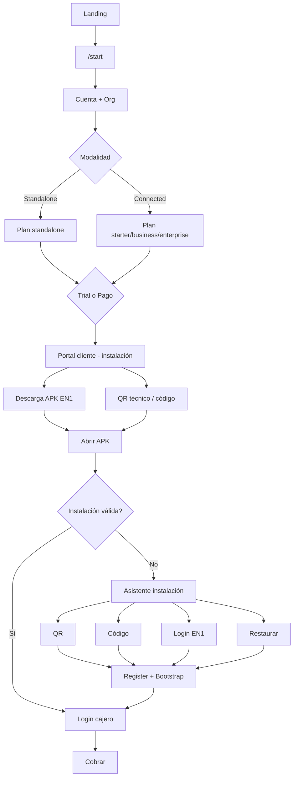
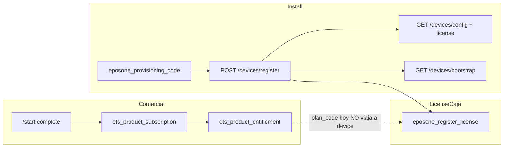

# EPosOne — Plan Maestro Onboarding e Instalación V1 · Respuesta CODITO

| Campo | Valor |
|-------|--------|
| Entrada | Plan Maestro Ana — **Propuesta funcional (sin implementación)** |
| Emisor | **CODITO** (contratos / EN1) |
| Pareja | **LOCAL** responde estado APK / pantallas / UX (fuera de este repo) |
| Estado | Entregable documental — **sin cambios de código** |
| Fecha | 6 ago 2026 |
| As-is base | [`EPOSONE_EP1_INSTALLATION_ACTIVATION_AS_IS_V1.md`](EPOSONE_EP1_INSTALLATION_ACTIVATION_AS_IS_V1.md) |
| Manual cajero (ya) | [`MANUAL_CAJERO_EPOSONE_USUARIO.md`](MANUAL_CAJERO_EPOSONE_USUARIO.md) |

**Alcance CODITO:** estado actual EN1, diagramas técnicos, contratos, gaps, recomendaciones y respuestas a las preguntas EN1 del Plan Maestro.  
**No incluye:** implementación, ni inventario Compose de LOCAL.

---

## 1. Alineación con principios del Plan Maestro

| Principio Ana | ¿Compatible con arquitectura actual? | Notas CODITO |
|---------------|--------------------------------------|--------------|
| EN1 único punto de entrada comercial | ✅ Ya (host EPosOne + `/start`) | Mantener |
| Toda instalación comienza desde EN1 | 🟡 Casi | Hoy: alta en EN1; install device vía código. First Start “Local sin EN1” es **otro eje** a deprecar o reclasificar si se adopta el Plan |
| APK oficial siempre desde EN1 | ❌ Hoy | Hoy CTA → **Google Play** / URL env. Plan pide distribución EN1 (AAB/APK hosted) — **gap de producto + ops**, no solo docs |
| Todo cliente registrado en EN1 | ✅ Embudo `/start` | Standalone comercial ya crea org+subscription |
| Standalone ≠ “sin EN1”; = sin sync operativa | ✅ Como **intención** ADR/Plan | Código: `modality=local` + features sin `web_admin`/`cloud_backup`; APK **aún no recibe** ese flag |
| Una sola APK | ✅ | Sin cambio |
| Menor fricción hasta “estoy cobrando” | 🟡 | Motor listo; falta portal instalación + onboarding APK + H4 cobro |

**Veredicto:** el Plan Maestro es la forma correcta de **nombrar y unificar** lo ya construido. No exige reescritura de Device Bearer / License Engine / `/start`; exige **cerrar gaps de exposición (modality), portal, QR técnico, descarga APK y cableado APK**.

---

## 2. Estado actual (as-is) — puntero

Detalle completo: [`EPOSONE_EP1_INSTALLATION_ACTIVATION_AS_IS_V1.md`](EPOSONE_EP1_INSTALLATION_ACTIVATION_AS_IS_V1.md).

Resumen ejecutivo:

```text
Landing / host EPosOne
  → /start (cuenta + org + plan + trial|active + entitlement + código EN1-02)
  → Play URL (no APK en EN1)
  → APK: URL + código → register → config(+license) → bootstrap
  → (pendiente APK) PIN cajero → turno → venta
```

No existe aún el **Portal de instalación** post-`/start` como panel único (hay BO EPosOne disperso: cajas, códigos, licencias).

---

## 3. Diagrama técnico objetivo (Plan) vs existente

### 3.1 Flujo oficial propuesto (Ana) — vista CODITO



### 3.2 Qué ya existe en EN1 (capa inferior reutilizable)



---

## 4. Contratos involucrados (EN1)

| Contrato / superficie | Rol en el Plan | Estado |
|----------------------|----------------|--------|
| ADR-024 Start Assistant | Entrada comercial `/start` | ✅ Implementado (sin pago, sin APK hosted) |
| ADR-023 Trial / Grace | Trial 15 · Grace 7 | ✅ Política; billing 🟡 |
| ADR-021 Installation Lifecycle | Estados install / ready | 🟡 EN1 parcial · APK gate pendiente |
| ADR-006 Op vs Admin | Operación APK vs admin EN1 | ✅ |
| Hito 1 Provisioning EN1-02 | Código → register | ✅ Frozen |
| Hito 2 Bootstrap | Sync down | ✅ Frozen |
| Hito 2.5 Cashier | PIN local + bootstrap cashiers | ✅ EN1 · ⏸ APK |
| Cash Shift HTTP v1 | Abrir/cerrar turno | ✅ EN1 · ⏸ APK |
| Order Domain / H3 HTTP | Venta/cobro | ✅ EN1 · ⏸ H4 APK |
| License Engine V1 | Licencia por caja | ✅ |
| First Start V4 | Local vs Connect EN1 en APK | 🟡 Dominio EN1 · UI APK pendiente — **tensionar** con “todo empieza en EN1” |
| ADR-005 License Policy | Cupos org | Stub allow-all |
| EIS (EasyAI) | Fuera de alcance onboarding POS | No mezclar |

**No existe hoy** un contrato HTTP llamado “onboarding” ni “installation token” QR. El candidato natural a extender es **EN1-02 + `/config` + entitlement**, no un segundo registro de devices.

---

## 5. Respuestas — preguntas EN1 (CODITO)

### ¿Dónde se almacena oficialmente la modalidad?

**Hoy (de facto):**

1. Catálogo: `commercial_plans[plan_code].modality` ∈ `{local, connected}`.  
2. Persistencia post-alta: **`ets_product_entitlement.plan_code`** (`standalone` ⇒ local; resto connected).  
3. **No** hay columna `modality` en org, subscription, device ni `eposone_register_license`.

**Recomendación oficial (sin implementar aún):** declarar como SoT  
`entitlement.plan_code` → `get_commercial_plan().modality`, y **exponer** un campo derivado `operating_modality: standalone|connected` (o `local|platform`) en config/bootstrap. Opcional: persistir `modality` denormalizado en entitlement para no depender del catálogo en runtime.

### ¿Quién la expone?

Hoy: **casi nadie hacia la APK**.  
Quién debería: **EN1 Device API** (`/config` y/o bootstrap) + **Portal cliente** (lectura entitlement).  
`/start` ya la muestra en UI comercial (`modality_label`).

### ¿Qué endpoint devuelve Standalone / Connected?

| Endpoint | ¿Devuelve modality hoy? |
|----------|-------------------------|
| `GET /api/public/eposone-start/catalog` | ✅ `modality` / labels en planes |
| `POST /api/public/eposone-start/complete` | 🟡 plan view incluye modality; no es API de device |
| `GET /api/v1/devices/config` | ❌ no modality comercial |
| `GET /api/v1/devices/bootstrap` | ❌ |
| Entitlement APIs internas | `plan_code` sí; modality derivable en servidor |

**Gap:** falta un campo estable en la superficie Device Bearer.

### ¿Puede la APK conocer automáticamente la modalidad?

**Hoy: no de forma fiable.**  
Tras cerrar el gap de exposición en `/config` (o bootstrap): **sí**, en el mismo momento del register/bootstrap, sin pantalla extra.

### ¿Qué información debería devolver el bootstrap? (recomendación)

Mantener lo actual (config compacta, products, stock, cashiers, policies, installation) y **añadir** (o mover desde `/config`):

| Campo | Motivo |
|-------|--------|
| `operating_modality` / `modality` | Standalone vs Connected |
| `plan_code` comercial | Alineado a entitlement (no solo `trial` de caja) |
| `license` (bloque License Engine) | Hoy está en `/config`; el contrato License Engine prefería bootstrap — unificar en un solo canal documentado |
| `subscription_status` | trial/active/past_due (opcional, portal también) |
| `sync_policy` | Qué sincroniza Connected vs qué no en Standalone |

### ¿Debe existir un endpoint específico de onboarding?

**Recomendación CODITO: no crear un segundo stack.**

| Necesidad Plan | Reutilizar |
|----------------|------------|
| Alta comercial | `/start` + `complete` (ya) |
| Panel post-alta | **Portal / sección BO** (UI nueva sobre datos existentes) |
| Install device | `register` + `config` + `bootstrap` |
| Login EN1 desde APK | **Nuevo contrato acotado** (OAuth/session o device-link token) que **termine** emitiendo o consumiendo código EN1-02 / register — no bypass del modelo de caja |
| QR técnico | Payload que alimente el mismo `register` (URL + code o installation token de un solo uso = código) |
| Restaurar | Reprovision same `device_uuid` (ya existe) + reissue code; documentar como Camino 4 |

Un `POST /api/v1/onboarding/*` solo tendría sentido como **fachada** que orqueste lo anterior, no como dominio nuevo.

---

## 6. Matriz de gaps (Plan Maestro ↔ realidad)

| Entrega Plan | Estado | Gap |
|--------------|--------|-----|
| Flujo comercial Landing→/start→modalidad→plan→trial/pago→portal | 🟡 | Modalidad/plan en `/start` ✅; **pago** ❌; **portal instalación** ❌ (BO parcial) |
| Portal: APK, suscripción, licencia, modalidad, devices, cajas, código, QR, regenerar, historial | 🟡/❌ | Cajas/código/licencia en BO registers; **no** panel unificado ni historial install ni QR técnico estándar |
| APK solo desde EN1 | ❌ | Solo Play URL |
| Gate APK “¿instalación válida?” → cajero | 🟡 | Spec ADR-021; APK/LOCAL |
| Asistente APK: QR / código / login EN1 / restaurar | 🟡 | Código ✅ EN1; resto LOCAL + contratos menores |
| Camino QR técnico auto-install | ❌ | ADR-024 QR comercial≠técnico install |
| Camino Login EN1 en APK | ❌ | First Start connect spec; sin HTTP login device |
| Camino restaurar | 🟡 | Reprovision + new code parcialmente; UX/docs faltan |
| Standalone sin sync diaria | 🟡 | Features comerciales; **APK no conoce modality**; sync policy no tipada |
| Trial 15 / Grace 7 único criterio | ✅ Aceptar | Standalone hoy `trial_days=0` (active inmediato) — **decidir** si Standalone también trial 15 o activación inmediata (no inventar 7) |
| Manuales derivados | 🟡 | Cajero ✅; instalación/admin/soporte/recuperación pendientes del flujo oficial |

---

## 7. Licenciamiento (criterio unificado — acuerdo CODITO con Ana)

| Concepto | Valor oficial a documentar |
|----------|----------------------------|
| **Trial** | **15 días** (connected subscription + License Engine caja) |
| **Grace** | **7 días** (pago / offline según ADR-023/007) |
| **No** | Tercer período “7 días trial Standalone” hasta GO comercial |

**Standalone hoy en código:** `trial_days: 0` → suscripción active al contratar. Eso es **activación inmediata**, no trial 7. El Manual/Plan deben decir explícitamente:

- Connected: trial 15 → (pago) → active → grace 7 si aplica.  
- Standalone: ¿active inmediato al contratar **o** trial 15 igual? → **decisión comercial pendiente**; CODITO recomienda **un solo trial 15** si se busca mensaje único, o mantener “activación inmediata” sin llamarlo trial.

---

## 8. QR — dos posibilidades (análisis CODITO)

| Tipo | Contenido | Estado | Uso Plan |
|------|-----------|--------|----------|
| **Comercial** | URL `https://…/start` (+ `?source=`) | Spec ADR-024; QR assets sueltos | Adquisición |
| **Técnico instalación** | `en1_base_url` + `provisioning_code` (o token = código EN1-02) | ❌ No contractualizado en Device API | Camino 1 APK |

**Recomendación:** el QR técnico **no** inventa “installation token” distinto del código EN1-02 salvo necesidad de ofuscar; un JWT/token de un uso que **resuelva al mismo** `eposone_provisioning_code` está bien si LOCAL lo prefiere, pero el destino sigue siendo `POST /register`.

---

## 9. Recomendaciones CODITO (orden sugerido, sin implementar aquí)

### P0 — Definición (docs / ADR corto)

1. Adoptar el Plan Maestro como **flujo oficial de producto** (este doc + Ana).  
2. Congelar: Standalone = registrado en EN1, **sin sync operativa**; Connected = sync.  
3. Congelar trial **15** / grace **7**; resolver Standalone trial_days=0 vs 15.  
4. Deprecar mensaje “Local sin EN1” del First Start **o** relegarlo a lab/dev — choca con “toda instalación comienza en EN1”.

### P1 — EN1 mínimo para desbloquear APK/Portal

1. Exponer `operating_modality` + `plan_code` comercial en **`GET /api/v1/devices/config`** (y documentar bootstrap).  
2. Portal cliente post-`/start`: vista instalación reutilizando registers/codes/license (UI).  
3. QR técnico = encode URL+code; botón regenerar = `issue_code_for_register` (ya existe).  
4. Política de descarga APK desde EN1 (artifact store / signed URL) — **GO producto + LOCAL/ops**; hoy prohibido asumir Play como único canal productivo si Ana lo descarta.

### P2 — Contratos nuevos acotados

1. **Login EN1 → bind device:** sesión admin o one-time link que elija caja y llame internamente a issue+register (o devuelva code).  
2. **Restaurar:** documentar reprovision `device_uuid` + código nuevo como Camino 4 oficial.  
3. **Sync policy** por modality en config (qué includes de bootstrap aplica Standalone).

### P3 — Manuales

Generar desde el mismo flujo: Instalación · Admin · Cajero (existe) · Soporte · Recuperación.

---

## 10. Qué pide CODITO a LOCAL (para cerrar el entregable conjunto)

Sin esto, el Plan queda a medias:

1. Inventario real de pantallas Compose (First Start / URL / código / bootstrap / cajero / turno).  
2. Cómo detectáis instalación válida / wipe / cambio de tablet hoy.  
3. Si Register+Bootstrap se reutilizan 100 % en los 4 caminos.  
4. Propuesta UX del asistente alineada a este Plan (solo instalación; sin cobros).  
5. Gaps de implementación estimados por camino (QR, código, login EN1, restaurar).

---

## 11. Resultado CODITO

| Entregable pedido | Entrega |
|-------------------|---------|
| Estado actual (as-is) | [`EPOSONE_EP1_INSTALLATION_ACTIVATION_AS_IS_V1.md`](EPOSONE_EP1_INSTALLATION_ACTIVATION_AS_IS_V1.md) |
| Diagrama técnico | §3 este doc |
| Contratos | §4 |
| Gaps | §6 |
| Recomendaciones | §9 |
| Preguntas EN1 | §5 |

**Conclusión:** el Plan Maestro de Ana es **adoptable sin cambiar la arquitectura Device/License**. El trabajo CODITO siguiente (con GO) es **exponer modality + portal/QR/docs**; el de LOCAL es el **asistente APK de 4 caminos** y el gate de instalación previa. Descarga APK desde EN1 es decisión de **distribución**, no de dominio POS.

---

*Sin implementación en este entregable. Commit solo si el usuario lo pide.*
