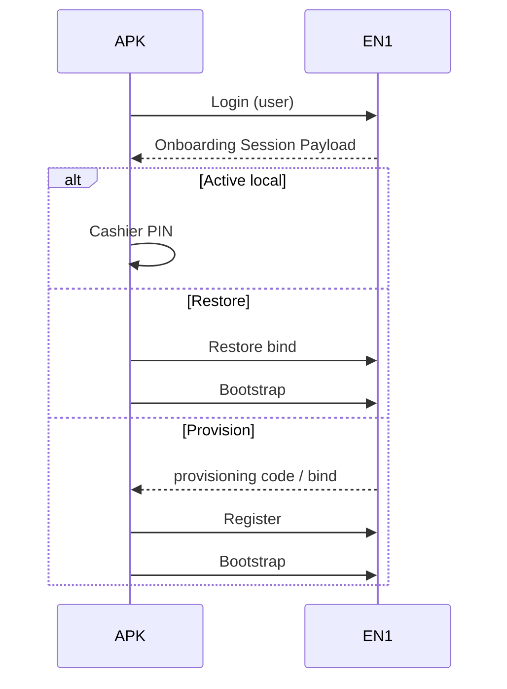

# EPosOne — Login Contract V1 (Onboarding)

| Campo | Valor |
|-------|--------|
| ID | **EPOSONE-LOGIN-CONTRACT-V1** |
| Estado | **Contrato P0** — 6 ago 2026 · sin código |
| ADR | [ADR-027](../ADR-027-EPOSONE-ONBOARDING-UNIFICADO-V1.md) |
| Uso | Camino **B** (Tengo cuenta) y paso inicial de **D** (Restaurar) |
| No confundir | Login **cajero** (PIN local Hito 2.5) |

---

## 1. Definición

**Iniciar sesión EN1 desde la APK** no es solo autenticación de usuario.

Debe **resolver el contexto comercial y de instalación** necesario para provisionar o restaurar el dispositivo.

```text
Credenciales EN1
        ↓
   Identidad (user)
        ↓
   Organizaciones autorizadas
        ↓
   Suscripción EPosOne (+ status)
        ↓
   Modalidad (Standalone | Connected)
        ↓
   Recursos (branches / POS / cajas / devices)
        ↓
   Licencias por caja (snapshot)
        ↓
   Decisión: Restore | Generate/usar Code | ir a cajero
```

---

## 2. Entradas

| Entrada | Notas |
|---------|--------|
| Identificador | Email (u otro IdP futuro) |
| Secreto | Password / SSO (P1) |
| `en1_base_url` | Host EN1 / producto EPosOne |
| Opcional `organization_id` | Si el usuario ya eligió org |

---

## 3. Salidas mínimas (contrato lógico)

Tras login exitoso, la APK debe obtener un **Onboarding Session Payload** (nombre lógico; HTTP concreto en P1):

| Campo | Obligatoriedad | Descripción |
|-------|----------------|-------------|
| `user_id` | Sí | Identidad EN1 |
| `organizations[]` | Sí | Orgs donde el user puede administrar/instalar |
| Por org: `organization_id`, `name` | Sí | |
| `subscription.status` | Sí | trial/active/past_due/… |
| `subscription.product_code` | Sí | `eposone` |
| `modality` | Sí | `standalone` \| `connected` (derivado de plan/entitlement) |
| `plan_code` | Sí | Comercial |
| `registers[]` / cajas | Sí | Recursos instalables |
| `devices[]` | Sí | Terminales conocidos (para restore/replace) |
| `licenses[]` | Sí | Snapshot por `register_ref` |
| `can_issue_provisioning_code` | Sí | Permiso |
| `active_provisioning_code` | No | Si existe código active (nunca obligatorio en claro en logs) |

---

## 4. Decisiones post-login (máquina)

| Condición | Siguiente paso |
|-----------|----------------|
| Device local ya **Active** y pertenece a org elegida | Cerrar login EN1 → **Login cajero** |
| User elige caja con device previo (otra tablet / wipe) | **Restore** o **Replace** según política |
| Caja **Provisionable** sin device | **Generate Code** (servidor) → flujo Register (Camino C interno) |
| Sin suscripción entitled | Bloquear con mensaje comercial (no inventar trial en APK) |
| Multi-org | Obligatorio seleccionar organización |

---

## 5. Restricciones

1. La APK **no** crea trial ni suscripción en el login (ADR-014: trial solo EN1).  
2. Login EN1 **≠** sesión de cajero.  
3. Credenciales de admin no se usan para atribuir ventas.  
4. Tokens de login EN1 no sustituyen Device Bearer para `/devices/*` operativos.  
5. Tras bind, operaciones POS usan **Device Bearer** + PIN cajero.

---

## 6. Relación con APIs existentes

| Necesidad | Hoy | P1 |
|-----------|-----|-----|
| Auth user | Sesión web `/start` login | Endpoint APK (session/token) **nuevo** |
| Listar orgs/productos | SubscriptionRegistry / Portal | Exponer a APK |
| Issue code | `issue_code_for_register` BO | Mismo servicio vía API autenticada user |
| Register/Bootstrap | Device Bearer ✅ | Sin cambio de modelo |

---

## 7. Diagrama



---

*P0 — especificación. Sin implementación HTTP en este documento.*
