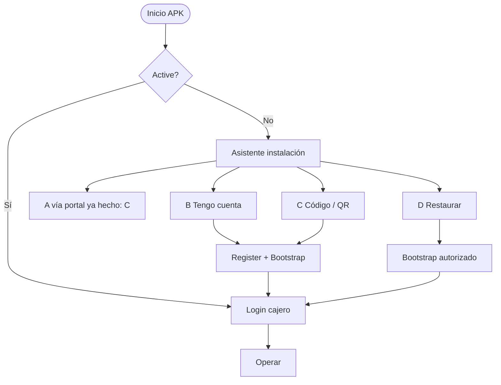

# EPosOne — Onboarding Contract V2

| Campo | Valor |
|-------|--------|
| ID | **EPOSONE-ONBOARDING-CONTRACT-V2** |
| Estado | **Contrato P0 oficial** — 6 ago 2026 · sin código |
| ADR | [ADR-027](../ADR-027-EPOSONE-ONBOARDING-UNIFICADO-V1.md) |
| Audiencia | LOCAL (APK) · EN1 · Manuales · Soporte |
| Reemplaza | First Start “Crear negocio sin EN1” / quinto flujo Local |

---

## 1. Ciclo único (todos los caminos)

```text
Nuevo negocio / acceso
        ↓
   Cuenta EN1
        ↓
   Organización
        ↓
   Plan (+ modalidad Standalone | Connected)
        ↓
   Provision   (Generate Code → Register)
        ↓
   Bootstrap
        ↓
   PIN cajero
        ↓
   Operar
```

**Regla de oro:** tras Provision+Bootstrap, el estado de la APK es indistinguible sea cual sea el camino A–D.

---

## 2. Modelo de producto (obligatorio)

```text
Cuenta EN1 → Organización → Suscripción EPosOne → Modalidad
```

| Modalidad | Operación |
|-----------|-----------|
| **Standalone** | Registrado en EN1; **sin** sync cloud operativa diaria |
| **Connected** | Registrado en EN1; **con** sync (catálogo, config, operación) |

No hay onboarding “sin cuenta EN1”.

---

## 3. Cuatro caminos oficiales

### A — Crear negocio

```text
Landing → /start → cuenta + org + plan/modalidad → trial|pago
       → Portal instalación → APK → (QR|código) → Register → Bootstrap → PIN → Operar
```

- Alta comercial **solo en EN1** (web).  
- APK **no** crea organización.

### B — Tengo cuenta

```text
APK → Login EN1 (Login Contract)
    → Resolver org / suscripción / modalidad / recursos
    → Si ya hay device válido → Restore o Login cajero
    → Si no → emitir/obtener código o bind caja → Register → Bootstrap → PIN → Operar
```

### C — Activar mediante código

```text
APK → (opcional escanear QR → código) → ingresar Provision Code
    → Register → Bootstrap → PIN → Operar
```

- Reutiliza EN1-02 actual.  
- QR **no** tiene lógica propia ([QR Contract](QR_CONTRACT_V1.md)).

### D — Restaurar instalación

```text
APK → Login EN1 → org → POS/caja → Bootstrap → PIN → Operar
```

Detalle: [Restore Contract](RESTORE_CONTRACT_V1.md).

---

## 4. Gate de entrada APK

```text
¿Instalación válida (Device Lifecycle = Active y token usable)?
  SÍ → Login cajero (no mostrar asistente)
  NO → Asistente de instalación (solo A-via-portal ya hecho / B / C / D)
```

El asistente **solo** trata instalación (no cobros, no catálogo admin).

---

## 5. Convergencia interna (obligatoria)

Todos los caminos ejecutan el mismo núcleo:

| Paso | Contrato / API |
|------|----------------|
| Provision Register | `POST /api/v1/devices/register` |
| Config + license | `GET /api/v1/devices/config` |
| Bootstrap | `GET /api/v1/devices/bootstrap` |
| Ready (si aplica) | `POST /api/v1/devices/installation/ready` |
| PIN | Local Hito 2.5 |
| Turno / venta | Cash + Orders HTTP |

---

## 6. Prohibiciones

- Quinto flujo “Modo Local / crear negocio solo en APK”.  
- QR con semántica distinta a “entregar provision code”.  
- Login que solo autentique sin resolver org/suscripción/recursos.  
- Provisioning que cree modalidad distinta a la de la suscripción.  

---

## 7. Diagrama oficial



Camino **A** comercial ocurre en web antes de la APK; en la tablet suele materializarse como **C** (código/QR del portal).

---

*V2 — P0. Endpoints nuevos de Login/Restore se especifican en sus contratos; implementación = GO posterior.*
