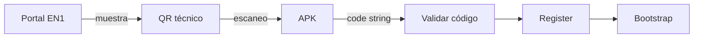

# EPosOne — QR Contract V1 (Instalación)

| Campo | Valor |
|-------|--------|
| ID | **EPOSONE-QR-CONTRACT-V1** |
| Estado | **Contrato P0** — 6 ago 2026 · sin código |
| ADR | [ADR-027](../ADR-027-EPOSONE-ONBOARDING-UNIFICADO-V1.md) · [ADR-024](../ADR-024-EPOSONE-START-ASSISTANT.md) § QR |

---

## 1. Decisión

El **QR de instalación** únicamente entrega el **código de aprovisionamiento** (EN1-02).

**Nunca** tendrá lógica propia, ni sustituye a Register/Bootstrap, ni porta modalidad, ni crea cuenta.

```text
QR  →  Provision Code  →  Register  →  Bootstrap
```

Equivale al Camino **C** con entrada por escáner.

---

## 2. Dos QR (no mezclar)

| Tipo | Payload | Destino |
|------|---------|---------|
| **Comercial** | URL a `/start` (adquisición) | Navegador / embudo web |
| **Técnico (instalación)** | **Solo** provisioning code (ver encoding) | APK asistente → Camino C |

Este contrato regula el **técnico**. El comercial sigue ADR-024.

---

## 3. Encoding del QR técnico

### Opción oficial V1 (simple)

Contenido del QR = **string del código** tal cual lo emite EN1  
(ej. `L2cG-RZg-MK4Kkyd`).

La APK ya debe conocer `en1_base_url` (build, settings previos, o pantallita una sola vez).

### Opción permitida V1.1 (si hace falta URL)

URI sin lógica extra:

```text
eposone://provision?code=<PROVISION_CODE>
```

o

```text
https://<en1-host>/eposone/install?code=<PROVISION_CODE>
```

La deep link **solo** extrae `code` y ejecuta el mismo Camino C.  
Prohibido: parámetros `modality`, `plan`, `org_id`, tokens de sesión, precios.

---

## 4. Reglas

1. QR técnico = presentación del **mismo** `eposone_provisioning_code`.  
2. TTL y un solo uso = reglas del código, no del QR.  
3. Regenerar código invalida el QR anterior (porque el código cambió).  
4. Escanear QR comercial dentro de la APK de install → abrir navegador `/start`, **no** Register.  
5. No firmar payloads distintos del código en V1.

---

## 5. Diagrama



---

*P0 — contrato.*
