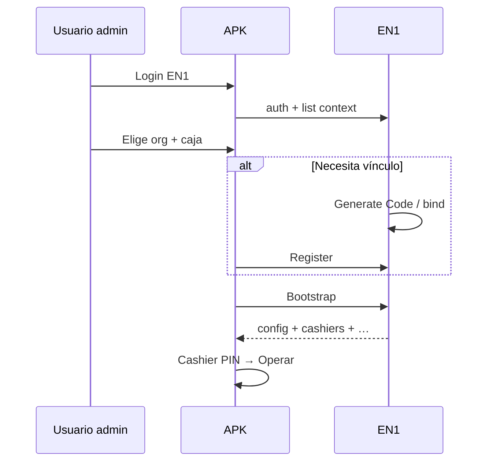

# EPosOne — Restore Contract V1

| Campo | Valor |
|-------|--------|
| ID | **EPOSONE-RESTORE-CONTRACT-V1** |
| Estado | **Contrato P0** — 6 ago 2026 · sin código |
| ADR | [ADR-027](../ADR-027-EPOSONE-ONBOARDING-UNIFICADO-V1.md) |
| Camino | **D** — Restaurar instalación |
| Depende | [Login Contract](LOGIN_CONTRACT_V1.md) · [Device Lifecycle](DEVICE_LIFECYCLE_V1.md) |

---

## 1. Objetivo

Recuperar operación en tablet **reiniciada**, **reinstalada** o **reemplazada**, sin repetir el alta comercial (`/start`).

```text
Login EN1
    ↓
Seleccionar Organización
    ↓
Seleccionar POS / Caja
    ↓
Bootstrap   (y Register si hace falta)
    ↓
Operar
```

---

## 2. Casos cubiertos

| Caso | Tratamiento |
|------|-------------|
| Misma tablet, app reinstalada, mismo `device_uuid` recuperable | **Re-Provision** (nuevo código o bind) → Register → Bootstrap |
| Misma tablet, token perdido, uuid nuevo | Como **Replace Device** de esa caja |
| Tablet nueva reemplazando otra | **Replace Device**: Generate Code → Register → Bootstrap; anterior → Replaced |
| Solo falta bootstrap (token válido) | Bootstrap directo → Active |

---

## 3. Flujo normativo

1. **Login EN1** → Onboarding Session Payload.  
2. Usuario selecciona **organización** (si hay más de una).  
3. EN1 valida suscripción entitled (`trial`/`active`/`past_due`).  
4. Usuario selecciona **POS/caja** autorizada.  
5. EN1 determina acción:
   - Si requiere nuevo vínculo device → Generate Code o bind server-side + **Register**.  
   - Si token aún válido → solo **Bootstrap**.  
6. APK aplica Bootstrap (+ config/license).  
7. Device Lifecycle → **Active**.  
8. **PIN cajero** → Operar.

---

## 4. Restricciones

1. Restore **no** cambia modalidad ni plan.  
2. Restore **no** crea organización ni suscripción.  
3. Solo usuarios con permiso de instalación/admin de esa org.  
4. No restaurar a una caja **Suspended** / licencia no operable sin mensaje explícito.  
5. No permitir dos tablets **Active** concurrentes en la misma caja si la política es 1 device (límite License Engine `max_devices`); Replace debe dejar la anterior en **Replaced**.  
6. Código de provisioning sigue siendo **un solo uso** si se usa Camino C interno.  
7. Standalone y Connected usan el **mismo** Restore; solo cambia sync posterior.

---

## 5. Errores canónicos (lógicos)

| Código lógico | Cuándo |
|---------------|--------|
| `auth_required` | Sin login |
| `org_forbidden` | User sin acceso |
| `subscription_inactive` | No entitled |
| `register_not_found` | Caja inválida |
| `device_conflict` | Otra tablet active y no se confirmó Replace |
| `license_blocked` | Caja no puede operar |
| `bootstrap_failed` | Fallo sync down |

---

## 6. Diagrama



---

*P0 — contrato. HTTP exacto en P1 reutilizando issue_code + register + bootstrap.*
