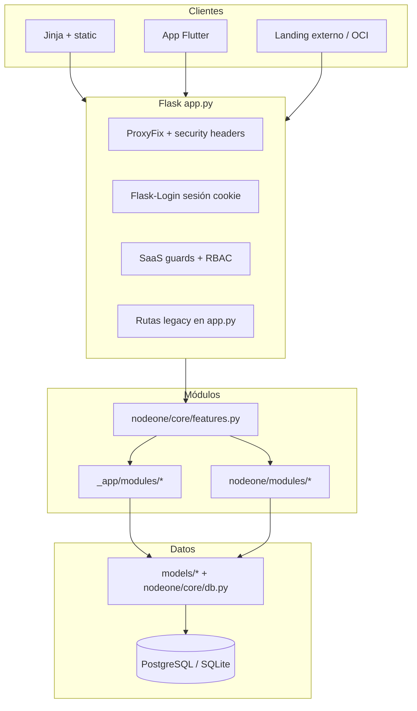

# EN1 — Arquitectura general

Backend **Easy NodeOne (EN1)**: monolito Flask multi-tenant con módulos activables por organización (SaaS).

## Vista de capas



## Punto de entrada

| Pieza | Ubicación | Rol |
|-------|-----------|-----|
| Aplicación Flask | `app.py` | Config, `db`, modelos reexportados, helpers de tenant, decoradores RBAC, rutas que aún no migraron |
| Registro de blueprints | `nodeone/core/features.py` → `register_modules(app)` | Única vía de registro modular (idempotente); aplica guards SaaS antes de `register_blueprint` |
| ORM compartido | `nodeone/core/db.py` | Instancia `SQLAlchemy` usada por `models/*` y módulos |
| Config entorno | `nodeone/config/settings.py` | `DATABASE_URL`, `BASE_DIR`, `LICENSE_PATH`, etc. |
| Paquete legacy | `_app/modules/` | Auth, members, payments, communications, services, policies, marketing, integrations |
| Paquete nuevo | `nodeone/modules/` | Citas, eventos, CRM API, ventas, taller, académico, contactos, e-factura, etc. |
| Catálogo SaaS | `nodeone/services/saas_catalog_defaults.py` | Semilla de `saas_module` y vínculos `saas_org_module` |
| Guards SaaS | `saas_features.py` | `before_request` / decoradores por código de módulo |

El arranque llama `register_modules(app)` desde `app.py` (no duplicar registro legacy sin guards).

## Multi-tenant

- **Organización** (`SaasOrganization`): tenant lógico; muchas tablas llevan `organization_id`.
- **Resolución de org activa**: `utils/organization.py` → `resolve_current_organization()` (host/subdominio, sesión, `last_selected_organization_id`, `user.organization_id`).
- **Datos de negocio (miembro)**: `tenant_data_organization_id()` en `app.py` delega en la misma resolución.
- **Admin / listados**: `admin_data_scope_organization_id()` en `nodeone/services/org_scope.py`.
- **Visibilidad de módulos (menú y guards)**: `org_id_for_module_visibility()` → `resolve_current_organization()`.
- **Modo single-tenant**: `NODEONE_SINGLE_TENANT_ONLY` (por defecto activo) fuerza org `1` salvo selector de admin plataforma.

Usuarios con varias empresas: tabla `user_organization` + selector post-login (`nodeone/services/post_login_organization.py`).

## Autenticación y autorización

| Mecanismo | Uso |
|-----------|-----|
| **Flask-Login** | Sesión por cookie; APIs móvil/web autenticadas reutilizan la misma sesión |
| **`is_admin`** | Admin de plataforma; omite guards SaaS y accede a cualquier org |
| **`admin_required`** | Admin plataforma **o** cualquier permiso RBAC “admin tenant” |
| **`platform_admin_required`** | Solo `User.is_admin` |
| **`require_permission('code')`** | RBAC granular; JSON → 403 con `error` / `message` |
| **Módulo SaaS** | `has_saas_module_enabled(org_id, code)` con caché por request (`nodeone/services/saas_module_cache.py`) |

## Módulos y despliegue

Cada funcionalidad es un **Blueprint** registrado en `register_modules`. Flags `NODEONE_SKIP_*` en `nodeone/core/features.py` permiten apagar módulos enteros en un worker (RAM / entornos parciales).

Inventario histórico de rutas P1: `docs/ENDPOINTS_P1.txt`, `docs/MODULOS_ACTIVOS_P1.txt`.

## Integraciones externas

- Pagos: Stripe, PayPal, Yappy manual, transferencia (`payment_processors.py`, `nodeone/modules/payments_*`).
- Email: `email_service`, plantillas, cola marketing.
- OAuth: Google/Facebook/LinkedIn vía Authlib (`_app/modules/auth`).
- Odoo: catálogo / matriz de permisos (`nodeone/integrations/odoo`).
- e-Factura Panamá: PAC efacturapty (`nodeone/modules/efactura`).
- Licencias: `license_validator` (ruta `LICENSE_PATH`).

## Directorios de referencia

```
backend/
├── app.py                 # Monolito + facades
├── models/                # ORM por dominio
├── _app/modules/          # Pack legacy (auth, payments, …)
├── nodeone/
│   ├── core/              # features, db, nav, gates plantillas
│   ├── modules/           # Blueprints por dominio
│   ├── services/          # Lógica compartida (tenant, pagos, email, …)
│   ├── integrations/
│   └── config/
├── saas_features.py
├── utils/organization.py
└── docs/                  # Esta documentación EN1
```

## Documentos relacionados

- [EN1_MODELS.md](./EN1_MODELS.md)
- [EN1_NUEVAS_FUNCIONALIDADES_Y_CORRECCIONES.md](./EN1_NUEVAS_FUNCIONALIDADES_Y_CORRECCIONES.md)
- [EN1_SAAS_GUARDS.md](./EN1_SAAS_GUARDS.md)
- [EN1_ROUTES.md](./EN1_ROUTES.md)
- [EN1_API_CONTRACT.md](./EN1_API_CONTRACT.md)
- [FLUTTER_SYNC.md](./FLUTTER_SYNC.md)
