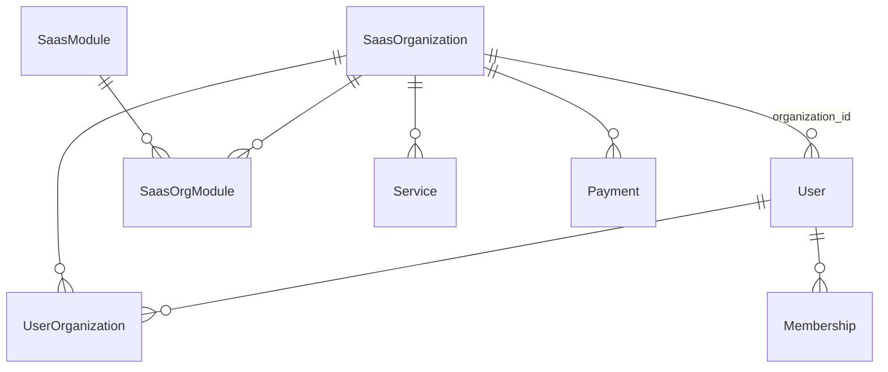

# EN1 — Modelos de datos

ORM **SQLAlchemy** centralizado en `nodeone/core/db.py`. Los modelos viven en `models/` y se importan desde `models/__init__.py`.

## Convenciones

| Regla | Detalle |
|-------|---------|
| **Multi-tenant** | Tablas operativas incluyen `organization_id` → FK `saas_organization.id` |
| **Usuario global** | `User.email` es único en toda la plataforma; membresía por org en `user_organization` |
| **RBAC** | `Role`, `Permission`, tablas `user_role` y `role_permission` (`models/associations.py`) |
| **Migraciones** | Muchos módulos usan `ensure_*_schema()` en `before_request` además de scripts SQL en `sql/` |

## Núcleo SaaS y tenant

| Modelo | Tabla | Descripción |
|--------|-------|-------------|
| `SaasOrganization` | `saas_organization` | Tenant: nombre, subdominio, política de registro, datos fiscales |
| `SaasModule` | `saas_module` | Catálogo de módulos (`code` único, `is_core`) |
| `SaasOrgModule` | `saas_org_module` | Toggle por org (`enabled`) |
| `SaasModuleDependency` | `saas_module_dependency` | Dependencias entre módulos |
| `OrganizationSettings` | `organization_settings` | Branding (colores, logo) por org |
| `SaasOrganizationGoogleOAuth` | `saas_organization_google_oauth` | OAuth Google por tenant |
| `TenantCrmContact` | `tenant_crm_contact` | Contacto CRM/fiscal legacy del tenant |

Códigos de módulo: ver catálogo en `nodeone/services/saas_catalog_defaults.py` (`SAAS_CATALOG_MODULES`).

## Identidad y acceso

| Modelo | Archivo | Notas |
|--------|---------|-------|
| `User` | `models/users.py` | `organization_id`, `is_admin`, `is_advisor`, verificación email, foto |
| `UserOrganization` | `models/users.py` | Membresía multi-org (`role`, `status`) |
| `UserSettings` | `models/users.py` | Preferencias JSON (notificaciones, tema, idioma) |
| `Role`, `Permission` | `models/users.py` | RBAC EN1 |
| `SocialAuth` | `models/users.py` | Vínculo OAuth |

## Membresías y beneficios

| Modelo | Archivo |
|--------|---------|
| `Membership`, planes, beneficios | `models/benefits.py` |

## Pagos y carrito

| Modelo | Archivo |
|--------|---------|
| `Payment`, `Subscription` | `models/payments.py` |
| `PaymentConfig`, `OrganizationPaymentMethod` | `models/payments.py` |
| `Cart`, `CartItem` | `models/catalog.py` |
| Descuentos membresía / códigos | `models/payments.py`, `models/events.py` (`DiscountCode`) |

## Catálogo y servicios

| Modelo | Archivo |
|--------|---------|
| `Service`, `ServiceCategory`, `ServicePricingRule` | `models/catalog.py` |
| `UserService`, `HistoryTransaction` | `models/catalog.py` |
| `ServiceRequest` | `models/service_request.py` |

## Citas y eventos

| Dominio | Archivo | Entidades principales |
|---------|---------|----------------------|
| Citas | `models/appointments.py` | `Advisor`, `AppointmentType`, `AppointmentSlot`, `Appointment`, disponibilidad |
| Eventos | `models/events.py` | `Event`, `EventRegistration`, `Discount`, participantes, certificados de evento |

## Comunicaciones

| Modelo | Archivo |
|--------|---------|
| `Notification`, `EmailLog`, `EmailConfig` | `models/communications.py` |
| Marketing (campañas, cola) | `models/communications.py` |
| Motor de reglas | `models/communication_rules.py` | `CommunicationEvent`, `CommunicationRule`, `UserCommunicationPreference` |

## Ventas, contabilidad, taller

| Dominio | Ubicación |
|---------|-----------|
| Cotizaciones / facturas (módulo sales) | `nodeone/modules/sales/models.py`, `nodeone/modules/accounting/models.py` |
| Núcleo contable | `models/accounting_core.py` — `Account`, `Journal`, `JournalEntry`, `JournalItem` |
| Ajustes | `models/accounting_adjustments.py` |
| Taller / SLA | Tablas vía módulo `nodeone/modules/workshop/` (órdenes, líneas, checklist) |

## CRM y contactos

| Modelo | Ubicación |
|--------|-----------|
| CRM API (leads, etapas) | `nodeone/modules/crm_api/models.py` |
| Maestro contactos EN1 | `models/contact.py` — `Contact` |
| Invitaciones org | `models/organization_invite.py` |

## Académico, certificados, otros

| Dominio | Archivo |
|---------|---------|
| LMS / matrículas | `models/academic.py`, `models/academic_program.py`, `models/course_cohort.py` |
| Certificados | `models/certificates.py` |
| Normativas | `models/policies.py` |
| e-Factura | `models/efactura.py` |
| Matriz Odoo | `models/security_matrix.py` |
| QR | `models/qr_codes.py` |
| CV / postulaciones | `models/cv_application.py` |
| Contador inventario | `models/contador.py` |

## Diagrama de relaciones (simplificado)

## Consultas con scope de org

- **Sesión miembro**: `utils.organization.scoped_query(Model)` filtra por `get_current_organization_id()`.
- **Scripts / workers**: `default_organization_id()` o `payment_organization_id_for_user_id()`.
- **No mezclar** `get_current_organization_id()` con `org_id_for_module_visibility()` para queries de datos: la primera puede ser `None` para anónimos; la segunda siempre resuelve org para UI/guards.

## Documentos relacionados

- [EN1_ARCHITECTURE.md](./EN1_ARCHITECTURE.md)
- [EN1_SAAS_GUARDS.md](./EN1_SAAS_GUARDS.md)
