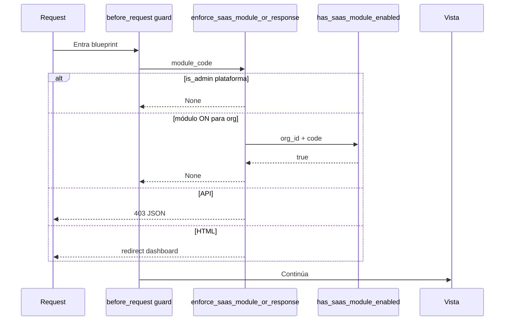

# EN1 — Guards SaaS (módulos por organización)

Los **guards SaaS** impiden usar rutas de un módulo si ese módulo no está habilitado para la organización activa del usuario.

Implementación principal: `saas_features.py` + registro en `nodeone/core/features.py`.

## ¿Cuándo está un módulo “ON”?

Lógica en `nodeone/services/saas_module_cache.py` → `has_saas_module_enabled_cached()`:

1. Si `module_code` vacío → **ON**.
2. Si multi-tenant catálogo desactivado (`app._enable_multi_tenant_catalog()` falso) → **ON** (modo legado).
3. Si no existe fila en `saas_module` para el código → **OFF**.
4. Si existe `saas_org_module` para `(organization_id, module_id)` → valor de `enabled`.
5. Si no hay fila org → **`is_core` del módulo** (módulos core como `payments` vienen ON por defecto).

Catálogo semilla: `SAAS_CATALOG_MODULES` en `nodeone/services/saas_catalog_defaults.py`.

Admin plataforma (`User.is_admin`): **no se evalúa** el guard en `enforce_saas_module_or_response`.

## Función central

```python
enforce_saas_module_or_response(module_code)
```

| Resultado | Significado |
|-----------|-------------|
| `None` | Continuar con la petición |
| `Response` | Bloquear: redirect HTML o JSON 403 |

### Organización usada en el guard

- Usuarios autenticados: `tenant_data_organization_id()` (misma fuente que beneficios, `/services`, catálogo).
- Fallo de contexto: `organization_context_lost` (API) o redirect a login/dashboard.

### Respuesta según tipo de petición

Se considera **API** si:

- `request.path` empieza con `/api/`, o
- el blueprint termina en `_api`, o
- `'api'` está en el nombre del blueprint.

| Tipo | Módulo deshabilitado | Sin org |
|------|---------------------|---------|
| API / JSON | `403` + `{"error": "Módulo no habilitado", "module": "<code>"}` | `403` + `organization_context_lost` u `Organización no disponible` |
| HTML | `flash` + redirect `dashboard` | redirect `login` o `dashboard` |

## Decorador opcional

```python
@require_saas_module('events')
def vista(): ...
```

Equivalente a comprobar sesión + `enforce_saas_module_or_response` antes de ejecutar la vista.

## Registro de guards (por blueprint)

| Helper | Módulo | Notas |
|--------|--------|-------|
| `register_simple_saas_guard(bp, code)` | Genérico | `before_request` en el blueprint |
| `register_appointments_saas_guards(*bps)` | `appointments` | Citas + APIs relacionadas |
| `register_services_saas_guards(services_bp)` | `appointments` | Catálogo `/services`; anónimos usan org por **host** |
| `register_events_saas_guards(...)` | `events` | API pública sin sesión usa `_org_id_for_module_visibility()` |
| `register_payments_blueprint_saas_guard` | `payments` | Excepción: `payments.diplomado_landing` |
| `register_payments_checkout_saas_guard` | `payments` | Excepción: `stripe_webhook` |
| `register_marketing_saas_guard` | `marketing_email` | Excepciones: open/click/unsubscribe |
| `register_certificates_saas_guards(...)` | `certificates` | Varios blueprints |
| `register_policies_public_saas_guard` | `policies` | Público: **404** si off (no 403) |

Registrados desde `register_modules()` para: communications, services, policies, payments, checkout, appointments, events, certificates, marketing, sales, accounting, workshop, memberships (varios admin), efactura, contacts, contador, security_matrix, etc.

## Casos especiales

### Contabilidad núcleo (`accounting_core`)

Blueprint propio en `nodeone/modules/accounting_core/routes.py`:

- Cadena: `accounting_core` → si no existe en catálogo, `sales`.
- Función `_saas_chain_enabled()` alineada con menú.

### Taller (`workshop`)

- Guard SaaS `workshop` en API.
- Rutas admin pueden comprobar además `sales` en acciones concretas.
- Manual de operaciones: [EN1_OPERACIONES_TALLER.md](./EN1_OPERACIONES_TALLER.md).

### Analytics

`before_request` propio: `analytics` o, en rutas de membresías del tablero, `memberships`.

### Rutas sueltas en `app.py` (chatbot, CRM contactos)

`register_saas_app_route_guards(app)` en `saas_features.py` mapea **endpoints** concretos a `chatbot` y `crm_contacts`. **Debe invocarse explícitamente** al arranque si se usan esas vistas fuera de blueprint; hoy el registro principal pasa por blueprints y decoradores (`require_saas_module` en admin).

### Módulos con doble gate (global + SaaS)

Ejemplos: `contacts`, `efactura`, `academic` — flags `NODEONE_*_MODULE_ENABLED` en entorno **además** del toggle por tenant.

## Códigos de módulo (catálogo)

| `code` | Nombre corto |
|--------|----------------|
| `appointments` | Citas |
| `events` | Eventos |
| `payments` | Pagos (core) |
| `communications` | Comunicaciones |
| `sales` | Ventas / facturación |
| `workshop` | Taller + SLA |
| `crm` / `crm_contacts` | CRM |
| `marketing_email` | Email marketing |
| `certificates` | Certificados |
| `policies` | Normativas |
| `memberships` | Membresías |
| `analytics` | Analítica |
| `academic` | Educación / LMS |
| `contacts` | Contactos maestro |
| `efactura` | Facturación electrónica |
| `contador` | Contador inventario |
| `chatbot` | IA / chatbots |
| `office365` | Office 365 |
| `security_matrix` | Matriz Odoo |
| `rbac_matrix` | Permisología EN1 |
| `qr_generator` | Generador QR |

`accounting` está reservado en catálogo; facturas usan guard `sales` en la práctica.

## Flujo de una petición



## Documentos relacionados

- [EN1_ROUTES.md](./EN1_ROUTES.md)
- [EN1_API_CONTRACT.md](./EN1_API_CONTRACT.md)
- [EN1_ARCHITECTURE.md](./EN1_ARCHITECTURE.md)
