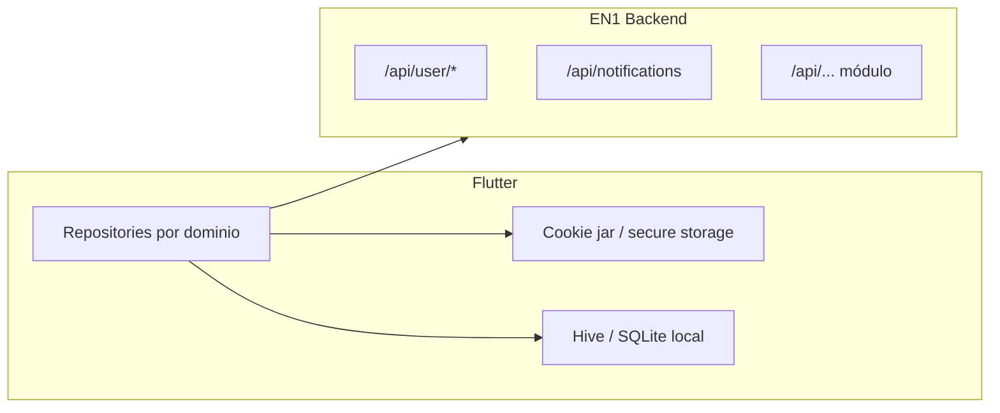

# Estrategia de sincronización — App Flutter ↔ Backend EN1

No hay código Flutter en este repositorio. Este documento define cómo la app móvil debe alinearse con el backend actual (sesión, tenant, APIs existentes) y un plan de sync incremental.

## Principios

1. **Servidor autoritativo** — El backend resuelve org, permisos y módulos SaaS; la app no “adivina” el tenant.
2. **Sesión primero** — Reutilizar Flask-Login (cookie) en el mismo host que la web; evitar duplicar lógica de `resolve_current_organization()` en el cliente.
3. **Sync por dominio** — Cada feature (notificaciones, perfil, citas) tiene su propio refresh; no hay endpoint `/sync` global hoy.
4. **Degradación por módulo** — Ante `403` + `Módulo no habilitado`, ocultar la sección y cachear el flag localmente hasta el próximo login.

## Arquitectura cliente

## Autenticación

| Paso | Endpoint / acción |
|------|-------------------|
| Login | POST `/login` (form) o flujo OAuth `/auth/<provider>` — misma cookie que web |
| Post-login org | El servidor fija `session['organization_id']` vía `apply_session_organization_after_login` |
| Multi-org | Si respuesta HTML es selector de org, replicar POST de elección antes de llamar APIs |
| Estado global | GET `/api/user/status` al abrir app (cold start) |
| Logout | GET `/logout` + limpiar cache local |

**Base URL**: un host por marca (subdominio = tenant en catálogo público). Para usuarios con varias orgs, el host puede forzar org (`utils/organization` host-lock).

Cliente HTTP: enviar cookies en todas las peticiones (`withCredentials` / `CookieManager` en Dio).

## Bootstrap tras login (orden recomendado)

1. `GET /api/user/status` — membresía, flags, onboarding.
2. `GET /api/user/settings` — preferencias UI (idioma `es`, `timezone` `America/Panama`, tema).
3. `GET /api/user/membership` — plan activo (manejar `404` como “sin membresía”).
4. `GET /api/notifications?limit=50` — badge `unread_count`.
5. Opcional: `GET /api/user/dashboard` — agregado pesado; no en cada foreground.

Guardar en cache local: `user_id`, `organization_id` devuelto implícitamente en payloads donde exista, lista de módulos inferida de qué APIs responden 200 vs 403.

## Sincronización por área

### Notificaciones (pull + acciones)

| Acción | Método | Ruta |
|--------|--------|------|
| Listar | GET | `/api/notifications?type=all&status=all&limit=50` |
| Marcar leída | POST | `/api/notifications/<id>/read` |
| Marcar todas | POST | `/api/notifications/read-all` |
| Eliminar | DELETE | `/api/notifications/<id>` |

**Estrategia**: pull al abrir bandeja y cada N minutos en foreground; tras acción, actualizar item local o relistar. No hay WebSocket ni push documentado en backend — si se añade FCM, será capa aparte.

### Preferencias usuario (push desde app)

| Acción | Método | Ruta |
|--------|--------|------|
| Leer | GET | `/api/user/settings` |
| Guardar | POST | `/api/user/settings` body `{ "preferences": { ... } }` — solo claves permitidas en `_default_user_preferences()` |
| Comunicación | PUT | `/api/user/communication-preferences` body `{ "items": [...] }` |

**Estrategia**: escritura optimista local → POST/PUT → en error, revertir y mostrar mensaje `error`.

### Módulos opcionales (citas, eventos, CRM)

Solo llamar APIs del módulo si el menú web equivalente está disponible o tras probar un GET ligero:

- Citas: `/api/appointments/*` (requiere `appointments`).
- Eventos: `/api/events/` (requiere `events`; API pública usa org por visibilidad).
- CRM: prefijo `/crm/` (requiere `crm`).

Ante primer `403` con `module`, persistir `disabled_modules[code]=true` en cache hasta logout.

## Cache local sugerido

| Clave | TTL | Fuente |
|-------|-----|--------|
| `user_status` | 5 min / invalidar en logout | `/api/user/status` |
| `notifications` | 1 min en inbox abierta | `/api/notifications` |
| `preferences` | Hasta push local | `/api/user/settings` |
| `membership` | 15 min | `/api/user/membership` |
| `saas_modules` | Sesión | Inferido de 403 o endpoint futuro |

No cachear respuestas admin (`/api/admin/*`) en dispositivos miembro.

## Offline

Estado actual del backend: **sin cola de escritura offline**. Recomendación v1:

- Solo lectura cacheada (notificaciones, perfil).
- Acciones de escritura: deshabilitar UI sin red o encolar en cliente con retry exponencial (máx. 24 h) sabiendo que **no hay idempotency-key** en el servidor — evitar duplicar POST de pagos o inscripciones.

## Conflictos y versiones

- No hay `ETag` / `If-Modified-Since` estándar en APIs miembro.
- Usar `updated_at` del payload cuando exista; si no, full refresh del listado.
- Coordinar releases app ↔ backend con [EN1_API_CONTRACT.md](./EN1_API_CONTRACT.md).

## Seguridad móvil

- Almacenar cookies en almacén seguro (Keychain / EncryptedSharedPreferences).
- No incrustar API keys de `/api/public/*` en la app miembro (son para landings).
- Respetar `must_change_password`: redirigir a cambio de clave si el HTML/login lo indica (paridad web).

## Roadmap API (opcional, no implementado)

Para simplificar Flutter en el futuro:

1. `GET /api/user/context` — `{ organization_id, modules: { code: bool }, permissions: [] }`.
2. `GET /api/sync/delta?since=<iso>` — solo si se versionan tablas por `updated_at` global.

Hasta entonces, usar bootstrap descrito arriba.

## Documentos relacionados

- [EN1_API_CONTRACT.md](./EN1_API_CONTRACT.md)
- [EN1_SAAS_GUARDS.md](./EN1_SAAS_GUARDS.md)
- [EN1_ARCHITECTURE.md](./EN1_ARCHITECTURE.md)
