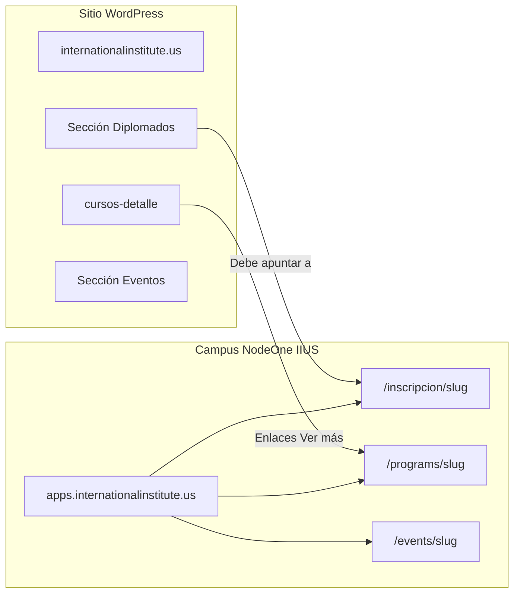

# IIUS — Catálogo sitio web vs plataforma (documento para analista)

**Fecha:** 2026-05-22  
**Audiencia:** analista de negocio / producto  
**Sitio marketing:** [internationalinstitute.us/cursos-detalle/](https://internationalinstitute.us/cursos-detalle/)  
**Campus / compras:** [apps.internationalinstitute.us](https://apps.internationalinstitute.us) (NodeOne, org 1)

---

## 1. Resumen ejecutivo

| Tema | Conclusión |
|------|------------|
| Regla de negocio | **Todo se paga.** Al pagar, el usuario debe quedar **inscrito** en lo comprado. |
| Nombres en web | “Diplomados”, “Cursos”, “Talleres”, “Eventos” son **categorías de marketing**; en sistema conviene **un solo funnel de compra formativa** con etiqueta visible. |
| ¿Cursos como Eventos en la app? | **No** para programas formativos. **Eventos** = actividades con **fecha, cupo y asistencia**. Cursos/diplomados = **programas de inscripción**. |
| Estado hoy | **Diplomados:** listos en apps con landing de compra. **Cursos del catálogo web:** slugs en BD pero **otra URL y otro flujo** (no desbloquean campus igual). **Eventos:** 0 en BD. **4 talleres** del sitio web **sin slug** en apps aún. |
| Recomendación | Unificar ofertas pagas formativas en **`academic_program` + `/inscripcion/<slug>`**; precios reales en planes; eventos puntuales aparte en módulo **Eventos**. |

---

## 2. Arquitectura: dos sitios, una operación



| Sitio | Rol | Quién lo edita |
|-------|-----|----------------|
| **internationalinstitute.us** | Marketing, catálogo, textos, “Ver más” | WordPress / diseño |
| **apps.internationalinstitute.us** | Cuentas, pagos, matrícula, campus, admin | NodeOne (EN1) |

Los botones **“Campus Virtual”** del sitio deben llevar a `apps.internationalinstitute.us` (login / inscripción).

---

## 3. Tres mecanismos técnicos en la app (no son intercambiables)

| # | Nombre interno | Tablas BD | URL pública en apps | Al pagar | ¿Abre “Mi campus” con política `academic_closed`? |
|---|----------------|-----------|---------------------|----------|-----------------------------------------------------|
| **A** | **Programa de inscripción** | `academic_program`, `academic_program_pricing_plan`, `academic_program_enrollment` | `/inscripcion/<slug>` | Matrícula académica `confirmed` | **Sí** |
| **B** | **Curso por cohorte** | `service` (`service_type=COURSE`), `course_cohort` | `/programs/<slug>` | Reserva cupo en cohorte | **No** (hoy) |
| **C** | **Evento** | `event`, `event_registration` | `/events/<slug>` | Registro a evento | **No** (producto distinto) |

**IIUS tiene `registration_policy = academic_closed`:** el miembro solo accede al campus completo con matrícula activa en tabla **A**.

Por eso los diplomados ya están en **A**. Los 12 cursos del catálogo están hoy en **B** → riesgo: **cobran pero no matriculan en campus**.

---

## 4. Nomenclatura recomendada (para alinear dueños)

| Lo que dice marketing | En NodeOne (dato) | Etiqueta en pantalla (`program_type`) | URL objetivo única |
|----------------------|-------------------|--------------------------------------|---------------------|
| Diplomado | Programa de inscripción | `diplomado` | `/inscripcion/<slug>` |
| Curso | Programa de inscripción | `curso` | `/inscripcion/<slug>` |
| Taller formativo (varias semanas, pago) | Programa de inscripción | `taller` | `/inscripcion/<slug>` |
| Evento (fecha, jornada, webinar) | Evento | — | `/events/<slug>` |
| Membresía | Membresía (otro módulo) | — | `/membership` / planes |

**Un solo concepto de negocio para A:** “oferta formativa pagada con slug”.

---

## 5. Página [cursos-detalle](https://internationalinstitute.us/cursos-detalle/) — estructura

Título de página: **“Catálogo de Cursos y Programas”**.

Introducción (marketing): cursos prácticos, talleres, liderazgo, IE, emprendimiento, espiritualidad, etc.

La página agrupa **tarjetas con “Ver más”** en 4 bloques:

1. **Cursos de Negocios** (4 ítems)  
2. **Cursos en Ciencia** (4 ítems)  
3. **Cursos en Espiritualidad** (4 ítems)  
4. **Talleres** (4 ítems)  

**Nota:** En el menú del sitio también existen **Entrenamientos → Diplomados** y **Eventos** (no están todos listados en `cursos-detalle`; los diplomados neuro suelen tener landings propias en apps).

---

## 6. Mapeo: tarjetas del sitio web → slug en apps

Leyenda:

- **En BD apps** = estado en servidor IIUS (2026-05-22).  
- **Ruta apps** = URL donde compra/inscribe hoy.  
- **Match** = grado de certeza del emparejamiento marketing ↔ slug (revisar enlaces reales “Ver más” en WordPress).

### 6.1 Cursos de Negocios

| # | Texto en sitio web (resumen) | Slug sugerido en apps | En BD apps | Ruta apps hoy | Match |
|---|------------------------------|----------------------|------------|---------------|-------|
| 1 | Desarrolla habilidades de **liderazgo** | `curso-en-liderazgo-y-gestion-de-equipos` | Sí (`service`) | `/programs/...` | Alto |
| 2 | **Emprendimiento** y Desarrollo de Negocios | `cursos-en-emprendimiento-y-desarrollo-de-negocios` | Sí | `/programs/...` | Alto |
| 3 | **Coaching** (liderazgo ejecutivo / organizacional) | `curso-en-coaching-ejecutivo-y-liderazgo-organizacional` | Sí | `/programs/...` | Alto |
| 4 | **Finanzas** personales y empresariales | `curso-en-finanzas-personales-y-empresariales` | Sí | `/programs/...` | Alto |

### 6.2 Cursos en Ciencia

| # | Texto en sitio web (resumen) | Slug sugerido en apps | En BD apps | Ruta apps hoy | Match |
|---|------------------------------|----------------------|------------|---------------|-------|
| 5 | **Coaching Profesional** Integral | `curso-en-coaching-profesional-integral` | Sí | `/programs/...` | Alto |
| 6 | **Técnicas de Anclaje PNL** | *Sin slug dedicado en semilla* | **No** | — | **GAP** — definir slug o unificar con fila 8 |
| 7 | **Inteligencia Emocional** y bienestar | `curso-en-inteligencia-emocional-y-bienestar` | Sí | `/programs/...` | Alto |
| 8 | **Programación Neurolingüística (PNL)** | `curso-en-neuroeducacion-y-programacion-neurolinguistica-pnl` | Sí | `/programs/...` | Medio-alto |
| 8b | (relacionado neuroplasticidad) | `curso-de-neuroeducacion-y-neuroplasticidad` | Sí | `/programs/...` | Alternativa fila 6/8 |

### 6.3 Cursos en Espiritualidad

| # | Texto en sitio web (resumen) | Slug sugerido en apps | En BD apps | Ruta apps hoy | Match |
|---|------------------------------|----------------------|------------|---------------|-------|
| 9 | **Mindfulness** y reducción del estrés | `curso-en-mindfulness-y-reduccion-del-estres` | Sí | `/programs/...` | Alto |
| 10 | **Espiritualidad** y crecimiento personal | `curso-en-espiritualidad-y-crecimiento-personal` | Sí | `/programs/...` | Alto |
| 11 | **Renovación de la Mente** | *No en semilla actual* | **No** | — | **GAP** |
| 12 | **La Mujer Virtuosa** (Prov 31) | `la-mujer-virtuosa-de-prov-31` | Sí | `/programs/...` | Alto |

### 6.4 Talleres (bloque en cursos-detalle)

| # | Texto en sitio web (resumen) | Slug en apps | En BD apps | Ruta apps hoy | Match |
|---|------------------------------|--------------|------------|---------------|-------|
| T1 | **Aprendizaje Práctico** | *pendiente* | **No** | — | **GAP** |
| T2 | **Liderazgo y Comunicación** | *pendiente* | **No** | — | **GAP** |
| T3 | **Creatividad e Innovación** | `diplomado-en-creatividad-y-expresion-artistica-aplicada` (nombre diplomado, tipo COURSE) | Sí (como curso) | `/programs/...` | Medio — revisar si es taller o diplomado |
| T4 | **Desarrollo Humano** | *pendiente* | **No** | — | **GAP** |

**Conteo cursos-detalle:** 16 tarjetas visibles → **12 slugs** en semilla técnica + **4 GAP** (Renovación de la Mente, 3 talleres, Anclaje PNL si no se unifica).

---

## 7. Diplomados (fuera de cursos-detalle, menú “Entrenamientos → Diplomados”)

Estos usan el funnel **A** (`/inscripcion/`) — **referencia de “cómo debe quedar todo”**.

| slug | Nombre | Precios USD (planes) | En `academic_program` | Landing compra |
|------|--------|----------------------|-------------------------|----------------|
| `neuro-liderazgo-intercultural` | Neuro-Liderazgo y Coaching Ejecutivo Intercultural | 1949 / 2300 / 2690 | Sí `published` | [inscripcion/neuro-liderazgo-intercultural](https://apps.internationalinstitute.us/inscripcion/neuro-liderazgo-intercultural) |
| `neuro-descodificacion-psicogenealogia-pnl` | Neuro-Descodificación™, Psicogenealogía y PNL | 1949 / 2299 / 2699 | Sí | `/inscripcion/neuro-descodificacion-psicogenealogia-pnl` |
| `neuro-teologia-coaching-cristiano-transgeneracional` | Neuro-Teología y Coaching Cristiano Transgeneracional | 1499 / 1799 / 2199 | Sí | `/inscripcion/neuro-teologia-coaching-cristiano-transgeneracional` |
| `neuro-heuristica-coaching-vida` | Neuro-Heurística™ y Coaching de Vida | 1499 / 1799 / 2199 | Sí | `/inscripcion/neuro-heuristica-coaching-vida` |

Planes: `full` (contado), `6`, `10` (un cargo hoy por total del plan).

---

## 8. Listado maestro de slugs en BD apps (IIUS org 1) — 2026-05-22

### 8.1 `academic_program` — funnel `/inscripcion/<slug>` (recomendado para todo lo formativo pago)

| slug | program_type | status | Planes (USD aprox.) | Nombre |
|------|--------------|--------|---------------------|--------|
| `neuro-liderazgo-intercultural` | diplomado | published | 1949, 2300, 2690 | Neuro-Liderazgo y Coaching Ejecutivo Intercultural |
| `neuro-descodificacion-psicogenealogia-pnl` | diplomado | published | 1949, 2299, 2699 | Neuro-Descodificación™, Psicogenealogía y PNL |
| `neuro-teologia-coaching-cristiano-transgeneracional` | diplomado | published | 1499, 1799, 2199 | Neuro-Teología y Coaching Cristiano Transgeneracional |
| `neuro-heuristica-coaching-vida` | diplomado | published | 1499, 1799, 2199 | Neuro-Heurística™ y Coaching de Vida |
| `taller-fundamentos-coaching-ejecutivo` | taller | published | 349 (`full`) | Taller: Fundamentos de Coaching Ejecutivo *(demo técnico)* |

### 8.2 `service` — `program_slug` — funnel `/programs/<slug>` (catálogo WordPress hoy)

| slug | service_type | base_price en BD | Cohort por defecto | Nombre |
|------|--------------|------------------|--------------------|--------|
| `curso-en-coaching-profesional-integral` | COURSE | 0 *(pendiente precio)* | `proxima-edicion` | Curso en Coaching Profesional Integral |
| `curso-en-inteligencia-emocional-y-bienestar` | COURSE | 0 | proxima-edicion | Curso en Inteligencia Emocional y Bienestar |
| `curso-en-neuroeducacion-y-programacion-neurolinguistica-pnl` | COURSE | 0 | proxima-edicion | Curso en Neuroeducación y PNL |
| `curso-de-neuroeducacion-y-neuroplasticidad` | COURSE | 0 | proxima-edicion | Curso de Neuroeducación y Neuroplasticidad |
| `curso-en-liderazgo-y-gestion-de-equipos` | COURSE | 0 | proxima-edicion | Curso en Liderazgo y Gestión de Equipos |
| `cursos-en-emprendimiento-y-desarrollo-de-negocios` | COURSE | 0 | proxima-edicion | Cursos en Emprendimiento y Desarrollo de Negocios |
| `curso-en-coaching-ejecutivo-y-liderazgo-organizacional` | COURSE | 0 | proxima-edicion | Curso en Coaching Ejecutivo y Liderazgo Organizacional |
| `curso-en-finanzas-personales-y-empresariales` | COURSE | 0 | proxima-edicion | Curso en Finanzas Personales y Empresariales |
| `curso-en-mindfulness-y-reduccion-del-estres` | COURSE | 0 | proxima-edicion | Curso en Mindfulness y Reducción del Estrés |
| `curso-en-espiritualidad-y-crecimiento-personal` | COURSE | 0 | proxima-edicion | Curso en Espiritualidad y Crecimiento Personal |
| `la-mujer-virtuosa-de-prov-31` | COURSE | 0 | proxima-edicion | La Mujer Virtuosa de Prov 31 |
| `diplomado-en-creatividad-y-expresion-artistica-aplicada` | COURSE | 0 | proxima-edicion | Diplomado en Creatividad y Expresión Artística Aplicada |

Script que creó/actualiza esta lista: `backend/scripts/seed_iius_course_programs_placeholder.py`.

### 8.3 Eventos

| slug | En BD |
|------|-------|
| *(ninguno)* | **0 eventos** en org 1 |

Menú web “Eventos” / “Coaching → Próximas Fechas → Eventos” requiere **lista de slugs + fechas + precios** antes de cargar en apps.

---

## 9. URLs de referencia (patrones)

| Acción | URL patrón | Ejemplo |
|--------|------------|---------|
| Landing compra (diplomado) | `https://apps.internationalinstitute.us/inscripcion/<slug>` | neuro-liderazgo-intercultural |
| Elegir plan → login | POST `.../seleccionar-plan` → redirect login con `next=` | — |
| Continuar al carrito | `.../inscripcion/<slug>/continuar/<plan>` | `.../continuar/full` |
| Checkout | `/checkout` | — |
| Landing cohorte (curso actual) | `https://apps.internationalinstitute.us/programs/<slug>` | curso-en-coaching-profesional-integral |
| Checkout cohorte | `/checkout/course?service_id=&cohort_id=` | — |
| Evento (futuro) | `https://apps.internationalinstitute.us/events/<slug>` | — |
| Admin programas | `https://apps.internationalinstitute.us/admin/academic-enrollment/programs` | — |
| Catálogo en apps (vitrina) | `https://apps.internationalinstitute.us/programas` | Agrupa por `category`; admins ven **Editar programa** en cada tarjeta → mismo formulario que `/admin/academic-enrollment/programs/<id>/edit` |
| API catálogo (WordPress / integraciones) | `GET https://apps.internationalinstitute.us/api/public/academic-programs` | CORS `*`; org por host; filtro `?category=Cursos de Negocios` |

---

## 10. Flujo de compra comparado (para el analista)

### 10.1 Funnel A — Diplomados (objetivo para todos)

```
Sitio WP "Ver más" → /inscripcion/<slug> → elige plan → registro/login
→ checkout → pago → matrícula confirmed → Mi campus desbloqueado
```

### 10.2 Funnel B — Cursos hoy (cursos-detalle)

```
Sitio WP "Ver más" → /programs/<slug> → elige cohorte "Próxima edición"
→ checkout course → pago → cupo cohorte
→ NO crea academic_program_enrollment → campus puede seguir bloqueado
```

### 10.3 Funnel C — Eventos (cuando existan)

```
/events/<slug> → registro → pago (product_type event) → EventRegistration
→ Certificado/asistencia de evento (no campus académico)
```

---

## 11. Reglas de negocio IIUS (campus)

| Política | Valor |
|----------|--------|
| `registration_policy` | `academic_closed` |
| Efecto | Sin matrícula pagada/confirmada en **tabla A**, el miembro **no** usa Explorar/catálogo abierto; sí puede inscribirse y pagar. |
| Admins | Sin bloqueo |

---

## 12. Gaps y decisiones pendientes (checklist analista)

| # | Tema | Acción sugerida | Responsable |
|---|------|-----------------|-------------|
| 1 | 4 ítems web sin slug (3 talleres + Renovación de la Mente) | Definir nombre, slug, precio, tipo | Negocio |
| 2 | Anclaje PNL | ¿Slug nuevo o mismo que curso PNL/neuroplasticidad? | Negocio |
| 3 | Precios en 0 en `service` | Tabla de precios USD por programa (todo pago) | Negocio + finanzas |
| 4 | Unificar funnel | Migrar 12 slugs a `academic_program` + `/inscripcion/` | Técnico |
| 5 | Enlaces WordPress | Actualizar cada “Ver más” a URL apps acordada | Marketing / WP |
| 6 | Creatividad artística | ¿`curso`, `taller` o `diplomado`? Hoy slug dice diplomado, tipo COURSE | Negocio |
| 7 | Eventos del menú | Inventario slugs, fechas, precios → módulo Eventos | Negocio |
| 8 | Diplomados en web | Confirmar CTAs de sección Diplomados → `/inscripcion/<slug>` neuro | Marketing |

---

## 13. Recomendación técnica (para incluir en acta)

1. **No** modelar el catálogo formativo de `cursos-detalle` como **Eventos** en NodeOne.  
2. **Sí** modelar como **Programas de inscripción** (`program_type`: curso / taller / diplomado según etiqueta).  
3. **Una URL de compra:** `https://apps.internationalinstitute.us/inscripcion/<slug>`.  
4. Completar **matriz slug × precio × plan** (mínimo plan `full`; cuotas si aplica).  
5. Cerrar **GAPs** de slugs faltantes en WordPress y en BD.  
6. Validar: pago de prueba → matrícula `confirmed` → usuario entra a **Mi campus**.

---

## 14. Plantilla matriz para completar (negocio)

Copiar y rellenar en Excel/Sheets:

| slug | nombre_comercial | seccion_web | tipo_visible | precio_USD_full | plan_6 | plan_10 | url_apps_objetivo | en_BD_hoy | notas |
|------|------------------|-------------|--------------|-----------------|--------|---------|-------------------|-----------|-------|
| neuro-liderazgo-intercultural | Neuro-Liderazgo… | Diplomados | diplomado | 1949 | 2300 | 2690 | /inscripcion/... | academic_program | OK |
| curso-en-coaching-profesional-integral | Coaching Profesional | Ciencia | curso | | | | /inscripcion/... | solo service | migrar |
| … | | | | | | | | | |

---

## 15. Referencias en repositorio

| Documento / script | Uso |
|------------------|-----|
| `docs/PLAN_MODULO_ACADEMIC_ENROLLMENT.md` | Plan módulo académico |
| `docs/EN1_IIUS_ACADEMIC_CLOSED.md` | Campus cerrado |
| `scripts/seed_academic_programs_iius_all.py` | Semilla 4 diplomados en BD |
| `scripts/seed_iius_course_programs_placeholder.py` | Semilla 12 slugs WordPress en `service` |
| `scripts/seed_academic_program_iius_sample_taller.py` | Taller demo |
| `_app/modules/payments/service.py` | `DIPLOMADOS_IIUS` (precios legacy) |

---

## 16. Estado despliegue apps (contexto)

| Ítem | Valor |
|------|--------|
| Git tag IIUS | `iius-go-20260522` → commit `9330cfc` |
| Host tenant | `apps.internationalinstitute.us` → org `1`, `subdomain=iius` |
| Validación auto | `go_iius_validate_all.sh` OK en IIUS |

---

*Documento generado para análisis de producto. Revisar enlaces reales “Ver más” en WordPress para confirmar slug fila a fila (sección 6).*
