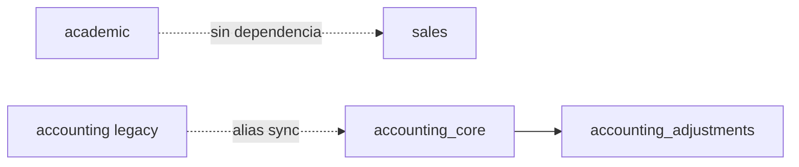

# Módulos SaaS: Ventas, Contabilidad ERP y menú lateral

Documento de referencia para **administradores de plataforma**, **implementadores** y **desarrollo**.  
Describe cómo los códigos del catálogo (`saas_module`) controlan lo que aparece en el menú y en las rutas, y el arreglo aplicado en mayo 2026 (IIUS / prod).

**Relacionado:** catálogo en código → `nodeone/services/saas_catalog_defaults.py` · UI → `/admin/saas-modules` · API → `/api/admin/saas/modules`.

---

## 1. Resumen ejecutivo

| Lo que ves en el menú | Código SaaS que lo controla | No confundir con |
|----------------------|-----------------------------|------------------|
| **Ventas** (Cotizaciones, Facturas) | `sales` | Analítica → pestaña «Ventas» (`analytics`) |
| **Contabilidad** (Plan de cuentas, asientos, CxC…) | `accounting_core` | Módulo legacy `accounting` (mismo toggle vía alias) |
| Submenú **Ajustes** (dentro de Contabilidad) | `accounting_adjustments` | Requiere `accounting_core` activo |
| KPI **Ventas** en **Analítica** | `analytics` | Módulo comercial `sales` |

**Regla:** apagar «Contabilidad» en Módulos **no** debe mostrar el menú Contabilidad aunque Ventas siga encendido. Antes del arreglo, el menú usaba un *fallback* a `sales` cuando `accounting_core` no existía en catálogo.

---

## 2. Problema que se corrigió (mayo 2026)

### Síntoma

En **Admin → Módulos SaaS** se desactivaba **Contabilidad** (`accounting`) y/o se esperaba ocultar contabilidad y ventas, pero en el sidebar seguían visibles **Contabilidad ERP** y/o **Ventas**.

### Causa raíz

1. El menú lateral evaluaba  
   `saas_module_enabled_chain('accounting_core', 'sales')`.  
   Como **`accounting_core` no estaba en la tabla `saas_module`**, la cadena caía al módulo **`sales`**. Si Ventas estaba ON, Contabilidad también se mostraba.

2. El toggle **«Contabilidad»** en Módulos usaba el código legacy **`accounting`**, distinto del código que usa el menú ERP (**`accounting_core`**).

3. **Analítica → Ventas** es independiente: depende de **`analytics`**, no de `sales`.

### Solución

- Alta en catálogo de **`accounting_core`** y **`accounting_adjustments`**.
- Menú y guards de `/admin/accounting-core/*` usan **solo** `accounting_core` (sin fallback a `sales`).
- Migración de vínculos org: `accounting_core` hereda `enabled` de `accounting` si existía fila legacy.
- Alias: al activar/desactivar `accounting` o `accounting_core`, se sincronizan ambos códigos.
- Dependencia SaaS: `accounting_adjustments` → `accounting_core`.

---

## 3. Catálogo de códigos (finanzas)

| Código | Nombre en Módulos | Rutas / menú principal | `is_core` | Toggle por tenant |
|--------|-------------------|-------------------------|-----------|-------------------|
| `sales` | Ventas | `/admin/sales/quotations`, `/admin/accounting/invoices` | No | Sí |
| `accounting` | Contabilidad (legacy) | Alias; sincronizado con `accounting_core` | No | Sí |
| `accounting_core` | Contabilidad ERP | `/admin/accounting-core/*` | No | Sí |
| `accounting_adjustments` | Ajustes contables | `/admin/accounting-core/adjustments` | No | Sí |
| `analytics` | Analítica | `/admin/analytics*` (incl. tablero «Ventas») | No | Sí |

### Dependencias entre módulos



- **`accounting_adjustments`** depende de **`accounting_core`**.
- **`academic`** (Educación / LMS) **no** depende de **`sales`**: podés tener inscripción académica y pagos sin el menú Ventas (cotizaciones). La dependencia `academic → sales` se eliminó en mayo 2026 porque bloqueaba desactivar Ventas en IIUS.

---

## 4. Cómo ocultar menús (operación)

Ruta: **Plataforma → Módulos SaaS** (`/admin/saas-modules?organization_id=<id>`).

| Objetivo | Acción en Módulos |
|----------|-------------------|
| Quitar **Ventas** (cotizaciones y facturas admin) | Desactivar **`sales`** |
| Quitar **Contabilidad ERP** (plan de cuentas, asientos, CxC) | Desactivar **`accounting_core`** o **`accounting` (legacy)** |
| Quitar solo **Ajustes contables** | Desactivar **`accounting_adjustments`** (Contabilidad ERP puede seguir ON) |
| Quitar tablero **Analítica → Ventas** | Desactivar **`analytics`** (no `sales`) |

Verificar que el **selector de empresa** en esa pantalla coincide con la organización activa en la barra lateral.

Los administradores de plataforma (`is_admin`) **no** quedan bloqueados por guards SaaS en rutas; el menú sí respeta flags para coherencia visual.

---

## 5. Implementación técnica

### Evaluación de flags

```python
# app.py — plantillas
saas_module_enabled('sales')
saas_module_enabled('accounting_core')

# Sin fallback a sales (mayo 2026)
# Antes: saas_module_enabled_chain('accounting_core', 'sales')
```

```python
# org_scope.has_saas_module_enabled(organization_id, code)
# - Con fila saas_org_module → usa link.enabled
# - Sin fila → default mod.is_core (False para estos módulos)
```

### Archivos tocados por el arreglo

| Archivo | Rol |
|---------|-----|
| `nodeone/services/saas_catalog_defaults.py` | Catálogo, migración `ensure_accounting_core_org_module_links`, alias `sync_accounting_module_aliases`, dependencia adjustments |
| `saas_admin_api.py` | Side effects al enable/disable; autocatalogo al listar módulos |
| `templates/base.html` | Sidebar Ventas / Contabilidad |
| `templates/partials/erp_app_subnav.html` | Subnav ERP |
| `nodeone/modules/accounting_core/routes.py` | `before_request` guard solo `accounting_core` |
| `nodeone/services/invoice_ledger.py` | Ya usaba `accounting_core` (sin cambio de contrato) |

### Bootstrap idempotente

Se ejecuta en arranque vía `ensure_saas_catalog_full()` y al abrir la lista de módulos en admin:

```bash
cd /opt/easynodeone/app/backend   # o dev/app/backend
/opt/easynodeone/app/.venv/bin/python3 -c "
import sys; sys.path.insert(0, '.')
from app import app
from nodeone.services.saas_catalog_defaults import ensure_saas_catalog_full
with app.app_context():
    ensure_saas_catalog_full(print)
"
```

Tras cambios de catálogo: **reiniciar** el servicio `nodeone`.

### Verificación rápida (org 1 ejemplo)

```bash
/opt/easynodeone/app/.venv/bin/python3 -c "
import sys; sys.path.insert(0, '/opt/easynodeone/app/backend')
from app import app, has_saas_module_enabled
with app.app_context():
    oid = 1
    for c in ('sales','accounting','accounting_core','accounting_adjustments','analytics'):
        print(c, has_saas_module_enabled(oid, c))
"
```

---

## 6. Despliegue: prod → dev

1. Copiar o mergear los archivos de la sección 5 en **`/opt/easynodeone/dev/app`** (rama `develop`).
2. Ejecutar `ensure_saas_catalog_full()` en el entorno destino (staging/dev/prod).
3. Reiniciar `nodeone`.
4. En **Módulos SaaS**, revisar por tenant que `sales` / `accounting_core` queden como negocio requiera (IIUS: contabilidad off; ventas según política).

No editar silos staging/prod/relatic a mano fuera de Git: ver [`REGLAS-DE-TRABAJO.md`](../../REGLAS-DE-TRABAJO.md) y [`CHECKLIST_ACTUALIZACION_Y_CLIENTES.md`](../../docs/CHECKLIST_ACTUALIZACION_Y_CLIENTES.md).

---

## 7. Preguntas frecuentes

**¿Por qué no me deja desactivar Ventas (`sales`)?**  
Antes: si **Educación (`academic`)** estaba activa, la API respondía *«Desactive primero academic»*. Esa dependencia ya no aplica. Si vuelve a fallar, revisá el mensaje rojo en Módulos SaaS (otro módulo dependiente).

**¿Por qué sigo viendo «Ventas» si apagué Contabilidad?**  
Porque el menú comercial **Ventas** depende de **`sales`**, no de contabilidad. Desactivá `sales` en Módulos.

**¿Por qué sigo viendo «Ventas» en Analítica?**  
Es el tablero KPI del módulo **`analytics`**. Desactivá `analytics` si no lo necesitás.

**¿Puedo tener Ventas sin Contabilidad ERP?**  
Sí: `sales` ON y `accounting_core` OFF. Cotizaciones/facturas funcionan; asientos automáticos en validación de factura no aplican (`invoice_ledger` exige `accounting_core`).

**¿Qué pasa si activo `accounting` (legacy)?**  
Se sincroniza **`accounting_core`** al mismo estado (y al desactivar, también se apagan **Ajustes**).

---

## 8. Historial

| Fecha | Cambio |
|-------|--------|
| 2026-05-22 | Corrección IIUS/prod: catálogo `accounting_core` / `accounting_adjustments`, menú sin fallback a `sales`, migración desde `accounting` legacy |
| 2026-05-22 | Eliminada dependencia SaaS `academic → sales` (permitía desactivar Ventas con Educación activa) |

**Documentos ERP relacionados (pueden mencionar fallback antiguo):**  
[`docs/ERP_FASE1_INSTRUCCION_TECNICA_CURSOR.md`](../../docs/ERP_FASE1_INSTRUCCION_TECNICA_CURSOR.md) · [`docs/ERP_FASE0_PREPARACION_FINANCIERA.md`](../../docs/ERP_FASE0_PREPARACION_FINANCIERA.md)
