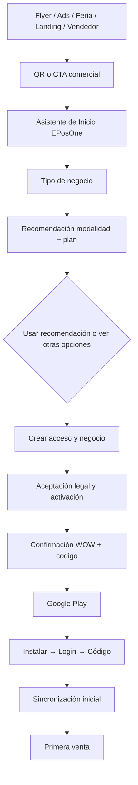
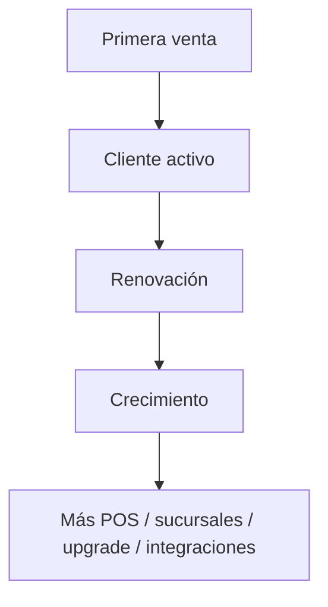

# ADR-024 — Asistente de Inicio EPosOne

| Campo | Valor |
|-------|--------|
| ID | **ADR-024** |
| Título | Asistente de Inicio EPosOne (puerta comercial oficial unificada) |
| Estado | **Aprobado para diseño** · Implementación **pendiente de GO** |
| Fecha | 2026-08-03 |
| Producto | EPosOne |
| Arquitectura | EN1 (invisible) + Portal EPosOne + Aplicación Android |
| Responsable Portal | **CODITO** |
| Responsable APK | **LOCAL** |
| Numeración | **No** usar ADR-019 (ocupado por Jerarquía Administrativa). Este es **ADR-024**. |
| Relacionados | [`EN1_PLATFORM_CONSTITUTION_V1.md`](EN1_PLATFORM_CONSTITUTION_V1.md) · [ADR-023 Trial/Grace](ADR-023-EPOSONE-TRIAL-SUBSCRIPTION-GRACE.md) · Centro legal `/legal/*` · Planes landing EPosOne |
| Este GO | **GO docs** — solo documentación. **Prohibido:** código, rutas, modelos, servicios, UI, deploy, Local, producción. |

---

## 0. Modo estricto (obligatorio)

No implementar, no crear rutas, no tocar modelos, no modificar servicios, no desplegar y no escribir código hasta recibir un **GO explícito** para cada fase:

| GO | Fase autorizada |
|----|-----------------|
| `GO docs` | Esta documentación (completada con este ADR) |
| `GO diseño` | Wireframes / UX / copy / preview |
| `GO implementación` | Código solo en Dev EN1 |
| `GO Local` | Handoff con LOCAL |
| `GO deploy` | Despliegue al silo indicado |

Cada GO autoriza **solo** la fase indicada. El silencio no es autorización.

---

## 1. Nombre oficial

El nombre canónico de la experiencia es:

**Asistente de Inicio EPosOne**

### No utilizar como nombre oficial

- Onboarding comercial  
- Wizard de registro  
- Registro EPosOne  
- Alta de organización  
- Provisioning Wizard  
- Asistente EN1  
- Configurador de suscripción  

### Ruta técnica (futura, no implementar en este GO)

`https://eposone.easytech.services/start`

`/start` es solo ruta interna. En la interfaz se usarán expresiones como:

- Comenzar con EPosOne  
- Empieza con EPosOne  
- Preparar mi negocio  
- Comenzar ahora  
- Crear mi acceso  

### Por qué no se llama “onboarding”

Onboarding implica que el cliente **ya decidió** usar el producto.  
Este asistente cubre algo más amplio: empieza **antes** de que exista un cliente formal (flyer, Google, anuncio, feria, recomendación). Por eso el enfoque es **Asistente de Inicio**, no onboarding operativo ni registro administrativo.

---

## 2. Naturaleza del asistente

El Asistente de Inicio EPosOne es el **proceso comercial oficial de entrada** al producto.

Puede comenzar desde:

- Un flyer  
- Un código QR  
- La landing de EPosOne  
- Una campaña digital  
- Google Ads / Facebook / Instagram  
- Una feria  
- Un vendedor  
- Un correo  
- Una recomendación  
- El sitio corporativo de EasyTech  

**No es** únicamente un proceso posterior a la compra.  
**No es** únicamente un proceso de registro.  
**No es** el onboarding operativo del POS.

---

## 3. Objetivo principal

Llevar a una persona desde:

> “Estoy interesado en EPosOne”

hasta:

> “Ya tengo mi negocio preparado, instalé la aplicación y puedo avanzar hacia mi primera venta.”

El asistente debe reducir al mínimo: formularios, decisiones, lenguaje técnico, pasos innecesarios, intervención humana, abandono y dudas sobre el siguiente paso.

---

## 4. Principio rector

Toda decisión de diseño deberá responder:

> ¿Esto ayuda a que un comerciante empiece con EPosOne más rápido, con menos fricción y sin conocer la arquitectura interna?

Si la respuesta es **no**, esa funcionalidad **no pertenece** al Asistente de Inicio.

### Instrucción de interpretación (para desarrolladores)

La dirección es correcta. El Asistente de Inicio EPosOne es el **proceso comercial oficial**, no un simple onboarding. Debe **recomendar, no obligar**; **simplificar, no configurar**; **preparar al cliente para instalar EPosOne**, dejando toda la configuración operativa (productos, impresoras, cajeros, impuestos, etc.) para la aplicación y los asistentes específicos del POS. Este ADR define explícitamente qué hace y qué **no** hace el Asistente para evitar que con el tiempo se convierta en un ERP dentro del registro.

---

## 5. Autoridad de la decisión

Este ADR define:

- La única puerta comercial oficial  
- El orden general del recorrido  
- Las responsabilidades de Codito y Local  
- Los límites del asistente  
- La estrategia de recomendación  
- El lenguaje visible al cliente  
- La experiencia de cierre  
- Los entregables previos al código  

No se podrá alterar el flujo de forma unilateral. Los cambios estructurales requieren: revisión, justificación, nuevo ADR o modificación formal, y **GO explícito**.

---

## 6. Un único punto de entrada

Todos los canales comerciales convergen en el mismo asistente.

**Prohibido crear:** formulario para landing, otro para ferias, otro para vendedores, otro para campañas, otro para QR, otro para promociones.

```text
Flyer / Landing / Campaña / Feria / Vendedor / Correo / Anuncio
                              ↓
              Asistente de Inicio EPosOne
```

Los canales podrán enviar parámetros de atribución (`/start?source=flyer|google|feria|vendedor`) **sin** cambiar la experiencia principal. La implementación de atribución queda fuera del GO documental; el diseño debe **permitirla**.

---

## 7. Branding

Toda la experiencia: identidad, colores, logo, tipografía, iconografía, ilustraciones y lenguaje **EPosOne**.

**Prohibido mostrar al usuario:** marca EN1, EasyNodeOne, Tenant, Organization Domain, Registry, Provisioning, Bootstrap, Entitlement, License Domain, Subscription Domain, ADR, estados internos de licencia, nombres técnicos de APIs/tablas, códigos internos de planes.

EN1 es plataforma **invisible**. El cliente compra y utiliza **EPosOne**.

---

## 8. Lenguaje comercial

**Usar:** tu negocio, tu punto de venta, tu acceso, tu plan recomendado, preparar EPosOne, descargar la aplicación, comenzar a vender, administrar desde cualquier lugar, operar localmente.

**Evitar en UI:** crear tenant, crear organización, provisionar dispositivo, generar entitlement, asociar suscripción, activar resource allocation, seleccionar SKU, ejecutar bootstrap, sincronizar registry.

Aunque esas operaciones ocurran internamente, **no** deben aparecer en la interfaz.

---

## 9. Modalidades visibles

No usar “Cloud” como nombre comercial principal. Presentar por **beneficio**:

| Título comercial | Etiqueta secundaria | Planes |
|------------------|---------------------|--------|
| Administra tu negocio desde cualquier lugar | EPosOne conectado | Starter, Business, Enterprise |
| Opera localmente desde un solo punto de venta | EPosOne Standalone | Standalone |

No presentar una decisión técnica “Cloud vs Standalone” sin explicación de beneficio.

---

## 10. Planes vigentes

| Modalidad o plan | Precio mensual |
|------------------|----------------|
| EPosOne Standalone | **USD 15.00** |
| Starter | **USD 29.95** |
| Business | **USD 39.95** |
| Enterprise | **USD 79.95** |

**No utilizar** precios previos (p. ej. USD 49.95 u otros). No modificar precios sin GO comercial.

---

## 11. Política de Trial

### Starter, Business y Enterprise

- Trial de **15 días**  
- Acceso al producto correspondiente al plan  
- Sin tarjeta de crédito  
- La misma instalación continúa si el cliente se suscribe  
- Después del Trial inicia la facturación  
- Grace Period de **7 días** (ADR-023)  
- La suspensión **no** elimina automáticamente los datos  

### Standalone

- **No** incluye Trial automático  
- Se activa al contratar  
- Activación inmediata tras confirmar contratación y pago correspondiente  
- No presentarlo como versión inferior; es modalidad **local**  

### En el asistente no mostrar estados internos

`TRIAL` · `ACTIVE` · `GRACE` · `SUSPENDED`

Sí mensajes comerciales: “15 días gratis”, “Activación inmediata”, “Suscripción activa”, “Pago pendiente”, “Actualiza tu método de pago”.

---

## 12. Recomendación, no selección obligatoria

El asistente **no** debe comenzar mostrando cuatro tarjetas de precios ni obligar a estudiar Starter/Business/Enterprise.

Flujo correcto:

```text
Tipo de negocio
    ↓
EPOSOne recomienda modalidad y plan
    ↓
El usuario acepta o revisa otras opciones
```

Pantalla principal: **una sola recomendación**.

- CTA principal: **Usar esta recomendación**  
- CTA secundario: **Ver otras opciones**  

Solo si abre “Ver otras opciones” podrá comparar otras modalidades o planes.

---

## 13. Motor de recomendación

El ADR define la **existencia** del mecanismo; **no** congela reglas comerciales rígidas.

**Entrada inicial posible:** tipo de negocio.  
**Señales futuras posibles:** sucursales, cajas, empleados, admin web, integraciones, volumen, preferencia local/conectada.

**Salida conceptual:**

```json
{
  "modality": "connected",
  "plan_code": "business",
  "reason_copy": "Recomendado para cafeterías y restaurantes que necesitan control, sincronización y crecimiento."
}
```

Ejemplos (orientativos, **no** inmutables): Cafetería → Business; Mini súper → Starter; Cadena → Enterprise.

> Las reglas de recomendación podrán evolucionar sin modificar la estructura general del Asistente de Inicio.

No crear un motor de recomendación paralelo si el catálogo y los planes ya están gestionados por los servicios existentes.

---

## 14. Flujo oficial

```text
Interés
    ↓
QR comercial o CTA
    ↓
Bienvenida
    ↓
Tipo de negocio
    ↓
Recomendación de modalidad + plan
    ↓
Usar recomendación  ó  Ver otras opciones
    ↓
Crear tu acceso
    ↓
Confirmar datos esenciales
    ↓
Aceptar términos legales
    ↓
Crear negocio y activar modalidad
    ↓
Confirmación WOW
    ↓
Descargar desde Google Play
    ↓
Instalar
    ↓
Abrir EPosOne
    ↓
Iniciar sesión
    ↓
Ingresar o escanear código
    ↓
Sincronización inicial
    ↓
Bienvenido a EPosOne
    ↓
Configuración operativa del POS
    ↓
Primera venta
    ↓
Cliente activo
    ↓
Renovación
    ↓
Crecimiento
```

Este flujo es la **referencia oficial**. No podrá modificarse sin nuevo ADR.

---

## 15. Orden de pantallas

### Pantalla 1 — Bienvenida

- Título: Empieza con EPosOne  
- Subtítulo: Prepara tu negocio y descarga tu punto de venta en pocos minutos.  
- CTA: Comenzar  
- No pedir datos  

### Pantalla 2 — Tipo de negocio

Una sola decisión. Opciones: Restaurante, Cafetería, Bar, Tienda, Mini súper, Farmacia, Servicios, Otro.  
**No** pedir: dirección, RUC, teléfono fiscal, empleados, sucursales, impuestos, productos, inventario.

### Pantalla 3 — Recomendación

Mostrar: modalidad, plan, precio, beneficio, razón breve, trial si aplica.  
CTA: Usar esta recomendación · Ver otras opciones.  
No tabla compleja automática.

### Pantalla 4 — Otras opciones (opcional)

Solo si el usuario lo pide. Permite Standalone / Starter / Business / Enterprise. Diferencias claras, sin tabla técnica de veinte filas.

### Pantalla 5 — Crear tu acceso

No llamarla “Registro de usuario”. Solo: Nombre, Correo, Contraseña (+ teléfono opcional). CTA: Continuar.

### Pantalla 6 — Datos mínimos del negocio

Nombre del negocio, país, tipo ya seleccionado, nombre comercial. Sin config operativa.

### Pantalla 7 — Resumen y aceptación

Negocio, modalidad, plan, precio, trial/activación. Aceptar: Términos, Privacidad, EULA, términos Standalone si aplica, Trial/reembolsos cuando corresponda.  
Consentimientos registran: usuario, documento, versión, fecha/hora, IP (si procede), canal.  
CTA: **Preparar mi EPosOne** (evitar “Crear tenant / Crear suscripción”).

### Pantalla 8 — Confirmación WOW

Sensación de logro, no comprobante administrativo.

- ¡Bienvenido a EPosOne! Tu negocio ya está preparado.  
- Checks: Acceso creado · Negocio preparado · Plan activado o Trial iniciado · Código de instalación listo  
- CTA principal: Descargar en Google Play  
- CTA secundario: Ver mi código de instalación (alfanumérico / QR / copiar; recuperable después)

### Pantalla 9 — Guía de instalación

Pasos: Descarga · Instala · Inicia sesión · Escanea o ingresa código · Espera configuración inicial.  
CTA “Abrir EPosOne” cuando exista. **No** enviar al Dashboard EN1.

---

## 16. Persistencia y recuperación

El usuario debe poder abandonar y retomar. Contemplar: cierre de navegador, cambio de dispositivo, pérdida de conexión, enlace por correo, último paso válido, evitar duplicar negocios/suscripciones, idempotencia.

- Antes de crear acceso: progreso temporal en navegador.  
- Después: progreso vinculado a la cuenta.  
No empezar desde cero si ya completó pasos válidos.

---

## 17. Navegación

Cada pantalla: una acción principal; como máximo una secundaria; Atrás cuando no genere inconsistencias; progreso; errores claros; guardado automático cuando sea posible.

No obligar “Paso 1 de 9” si pasos condicionales confunden. Preferir etapas: **Tu negocio · Tu recomendación · Tu acceso · Todo listo**. UX final en wireframes (`GO diseño`).

---

## 18. Principio de no bloqueo

El asistente **nunca** bloqueará por falta de: impresora, productos, cajeros, fiscal, impuestos, inventario, mesas, cocina, KDS, hardware, lectores, recibos, logos.

El asistente deja preparado: acceso, identidad del negocio, modalidad, plan, trial/activación, aceptación legal, licencia/entitlement, código, acceso a Google Play.  
La configuración operativa ocurre **después**.

---

## 19. Lo que el asistente NO hace

El Asistente de Inicio EPosOne **no**:

- Administra productos / importa catálogos / crea inventario inicial  
- Configura impresoras (Bluetooth/IP), cocina, bar, KDS  
- Crea cajeros / PIN / roles operativos  
- Configura impuestos, facturación electrónica, documentos fiscales  
- Configura mesas, salón, promociones, métodos de pago operativos  
- Abre cajas/turnos, realiza ventas, ejecuta cierres  
- Configura hardware / administra sucursales avanzadas  
- Abre el Dashboard EN1 como destino final  
- Obliga a completar el POS antes de descargar  
- Reemplaza el onboarding operativo dentro de la aplicación  

Eso pertenece a: EPosOne Local, asistentes operativos posteriores, configuración administrativa, instalación/soporte.

---

## 20. Responsabilidades de CODITO

Ruta comercial, branding web, experiencia del asistente, recomendación, creación de acceso e identidad del negocio, modalidad/plan, trial/suscripción cuando aplique, entitlement, licencia, código, consentimientos, confirmación, CTA Play, recuperación, handoff documentado a Local, eventos de analítica (diseño), protección contra duplicados, idempotencia.

**Reutilizar servicios existentes.** No duplicar modelos, tablas, dominios, reglas de suscripción, licencias, organizaciones ni provisioning.

---

## 21. Responsabilidades de LOCAL

Instalación, login, código, validación, bootstrap, descarga de configuración, sync inicial, dispositivo listo, bienvenida, onboarding operativo, preparación para primera venta.

Local **no** registra comercialmente, no selecciona planes, no crea organizaciones, no gestiona pagos, no muestra precios, no acepta términos SaaS, no crea suscripciones.

Cambios en Local requieren **GO Local**.

---

## 22. Contrato de handoff CODITO → LOCAL

Local debe recibir al menos: usuario autenticable; negocio creado; modalidad; plan; trial o suscripción válida; entitlement; código válido; estado apto para provisioning; configuración básica; branding/contexto de producto.

El contrato documentará: identificador; duración; usos permitidos; expiración; reutilización; revocación; regeneración; errores; idempotencia; auditoría.

**No** inventar un segundo mecanismo de códigos si ya existe provisioning.

---

## 23. Dos tipos de QR

| Tipo | Destino | Uso |
|------|---------|-----|
| **QR comercial** | `https://eposone.easytech.services/start` | Flyers, campañas, ferias, landing, vendedores, redes — inicia el Asistente |
| **QR técnico** | Google Play (o página oficial de descarga) | Ya registrado, reinstalación, segundo dispositivo, cambio de equipo, soporte |

El flyer comercial principal prioriza el **QR comercial**.

---

## 24. Analítica (diseño; no obligatorio implementar todos en V1)

**Adquisición:** `start_page_viewed`, `start_assistant_started`, `source_detected`, `qr_commercial_scanned`  

**Recomendación:** `business_type_selected`, `recommendation_generated`, `recommendation_accepted`, `other_options_opened`, `alternative_plan_selected`  

**Conversión:** `access_creation_started`, `access_created`, `business_created`, `legal_terms_accepted`, `trial_started`, `subscription_created`, `installation_code_generated`  

**Instalación:** `play_cta_clicked`, `app_opened`, `login_completed`, `installation_code_submitted`, `initial_sync_completed`, `device_ready`  

**Activación:** `first_cashier_created`, `first_shift_opened`, `first_sale_completed`  

**Retención:** `trial_converted`, `subscription_renewed`, `plan_upgraded`, `additional_pos_added`, `additional_branch_added`  

No incluir datos sensibles innecesarios.

---

## 25. Diagrama oficial (dos capas)

### Capa A — Adquisición y activación



### Capa B — Ciclo del cliente



El asistente **no** implementa necesariamente toda la Capa B. El ecosistema debe diseñarse con esa continuidad. El éxito **no** es solo crear una cuenta ni solo la primera venta aislada: es crear un **cliente recurrente**.

---

## 26–28. Experiencia móvil, rendimiento y seguridad

**Móvil primero** (QR): carga rápida, botones grandes, campos mínimos, sin tablas anchas, sin hover obligatorio, contraste accesible. También desktop/tablet.

**Rendimiento:** sensación inmediata; SPA opcional (no dogmática); respetar arquitectura del Portal EPosOne; no introducir framework nuevo sin GO técnico.

**Seguridad:** CSRF, rate limiting, validación de correo, contraseñas seguras, anti-abuso, no exponer códigos públicamente, expiración de enlaces, idempotencia, auditoría, PII, no loguear secretos, consentimiento versionado, aislamiento por organización, validación de host de producto. Usar autenticación existente; no inventar auth paralela.

---

## 29–30. Errores y abandono

Wireframes deben cubrir: correo ya registrado, cuenta/negocio existente, plan no disponible, fallos trial/suscripción/código, código expirado, conexión interrupida, reintentos, otro dispositivo.

Mensajes comerciales (nunca `IntegrityError…`).

Definir abandono en: tipo de negocio, recomendación, crear acceso, aceptación, post-negocio, pre-descarga, post-descarga sin activar, post-instalar sin código. Recuperar proceso / enlace de continuación / anti-duplicados. Campañas de recuperación = GO aparte.

---

## 31. Legal

Enlazar: Términos, Privacidad, EULA, Reembolsos, Trial, Standalone, eliminación de datos (`/legal/*`). Abrir sin perder progreso. Casillas **no** preseleccionadas. Conservar evidencia de aceptación.

---

## 32. Reutilización futura

Shell reutilizable (layout, progreso, recomendación, acceso, legal, confirmación, handoff) para EM+Acción, ePayroll, etc.  
**Reutilizable por diseño, sin sobrearquitectura prematura.**

---

## 33. Restricciones absolutas

Codito **no** debe: implementar sin GO; cambiar precios/Trial/Grace; crear planes; renombrar planes; motor de licencias paralelo; org alternativa; mostrar EN1/jerga; config POS; flujos por canal; Dashboard EN1 al final; forzar plan manual; bloquear por hardware/productos/impresoras; publicar a producción; tocar Local; modificar provisioning sin revisión; reutilizar ADR-019; commit no solicitado; interpretar silencio como autorización.

---

## 34. Fases y GO (recordatorio)

| Fase | GO | Incluye | No incluye |
|------|-----|---------|------------|
| A Documentación | `GO docs` | Este ADR + diagramas + límites | Código, UI, DB, deploy |
| B Diseño | `GO diseño` | Wireframes, UX, copy, preview | Implementación productiva |
| C Implementación | `GO implementación` | Dev EN1, integración servicios | Producción, Local |
| D Local | `GO Local` | Login/código/sync con LOCAL | Unilateral Codito |
| E Deploy | `GO deploy` | Silo autorizado tras checklist | PRD sin GO específico |

---

## 35. Entregables obligatorios antes del código

ADR completo · Diagrama E2E · Wireframes · Flujo navegable · Copy · Errores · Abandono · Recomendación · Otras opciones · WOW · Contrato Codito→Local · Mapa integración · Confirmación no-modelos-paralelos · Eventos analítica · Checklist seguridad · Checklist legal · Preview móvil/desktop · Confirmación precios · Confirmación Trial/Standalone.

*(Wireframes y previews = `GO diseño`, no este GO docs.)*

---

## 36. Criterios de aceptación documental

Un desarrollador nuevo debe entender sin preguntar:

- Qué es el Asistente de Inicio y por qué no es un registro  
- Por qué EN1 es invisible  
- Cómo se recomienda un plan y que se puede cambiar  
- Qué hace Codito / Local  
- Qué no pertenece al asistente  
- Que no se configuran productos ni impresoras  
- Que el flujo puede retomarse  
- Que existen dos QR  
- Que el éxito no es solo crear una cuenta  
- Que el ciclo continúa hasta renovación y crecimiento  
- Que no puede implementar sin GO  

---

## 37. Criterios de aceptación de diseño (futuros)

Móvil · una acción principal por pantalla · sin jerga · recomienda no obliga · otras opciones · pocos datos · branding EPosOne · no Dashboard EN1 · confirmación clara · guía Play · retoma · errores · legal · handoff Local.

---

## 38. Criterios de aceptación funcional (futuros)

QR → tipo → recomendación → aceptar/cambiar → acceso → negocio → legal → trial/Standalone → código → Play → login → código → sync → inicio operativo sin intervención ETS.

---

## 39. Estado de este GO docs

| Ítem | Estado |
|------|--------|
| ADR-024 formal | **Entregado** (este documento) |
| Diagrama Mermaid Capa A + B | **Incluido** (§25) |
| Flujo, límites, handoff conceptual, precios, trial | **Incluidos** |
| Código / `/start` / UI / DB / deploy / Local | **No iniciado** — requiere GO de fase |

---

## 40. Siguiente acción autorizada

Únicamente uno de:

`GO diseño` · `GO implementación` · `GO Local` · `GO deploy`

*(Más `GO docs` solo si se pide enmendar este ADR.)*

---

*ADR-024 — Aprobado para diseño · 2026-08-03 · GO docs ejecutado. Sin implementación.*
