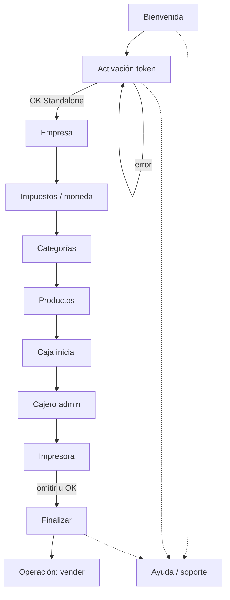

# ADR-033 — Standalone Onboarding Assistant

| Campo | Valor |
|-------|--------|
| ID | **ADR-033** |
| Título | Asistente de onboarding local — EPosOne Standalone (Autogestionado) |
| Estado | **PROPOSED (completo para revisión)** — handoff LOCAL · **sin** GO de código |
| Versión | 1.1 |
| Fecha | Agosto 2026 |
| Autor | Arquitectura EN1 / EPosOne · especificación UX para LOCAL |
| Impacto | EPosOne APK |
| Implementación de código | **NO autorizada** |
| Responsable diseño APK | **LOCAL** |
| Complementa | [ADR-032](ADR-032-PRODUCT-IMPLEMENTATION-MODEL.md) · [ADR-031](ADR-031-EN1-COMMERCIAL-DOMAIN-ARCHITECTURE.md) · [ADR-035](ADR-035-ACTIVATION-LICENSE-TOKEN-QR.md) |
| Gate | [EN1_COMMERCIAL_IMPLEMENTATION_GATE.md](EN1_COMMERCIAL_IMPLEMENTATION_GATE.md) |
| Relacionados | [ADR-001](ADR-001-EPOSONE-STANDALONE.md) · [ADR-027](ADR-027-EPOSONE-ONBOARDING-UNIFICADO-V1.md) · [ADR-021](ADR-021-EPOSONE-INSTALLATION-LIFECYCLE.md) · [ADR-024](ADR-024-EPOSONE-START-ASSISTANT.md) |

---

## 1. Objetivo

Diseñar la **experiencia de usuario** del asistente Standalone para que un cliente pueda **empezar a vender sin asistencia**, tras activar con token (ADR-035).

**Solo UX / flujo.** No implementar. No adelantarse a contratos HTTP definitivos de CODITO (034/035).

Mantener el flujo APK vigente (Register / Bootstrap / Gate / Welcome / licenciamiento) hasta aprobación + GO.

---

## 2. Separación de capas

```text
Registro comercial (web /start)     → ADR-031 / 024
Activación (token)                  → ADR-035
Asistente local (este ADR)          → negocio en dispositivo
Provisioning/bootstrap Connected    → ADR-034 (no aplica aquí)
```

---

## 3. Flujo UX (diagrama)



---

## 4. Pantallas

| # | Pantalla | Propósito | Validaciones mínimas | Recuperación |
|---|----------|-----------|----------------------|--------------|
| 1 | **Bienvenida** | Expectativa Standalone; tiempo estimado; link ayuda | — | Siempre accesible atrás desde pasos tempranos |
| 2 | **Activación** | Pegar / escanear QR / deep link | Token no vacío; errores tipados ADR-035 | Reintentar; “pegar de nuevo”; ayuda |
| 3 | **Empresa** | Nombre comercial, datos básicos | Nombre requerido | Guardar borrador local |
| 4 | **Impuestos** | Tasas / moneda | Moneda + al menos regla default | Defaults sensatos por país |
| 5 | **Categorías** | ≥1 categoría | Nombre único local | Crear “General” sugerida |
| 6 | **Productos** | ≥1 producto vendible | Nombre + precio ≥ 0 | Plantilla rápida |
| 7 | **Caja** | Caja local | Nombre | Default “Caja 1” |
| 8 | **Cajero** | Admin + PIN | PIN 4–6 dígitos; no trivial | Confirmar PIN |
| 9 | **Impresora** | Selección / prueba | Omitible con aviso | “Configurar después” |
| 10 | **Finalizar** | Checklist + CTA vender | Pasos 2–8 OK; 9 opcional | Editar paso desde resumen |

---

## 5. Experiencia de instalación (análisis)

### 5.1 Cantidad de pasos

- **10** pantallas; **9** obligatorias + impresora omitible.  
- Objetivo: **&lt; 15 minutos** para negocio simple (1 categoría, 3 productos).  
- Atajos: “usar ejemplos” en categorías/productos (recomendación UX).

### 5.2 Navegación

- Stepper visible (paso X de N).  
- Atrás permitido hasta Finalizar; tras “Empezar a vender”, edición vía Ajustes.  
- No forzar cuenta cloud ni sync.

### 5.3 Validaciones

- Bloquear “Siguiente” solo en campos críticos.  
- Mensajes en lenguaje de negocio, no códigos HTTP crudos.  
- Mapear errores de activación (`expired`, `used`, …) a copy claro.

### 5.4 Recuperación

- Persistencia local del progreso del asistente (draft).  
- Si mata la app a mitad: reanudar en el último paso incompleto.  
- Re-activación solo si licencia local ausente/inválida.

### 5.5 Offline

- Post-activación (claims ya persistidos): resto del asistente **100% local**.  
- Activación: online preferido; si ADR-035 define modo offline firmado, LOCAL lo adoptará en GO — hasta entonces asumir online para redeem.

---

## 6. Recursos de ayuda (dónde aparecen)

| Recurso | Ubicación UX |
|---------|----------------|
| Manual PDF | Bienvenida · menú “?” global · Finalizar |
| Videos | Bienvenida · paso contextual (p. ej. Impresora) |
| FAQ | Menú ayuda · Activación (errores frecuentes) |
| Base de conocimiento | Deep link externo desde ayuda |
| **Solicitar soporte** | Ayuda global · Finalizar · error bloqueante |

### Copy obligatorio — soporte

Toda CTA de soporte debe dejar claro que la asistencia:

> **puede estar incluida en el plan contratado** o prestarse como **servicio profesional adicional** (instalación remota/presencial, migración, capacitación).

No presentar el soporte premium como “gratis ilimitado” por defecto.

---

## 7. Recomendaciones de usabilidad

1. Un campo primario por pantalla cuando sea posible.  
2. Teclado numérico en PIN y precios.  
3. Escaneo QR con fallback manual siempre visible.  
4. No mezclar “crear cuenta EN1” dentro del asistente.  
5. Celebración breve en Finalizar; CTA único “Empezar a vender”.  
6. Modo oscuro/contraste: seguir design system APK vigente.  
7. Accesibilidad: tamaños táctiles ≥ 48 dp; lecturas de error.  
8. Telemetría mínima (opt-in): paso abandonado — solo tras GO privacidad.

---

## 8. Qué NO modificar todavía (LOCAL)

Hasta contratos publicados/aprobados (Gate):

- Register  
- Bootstrap  
- Gate 2  
- Provisioning  
- Licenciamiento vigente  
- Welcome  

No implementar: asistente nuevo, QR definitivo, token canónico, refactor, borrado de código muerto.

---

## 9. Comentarios de arquitectura (para LOCAL)

1. El asistente es **implementación autogestionada**, no registro comercial.  
2. Token ≠ QR; diseñar UX multi-canal desde el día 1 del diseño.  
3. No preguntar Standalone vs Connected.  
4. No crear expectativa de sync cloud en este flujo.  
5. Coordinar copy de errores con ADR-035 § errores.

---

## 10. Entregables de este ADR

- [x] Flujo UX y pantallas  
- [x] Diagrama del asistente  
- [x] Validaciones / recuperación / offline  
- [x] Mapa de ayuda y copy de soporte  
- [x] Recomendaciones de usabilidad  

Wireframes visuales de alta fidelidad: responsabilidad LOCAL (fuera del repo EN1 salvo que se anexen después).

---

## 11. Estado

**PROPOSED (completo para revisión)** v1.1.

Implementación APK solo tras aprobación de **033 + 034 + 035** y GO explícito por fases.
