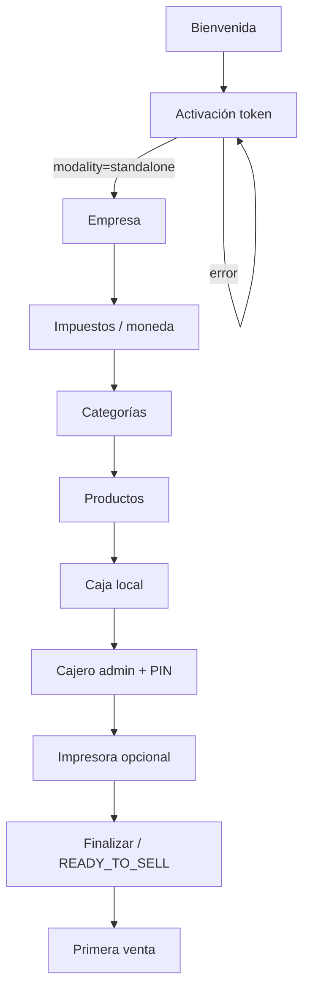

# ADR-033 — Standalone Onboarding Assistant

| Campo | Valor |
|-------|--------|
| ID | **ADR-033** |
| Título | Asistente de onboarding local — EPosOne Standalone (Autogestionado) |
| Estado | **ACCEPTED (arquitectura)** — 7 ago 2026 |
| Versión | 1.2 |
| Fecha | Agosto 2026 |
| Autor | Arquitectura EN1 / EPosOne |
| Impacto | EPosOne APK (LOCAL) |
| Implementación de código | **Autorizada solo con GO explícito de implementación** (Gate liberado; no implica GO automático) |
| Responsable implementación APK | **LOCAL** |
| Complementa | [ADR-032](ADR-032-PRODUCT-IMPLEMENTATION-MODEL.md) · [ADR-031](ADR-031-EN1-COMMERCIAL-DOMAIN-ARCHITECTURE.md) · [ADR-035](ADR-035-ACTIVATION-LICENSE-TOKEN-QR.md) |
| Gate | [EN1_COMMERCIAL_IMPLEMENTATION_GATE.md](EN1_COMMERCIAL_IMPLEMENTATION_GATE.md) (**LIBERADO**) |
| Relacionados | [ADR-001](ADR-001-EPOSONE-STANDALONE.md) · [ADR-027](ADR-027-EPOSONE-ONBOARDING-UNIFICADO-V1.md) · [ADR-021](ADR-021-EPOSONE-INSTALLATION-LIFECYCLE.md) · [ADR-024](ADR-024-EPOSONE-START-ASSISTANT.md) |

---

## 1. Objetivo

Definir el **asistente de primera instalación Standalone** en EP1 para que el cliente pueda llegar a **READY_TO_SELL** sin asistencia ETS y **sin** Bootstrap Connected.

Camino canónico:

```text
QR comercial (/start) → Cliente ETS → Suscripción/Licencia Standalone (7 días gracia)
  → código email + APK → EP1 valida código (ADR-035)
  → asistente Standalone local → negocio (Café Amor) → PIN → caja → READY_TO_SELL
```

> **Enmienda P0:** EN1 **no** crea Café Amor / Org operativa. El negocio nace en EP1. Ver [`EN1_START_STANDALONE_P0_REFACTOR_REPORT.md`](EN1_START_STANDALONE_P0_REFACTOR_REPORT.md).

---

## 2. Decisiones inequívocas

| # | Norma |
|---|--------|
| 1 | Standalone = implementación **autogestionada** (ADR-032). |
| 2 | **EN1** maneja: Cliente, Organización comercial, Contrato, Suscripción, Licencia, **autorización/token** de activación (ADR-035). |
| 3 | **EN1 NO crea** Sucursal / POS / Caja (ni cajero cloud) para Standalone. |
| 4 | **EP1** ejecuta el asistente local y crea/configura **localmente** lo mínimo para vender. |
| 5 | Existe criterio explícito **READY_TO_SELL** (§6). |
| 6 | Interrupción del asistente → **reanudación** desde borrador local (§5.4). |
| 7 | Operación local posterior **no depende** de Bootstrap Connected ni sync cloud diaria. |
| 8 | EP1 **no pregunta** Standalone vs Connected; lo fija el token (ADR-035). |

---

## 3. Separación de capas

```text
Registro comercial (web /start)     → ADR-031 / 024
Activación (token / QR técnico)     → ADR-035
Asistente local (este ADR)          → negocio en dispositivo
Connected (árbol EN1 + bootstrap)   → ADR-034 — NO aplica a este camino
```

---

## 4. Flujo UX



---

## 5. Pantallas

| # | Pantalla | Mínimo | Recuperación |
|---|----------|--------|--------------|
| 1 | Bienvenida | Contexto + ayuda | — |
| 2 | Activación | Token (pegar/QR/link); claims ADR-035 | Reintento; copy de errores |
| 3 | Empresa | Nombre comercial | Draft local |
| 4 | Impuestos / moneda | Moneda + regla default | Defaults por país |
| 5 | Categorías | ≥1 | Sugerir “General” |
| 6 | Productos | ≥1 vendible | Plantilla rápida |
| 7 | Caja | Caja **local** (no OrgUnit EN1) | Default “Caja 1” |
| 8 | Cajero admin | PIN 4–6 no trivial | Confirmar PIN |
| 9 | Impresora | Omitible | “Después” |
| 10 | Finalizar | Checklist → CTA vender | Editar desde resumen |

### 5.4 Reanudación (obligatoria)

- Persistencia local del progreso (`assistant_draft`).  
- Al reabrir EP1: si hay draft incompleto y licencia local válida → **reanudar** en el último paso incompleto.  
- Si licencia local ausente/inválida → volver a Activación.  
- No perder datos de pasos ya completados salvo reset explícito del usuario.

### 5.5 Offline

- Tras activación exitosa (claims persistidos): pasos 3–10 **100% locales**.  
- Activación: online según ADR-035 (`redeem`); sin Bootstrap Connected.

---

## 6. READY_TO_SELL (criterio de hecho)

EP1 alcanza **READY_TO_SELL** cuando **todas** son verdaderas:

| # | Condición |
|---|-----------|
| 1 | Activación Standalone OK (`modality=standalone` en claims) |
| 2 | Empresa con nombre |
| 3 | Moneda + impuesto/regla fiscal mínima |
| 4 | ≥1 categoría |
| 5 | ≥1 producto vendible (precio ≥ 0) |
| 6 | ≥1 caja local |
| 7 | ≥1 cajero admin con PIN usable |
| 8 | Usuario confirma Finalizar / “Empezar a vender” |

**No** se exige: impresora, sync EN1, bootstrap cloud, Sucursal/POS/Caja en EN1, catálogo cloud.

Al alcanzar READY_TO_SELL, EP1 puede procesar la **primera venta** en modo local.

---

## 7. Ayuda y soporte

Manual PDF, videos, FAQ, KB y **Solicitar soporte** en Bienvenida / “?” / Finalizar / errores bloqueantes.

Copy obligatorio: la asistencia **puede estar incluida en el plan** o ser **servicio profesional adicional**.

---

## 8. Fuera de alcance de este ADR

- Crear árbol ops en EN1.  
- Flujo Connected (ADR-034).  
- Emisión de tokens (ADR-035 / CODITO).  
- Registro comercial web (ADR-024).  

Código APK: solo tras **GO de implementación** explícito (Gate ya liberado no sustituye ese GO).

---

## 9. Enmiendas / precedencia

| Doc | Efecto |
|-----|--------|
| ADR-032 | Este ADR materializa Autogestionada. |
| ADR-027 | Camino Standalone **no** exige Provision→Bootstrap cloud; enmienda § ciclo (§ en ADR-027). |
| ADR-024 | `/start` = comercial; configuración operativa de venta → este asistente, no el web. |
| ADR-021 | Estados APK Standalone pueden llegar a `ready` vía asistente local sin bootstrap Connected. |

---

## 10. Estado

**ACCEPTED (arquitectura)** — 7 ago 2026 · v1.2.
