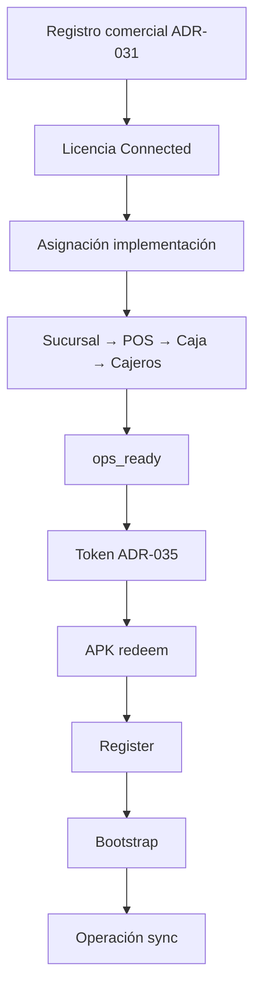

# ADR-034 — Connected Provisioning Flow

| Campo | Valor |
|-------|--------|
| ID | **ADR-034** |
| Título | Flujo de aprovisionamiento Connected — Implementación Asistida |
| Estado | **ACCEPTED (arquitectura)** — 7 ago 2026 |
| Versión | 1.2 |
| Fecha | Agosto 2026 |
| Autor | Arquitectura EN1 / EPosOne · CODITO |
| Impacto | EN1 · Portal ETS · Device API · EPosOne APK (consumo) |
| Implementación de código | **Autorizada solo con GO explícito de implementación** |
| Pregunta rectora | **¿Cómo materializa ETS un EPosOne Connected antes de que el dispositivo opere?** |
| Complementa | [ADR-032](ADR-032-PRODUCT-IMPLEMENTATION-MODEL.md) · [ADR-031](ADR-031-EN1-COMMERCIAL-DOMAIN-ARCHITECTURE.md) · [ADR-035](ADR-035-ACTIVATION-LICENSE-TOKEN-QR.md) |
| Gate | [EN1_COMMERCIAL_IMPLEMENTATION_GATE.md](EN1_COMMERCIAL_IMPLEMENTATION_GATE.md) (**LIBERADO**) |
| Relacionados | [ADR-021](ADR-021-EPOSONE-INSTALLATION-LIFECYCLE.md) · [DEVICE_LIFECYCLE_V1.md](eposone-onboarding/DEVICE_LIFECYCLE_V1.md) · [ADR-003](ADR-003-EPOSONE-SYNC.md) · [ADR-027](ADR-027-EPOSONE-ONBOARDING-UNIFICADO-V1.md) · [ADR-033](ADR-033-STANDALONE-ONBOARDING-ASSISTANT.md) |

---

## 1. Objetivo

Especificar la **Implementación Asistida** Connected: EN1 es dueño del árbol operativo **antes** de Register/Bootstrap; EP1 **consume** esa configuración.

```text
Registro Comercial → Implementación (EN1 árbol) → Token → APK → Register → Bootstrap → Operación
```

---

## 2. Decisiones inequívocas

| # | Norma |
|---|--------|
| 1 | Connected = implementación **asistida** (ADR-032). |
| 2 | **EN1 es dueño** del árbol: Sucursal → POS → Caja (+ cajeros) **existen en EN1 ANTES** de Register/Bootstrap. |
| 3 | EP1 **consume** esa configuración vía activación + device API; **no inventa** Sucursal/POS/Caja en onboarding. |
| 4 | **Prohibido** reutilizar el asistente Standalone (ADR-033) para crear el árbol Connected localmente. |
| 5 | Token Connected solo tras `ops_ready` (ADR-035). |
| 6 | Modalidad la fija el token; EP1 no pregunta. |

---

## 3. Diagrama



---

## 4. Estados del caso

| Estado | Significado |
|--------|-------------|
| `queued` → `assigned` → `ops_in_progress` → `ops_ready` | Hasta árbol mínimo |
| `token_issued` → `awaiting_device` → `device_provisioned` → `bootstrapped` → `active` | Device |
| `blocked` / `cancelled` | Excepciones |

`ops_ready` = mínimo Sucursal + POS + Caja + ≥1 cajero. **Gate duro** antes de emitir token.

---

## 5. Recursos (EN1)

Obligatorios en `ops_ready`: branch, pos, register, cashier.  
Opcionales diferibles: catálogo, políticas, multi-sucursal.

---

## 6. Provisioning y Bootstrap

- **Provisioning:** token + `device_uuid` → terminal ligado a **caja existente**.  
- **Bootstrap:** snapshot cloud; **no** crea org comercial ni árbol.  
- Legacy `X-EN1-Provisioning-Code`: puente hasta migración a token (ADR-035).

---

## 7. Responsabilidades

| Actor | Hace |
|-------|------|
| CODITO / ETS | Caso, árbol, token, ops Portal |
| Cliente | Instala APK, activa, opera |
| LOCAL | UX Connected post-token (register/bootstrap); **sin** wizard Standalone de árbol |

---

## 8. Contratos HTTP (especificación; código = GO aparte)

Sin cambio respecto a v1.1 §9: cases / ops-tree / activation-token; device `register` / `config` / `bootstrap`; errores `ops_not_ready`, `modality_mismatch`, etc.

Paths ilustrativos; congelar en GO de implementación.

---

## 9. Enmiendas / precedencia

| Doc | Efecto |
|-----|--------|
| ADR-032 | Materializa Asistida. |
| ADR-033 | **No** usar para Connected. |
| ADR-027 | Camino Connected = Implementación EN1 → Register → Bootstrap (enmienda ciclo). |
| ADR-024 | `/start` no crea árbol Connected; lo hace este flujo ops. |

---

## 10. Estado

**ACCEPTED (arquitectura)** — 7 ago 2026 · v1.2.  
Código solo con **GO de implementación** explícito.
