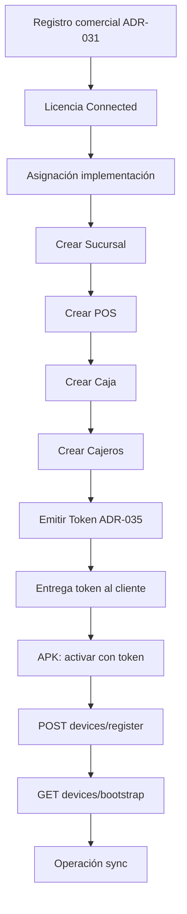
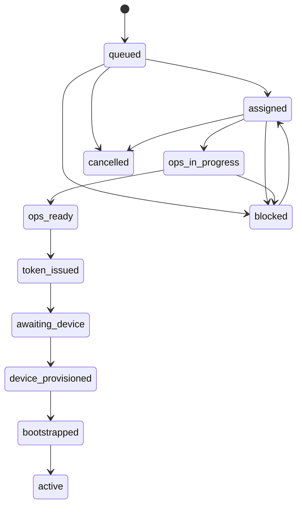

# ADR-034 — Connected Provisioning Flow

| Campo | Valor |
|-------|--------|
| ID | **ADR-034** |
| Título | Flujo de aprovisionamiento Connected — Implementación Asistida |
| Estado | **PROPOSED (completo para revisión)** — handoff CODITO · **sin** GO de código |
| Versión | 1.1 |
| Fecha | Agosto 2026 |
| Autor | Arquitectura EN1 / EPosOne · CODITO (especificación) |
| Impacto | EN1 · Portal ETS · Device API · EPosOne APK (consumo) |
| Implementación de código | **NO autorizada** |
| Pregunta rectora | **¿Cómo materializa ETS un EPosOne Connected antes de que el dispositivo opere?** |
| Complementa | [ADR-032](ADR-032-PRODUCT-IMPLEMENTATION-MODEL.md) · [ADR-031](ADR-031-EN1-COMMERCIAL-DOMAIN-ARCHITECTURE.md) · [ADR-035](ADR-035-ACTIVATION-LICENSE-TOKEN-QR.md) |
| Gate | [EN1_COMMERCIAL_IMPLEMENTATION_GATE.md](EN1_COMMERCIAL_IMPLEMENTATION_GATE.md) |
| Relacionados | [ADR-021](ADR-021-EPOSONE-INSTALLATION-LIFECYCLE.md) · [DEVICE_LIFECYCLE_V1.md](eposone-onboarding/DEVICE_LIFECYCLE_V1.md) · [ADR-003](ADR-003-EPOSONE-SYNC.md) · [ADR-027](ADR-027-EPOSONE-ONBOARDING-UNIFICADO-V1.md) |

---

## 1. Objetivo

Especificar la **Implementación Asistida** de EPosOne Connected: recursos operacionales, estados, responsabilidades, provisioning, bootstrap y **contratos HTTP propuestos** (especificación; no código).

Separación obligatoria:

```text
Registro Comercial  →  Implementación  →  Provisioning  →  Operación
     (ADR-031)           (este ADR)      (device API)      (sync)
```

---

## 2. Principios

1. Comercial ≠ Implementación ≠ Provisioning ≠ Operación.  
2. Connected: ETS crea el árbol ops **antes** del device.  
3. La APK no elige modalidad; la fija el token (ADR-035).  
4. Provisioning vincula dispositivo a **caja ya existente**.  
5. Bootstrap descarga snapshot cloud; no crea la org comercial.  
6. Hasta aprobación de ADR-033/034/035: **no implementar** (ver Gate).

---

## 3. Diagrama de flujo



---

## 4. Fases y estados del caso de implementación

### 4.1 Estados del caso (EN1 / ops)

| Estado | Significado | Siguiente |
|--------|-------------|-----------|
| `queued` | Licencia Connected; pendiente asignación | `assigned` |
| `assigned` | Ejecutivo/implementador asignado | `ops_in_progress` |
| `ops_in_progress` | Creando árbol / catálogo / cajeros | `ops_ready` |
| `ops_ready` | Mínimo Sucursal→POS→Caja (+ cajero) OK | `token_issued` |
| `token_issued` | Token emitido (ADR-035) | `awaiting_device` |
| `awaiting_device` | Cliente aún no provisionó | `device_provisioned` |
| `device_provisioned` | Register OK | `bootstrapped` |
| `bootstrapped` | Bootstrap OK | `active` |
| `active` | Operación sync | — |
| `blocked` | Falta dato / pago / verificación | resolver → estado previo |
| `cancelled` | Caso cancelado | fin |

### 4.2 Diagrama de estados



---

## 5. Recursos operacionales (creación)

Mínimo obligatorio en `ops_ready`:

| Recurso | Tipo EN1 | Notas |
|---------|----------|-------|
| Sucursal | OrgUnit `branch` | Al menos una |
| POS | OrgUnit `pos` | Bajo sucursal |
| Caja | OrgUnit `register` | Bajo POS; destino del device |
| Cajero | Cashier domain | Mínimo un admin operativo |

Opcional según servicio contratado (puede diferirse post-`active`):

- Catálogo / categorías / productos  
- Impuestos / políticas comerciales  
- Impresoras / periféricos (a menudo en device)  
- Sucursales adicionales  

**No** forma parte de esta fase: registro Cliente/Contrato (ya hecho).

---

## 6. Provisioning

| Aspecto | Norma |
|---------|--------|
| Entrada | Token de activación válido (ADR-035) + `device_uuid` |
| Efecto | Terminal ligado a **caja** del caso; Bearer de dispositivo |
| Código legacy | `X-EN1-Provisioning-Code` puede mapearse al token en transición |
| Fallo tipado | Token Connected sin caja → `ops_not_ready` |

Estados APK (vista cliente, ADR-021 / Device Lifecycle): `unprovisioned` → `provisioned` → …

---

## 7. Bootstrap

| Aspecto | Norma |
|---------|--------|
| Entrada | Bearer de dispositivo post-register |
| Efecto | Snapshot: config, catálogo, cajeros, license block, etc. |
| No hace | Crear árbol ops; cambiar modalidad; alta comercial |
| Re-bootstrap | Por versión de catálogo/config (contratos Hito 2) |

---

## 8. Responsabilidades

| Actor | Responsable de |
|-------|----------------|
| **ETS / CODITO** | Cola, estados del caso, árbol ops, emisión token, Portal ops |
| **Cliente** | Instalar APK, activar, operar |
| **LOCAL** | Consumo token Connected, register/bootstrap UX, **sin** asistente Standalone completo |

---

## 9. Contratos HTTP (propuestos — especificación)

> Prefijo ilustrativo. Versión y paths finales se congelan en GO de implementación.  
> Coexistencia con Hito 1/2 actuales (`/api/v1/devices/*`) hasta migración.

### 9.1 Ops — caso de implementación (Portal / Admin EN1)

| Método | Path propuesto | Auth | Descripción |
|--------|----------------|------|-------------|
| `POST` | `/api/v1/implementation/cases` | Admin ETS | Crear caso desde `license_id` / `contract_id` |
| `GET` | `/api/v1/implementation/cases/{id}` | Admin ETS | Estado + refs ops |
| `PATCH` | `/api/v1/implementation/cases/{id}` | Admin ETS | Transición de estado, asignación |
| `POST` | `/api/v1/implementation/cases/{id}/ops-tree` | Admin ETS | Asegurar Sucursal→POS→Caja (+ cajeros) |
| `POST` | `/api/v1/implementation/cases/{id}/activation-token` | Admin ETS | Emitir token (delega ADR-035) |

**Respuesta mínima `GET case`:**

```json
{
  "case_id": 1,
  "status": "ops_ready",
  "organization_id": 10,
  "license_id": 20,
  "branch_ref": "branch-main",
  "pos_ref": "pos-1",
  "register_ref": "reg-1",
  "modality": "connected",
  "implementation_strategy": "assisted"
}
```

### 9.2 Device — sin cambio de semántica (referencia vigente)

| Método | Path | Rol en este ADR |
|--------|------|-----------------|
| `POST` | `/api/v1/devices/register` | Provisioning (fase F); header/código = token o legacy |
| `GET` | `/api/v1/devices/config` | Config post-register |
| `GET` | `/api/v1/devices/bootstrap` | Bootstrap (fase F) |

**Evolución propuesta (ADR-035):** aceptar `X-EN1-Activation-Token` además de / en lugar de `X-EN1-Provisioning-Code` cuando el token sea el canónico.

### 9.3 Errores tipados (device)

| Código | HTTP | Cuándo |
|--------|------|--------|
| `activation_token_invalid` | 401/400 | Token desconocido / firma |
| `activation_token_expired` | 400 | Vigencia token |
| `activation_token_used` | 409 | Un solo uso agotado |
| `ops_not_ready` | 409 | Connected sin árbol mínimo |
| `modality_mismatch` | 409 | Token Standalone en flujo Connected o viceversa |

---

## 10. Comentarios de arquitectura

1. El caso de implementación es la unidad de trabajo ops; no confundirlo con Suscripción.  
2. `ops_ready` es el gate duro antes de emitir token Connected.  
3. Standalone **no** usa este ADR para crear árbol; ver ADR-033.  
4. Evitar que `/start` vuelva a crear Sucursal→POS→Caja (Fase 1 comercial ya lo separó).  
5. Legacy provisioning codes: puente temporal documentado en ADR-035 § legacy.

---

## 11. Fuera de alcance / no iniciar

Código; Portal ETS nuevo; email verification productizada; QR definitivo; refactor; borrado de endpoints; cambios a `/start` salvo bugs.

---

## 12. Estado

**PROPOSED (completo para revisión)** v1.1.

Aprobación Arquitectura requerida. Implementación solo tras Gate (033+034+035 aprobados) + GO por fases.
