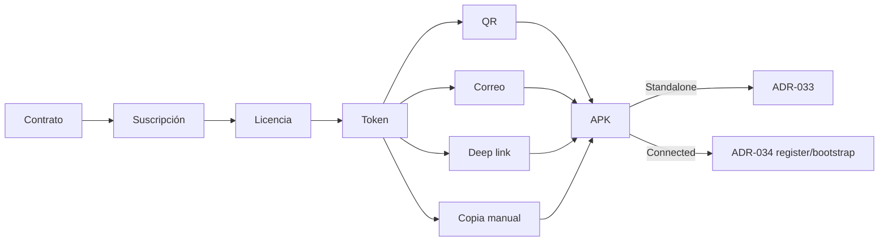

# ADR-035 — Activation Model (Licencia → Token → QR)

| Campo | Valor |
|-------|--------|
| ID | **ADR-035** |
| Título | Modelo de activación — Licencia, Token, transporte, vigencia y seguridad |
| Estado | **PROPOSED (completo para revisión)** · **sin** GO de código |
| Versión | 1.1 |
| Fecha | Agosto 2026 |
| Autor | Arquitectura EN1 / EPosOne · CODITO (especificación) |
| Impacto | EN1 · Portal ETS · EPosOne APK |
| Implementación de código | **NO autorizada** |
| Pregunta rectora | **¿Qué es la orden de activación y cómo llega de forma segura al dispositivo?** |
| Complementa | [ADR-032](ADR-032-PRODUCT-IMPLEMENTATION-MODEL.md) · [ADR-031](ADR-031-EN1-COMMERCIAL-DOMAIN-ARCHITECTURE.md) |
| Consumidores | [ADR-033](ADR-033-STANDALONE-ONBOARDING-ASSISTANT.md) · [ADR-034](ADR-034-CONNECTED-PROVISIONING-FLOW.md) |
| Gate | [EN1_COMMERCIAL_IMPLEMENTATION_GATE.md](EN1_COMMERCIAL_IMPLEMENTATION_GATE.md) |
| Relacionados | [ADR-016](ADR-016-COMMERCIAL-LICENSING-V2-ENTITLEMENT.md) · [ADR-021](ADR-021-EPOSONE-INSTALLATION-LIFECYCLE.md) · [ADR-007](ADR-007-EPOSONE-COMMERCIAL-LICENSING-OFFLINE.md) |

---

## 1. Objetivo

Modelo canónico de activación **desacoplado del QR**:

```text
Contrato → Suscripción → Licencia → Token de Activación → Transporte → APK
                              ↑ orden              ↑ referencia    ↑ QR|mail|link|copia
```

Incluye: vigencia, seguridad, revocación, renovación y **contrato HTTP propuesto**.

---

## 2. Diagrama



---

## 3. Licencia (orden de activación)

### 3.1 Campos lógicos

| Campo | Descripción |
|-------|-------------|
| `license_id` | Identificador |
| `product_code` | p. ej. `eposone` |
| `modality` | `standalone` \| `connected` |
| `implementation_strategy` | `self_serve` \| `assisted` |
| `organization_id` | Tenant |
| `contract_id` / `subscription_id` | Anclaje comercial |
| `entitlement_ref` | Cupos/features (ADR-016) |
| `starts_at` / `ends_at` | Vigencia de la licencia |
| `status` | ver §3.2 |
| `signature` / `kid` | Integridad EN1 |

### 3.2 Estados de licencia

| Estado | Significado |
|--------|-------------|
| `issued` | Emitida; aún no activada en dispositivo |
| `active` | En uso válido |
| `suspended` | Temporalmente no usable |
| `revoked` | Invalidada por ETS |
| `expired` | Fuera de vigencia |
| `renewed` | Histórico; reemplazada por nueva licencia |

---

## 4. Token de activación

### 4.1 Campos lógicos

| Campo | Descripción |
|-------|-------------|
| `token` | Valor opaco (código) que ve el usuario |
| `token_id` | Id interno |
| `license_id` | FK a licencia |
| `product_code` | Eco de licencia |
| `modality` / `implementation_strategy` | Eco; ramifica APK |
| `register_ref` | Opcional; obligatorio en Connected tipico |
| `expires_at` | Ventana del **token** (puede ser menor que la licencia) |
| `max_uses` / `uses_count` | Política de uso |
| `status` | `active` \| `consumed` \| `revoked` \| `expired` |
| `jti` / nonce | Anti-replay |
| `signature` | HMAC/JWT según GO futuro |

### 4.2 Emisión

| Modalidad | Condición para emitir |
|-----------|------------------------|
| Standalone | Licencia `issued`/`active`; **sin** exigir árbol ops |
| Connected | Licencia OK **y** caso implementación `ops_ready` (ADR-034) |

---

## 5. Transporte (QR y equivalentes)

| Canal | Rol |
|-------|-----|
| **QR** | Imagen que codifica URL de activación **o** el string del token |
| Correo | Mismo token / mismo link |
| Deep link | `https://…/activate?token=…` o scheme APK |
| Copia manual | String del token |

Reglas:

- QR **no** es la orden.  
- Regenerable mientras el token esté `active`.  
- Rotar QR no rota la licencia; puede rotar solo la representación.

---

## 6. Vigencia

| Objeto | Regla propuesta |
|--------|-----------------|
| Licencia | Vigencia comercial (plan / contrato / trial) |
| Token | TTL corto configurable (p. ej. 7–30 días) independiente |
| Tras consumo | Token → `consumed`; licencia → `active` si procede |
| Reloj | UTC; skew ±5 min en validación |

---

## 7. Seguridad

1. Tokens de alta entropía; no secuenciales predecibles.  
2. Firma verificable (servidor siempre; cliente opcional offline en fase 2).  
3. Transporte HTTPS para links; QR no debe embeber secretos largos si se usa URL corta.  
4. Rate-limit en `activate` / `register`.  
5. Auditoría: emisión, validación, consumo, revocación.  
6. No loguear token en claro en logs de aplicación.  
7. Binding opcional a `device_uuid` tras primer uso (política por plan).

---

## 8. Revocación

| Acción | Efecto |
|--------|--------|
| Revocar **token** | Token `revoked`; otros tokens de la licencia pueden seguir |
| Revocar **licencia** | Licencia `revoked`; **todos** los tokens pendientes inválidos; device debe dejar de operar según grace (ADR-007/023 — alinear en GO) |
| Suspender licencia | Tokens no consumibles; dispositivos según política de grace |

---

## 9. Renovación

| Caso | Comportamiento propuesto |
|------|--------------------------|
| Renovación comercial | Nueva vigencia en licencia/suscripción; token de activación **no** se renueva solo |
| Reinstalación misma tablet | Nuevo token o re-provision (Device Lifecycle) con política `re_provision` |
| Rotación preventiva | Emitir nuevo token; invalidar anterior si no consumido |
| Upgrade Standalone→Connected | Nueva licencia/estrategia; nuevo token; flujo ADR-034 |

---

## 10. Comportamiento APK

1. Ingreso token (pegar / QR / link).  
2. Validar (online preferido).  
3. Persistir claims de licencia local.  
4. Enrutar sin preguntar modalidad:  
   - Standalone → ADR-033  
   - Connected → register + bootstrap (ADR-034)  

Errores: ver §11.3.

---

## 11. Contratos HTTP (propuestos)

### 11.1 Emisión / gestión (EN1 Admin / Portal)

| Método | Path | Auth | Body / notas |
|--------|------|------|----------------|
| `POST` | `/api/v1/activation/licenses` | Admin | Crear/asegurar licencia desde subscription |
| `GET` | `/api/v1/activation/licenses/{id}` | Admin | Estado licencia |
| `POST` | `/api/v1/activation/licenses/{id}/revoke` | Admin | Revocación |
| `POST` | `/api/v1/activation/tokens` | Admin | `{ "license_id", "ttl_seconds?", "register_ref?" }` |
| `GET` | `/api/v1/activation/tokens/{id}` | Admin | Metadatos (sin secret en claro si ya entregado) |
| `POST` | `/api/v1/activation/tokens/{id}/revoke` | Admin | Revoca token |
| `GET` | `/api/v1/activation/tokens/{id}/qr.png` | Admin | Representación QR |

**Respuesta emisión token (ejemplo):**

```json
{
  "token_id": "tok_01",
  "token": "A1B2-C3D4-E5F6",
  "license_id": 20,
  "modality": "standalone",
  "implementation_strategy": "self_serve",
  "expires_at": "2026-09-01T00:00:00Z",
  "max_uses": 1,
  "activate_url": "https://eposone.easytech.services/activate?token=A1B2-C3D4-E5F6"
}
```

### 11.2 Validación / activación (público autenticado por token)

| Método | Path | Auth | Descripción |
|--------|------|------|-------------|
| `POST` | `/api/v1/activation/validate` | Token en body | Pre-check sin consumir (opcional) |
| `POST` | `/api/v1/activation/redeem` | Token + `device_uuid` | Valida y marca uso; devuelve claims |

**Request `redeem`:**

```json
{
  "token": "A1B2-C3D4-E5F6",
  "device_uuid": "…",
  "product_code": "eposone"
}
```

**Response OK:**

```json
{
  "license_id": 20,
  "organization_id": 10,
  "product_code": "eposone",
  "modality": "connected",
  "implementation_strategy": "assisted",
  "register_ref": "reg-1",
  "provisioning_hint": {
    "next": "devices_register",
    "header": "X-EN1-Activation-Token"
  },
  "license_expires_at": "2027-01-01T00:00:00Z"
}
```

### 11.3 Errores

| `error` | HTTP |
|---------|------|
| `activation_token_invalid` | 400/401 |
| `activation_token_expired` | 400 |
| `activation_token_used` | 409 |
| `activation_token_revoked` | 403 |
| `license_revoked` | 403 |
| `license_expired` | 403 |
| `ops_not_ready` | 409 |
| `product_mismatch` | 400 |

### 11.4 Relación con device register

Tras `redeem` (o en un solo paso), APK llama `POST /api/v1/devices/register` con el token/código acordado.  
Hasta GO: el código de provisioning actual es el **puente legacy**; no eliminar.

---

## 12. Comentarios de arquitectura

1. Separar TTL de token vs vigencia de licencia evita códigos eternos.  
2. QR como vista evita acoplar UX a un solo canal.  
3. `redeem` antes de `register` permite UX de error temprano en Standalone.  
4. Connected sin `ops_ready` no debe emitir token (o debe fallar redeem con `ops_not_ready`).  
5. Congelar modelo de datos comercial (ADR-031 Fase 1); este ADR no altera Cliente/Contrato salvo FKs futuras bajo GO.

---

## 13. Fuera de alcance / no iniciar

Código; JWT final; Portal; email verification; borrado legacy; refactor APK Welcome/Register.

---

## 14. Estado

**PROPOSED (completo para revisión)** v1.1.

Aprobación + Gate (033/034/035) antes de cualquier implementación.
