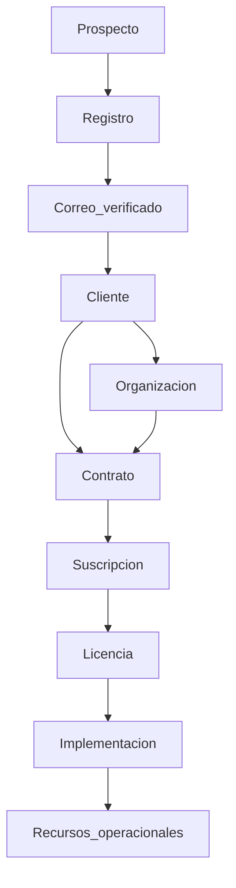

# EN1 — Modelo Comercial (Arquitectura de alto nivel)

| Campo | Valor |
|-------|--------|
| ID | **EN1-MODELO-COMERCIAL-V1** |
| Estado | **Borrador de arquitectura** — 7 ago 2026 · alineado a [ADR-031](ADR-031-EN1-COMMERCIAL-DOMAIN-ARCHITECTURE.md) (**PROPOSED**) |
| Implementación | **NO autorizada** por este documento ni por ADR-031 hasta aprobación formal |
| Precedencia | Referencia + ADR-031. Hasta aprobación, ADRs vigentes rigen el código. |
| Ámbito | Plataforma EN1 · Easy Technology Services · todos los productos (EPosOne, EM+Acción, Relatic, hosting, consultoría, futuros) |
| Relacionados (a enmendar *después*) | [ADR-031](ADR-031-EN1-COMMERCIAL-DOMAIN-ARCHITECTURE.md) · [ADR-022](ADR-022-EN1-MULTIPRODUCT-COMMERCIAL-MODEL.md) · [ADR-014](ADR-014-SUBSCRIPTION-REGISTRY.md) · [ADR-016](ADR-016-COMMERCIAL-LICENSING-V2-ENTITLEMENT.md) · [ADR-027](ADR-027-EPOSONE-ONBOARDING-UNIFICADO-V1.md) · [ADR-028](ADR-028-EPOSONE-PLAN-DEFAULTS-COMMERCIAL-OVERRIDES.md) · [ADR-024](ADR-024-EPOSONE-START-ASSISTANT.md) · [ADR-017](ADR-017-CUSTOMER-ENTRY-POINT-PRODUCT-PORTAL.md) |

---

## 1. Propósito

Definir el **modelo mental y las entidades** del negocio EN1 **antes** de modificar ADRs, contratos HTTP o código.

Problema que corrige:

> Hoy el alta del cliente se confunde con la implementación del producto (organización ≈ POS/caja/bootstrap).

Principio:

> **Registro comercial ≠ Implementación operacional.**

---

## 2. Dos dominios (decisión consolidada)

```text
┌─────────────────────────────────────────────────────────┐
│  DOMINIO COMERCIAL                                      │
│  Propiedad: Easy Technology Services                    │
│  Prospecto · Cliente · Organización · Contrato ·        │
│  Suscripción · Licencia · Facturación · Pagos ·         │
│  Expediente · Soporte                                   │
└─────────────────────────────────────────────────────────┘
                          │
                          │ cuando el producto lo requiere
                          ▼
┌─────────────────────────────────────────────────────────┐
│  DOMINIO OPERACIONAL                                    │
│  Propiedad: el producto contratado                      │
│  Ej. EPosOne Connected:                                 │
│  Sucursales · POS · Cajas · Cajeros · Inventario · Sync │
└─────────────────────────────────────────────────────────┘
```

| Dominio | Existe aunque… | No implica… |
|---------|----------------|-------------|
| **Comercial** | El cliente nunca implemente un producto | Tener cajas, sync o bootstrap |
| **Operacional** | Solo si el producto/modalidad lo exige | Ser el acto de “registrar al cliente” |

Esto aplica a **toda** la plataforma EN1, no solo a EPosOne.

---

## 3. Organización — un solo concepto

**Prohibido** introducir “organización ligera” / “organización pesada”.

Hay **una** entidad: **Organización**.

| Afirmación | Norma |
|------------|--------|
| Qué es | La empresa / entidad jurídica o comercial del cliente |
| Qué no es | El árbol de sucursales, POS, cajas, inventario o sync |
| Qué cambia con el tiempo | Los **recursos operacionales asociados**, no el “tipo” de organización |

```text
Organización
    ├── Productos contratados
    ├── Contratos / Suscripciones / Licencias
    └── Recursos operacionales   ← solo cuando aplique
```

Una Organización **sin** sucursales ni cajas sigue siendo una Organización completa.  
Simplemente **aún no tiene** recursos operacionales.

### Rol del proveedor comercial (ETS / EN1)

**Organización canónica del proveedor en producción:**

| Campo | Valor |
|-------|--------|
| `saas_organization.id` | **1** |
| Nombre | **Easy NodeOne Producción** |
| `subdomain` | `none` |
| Marca comercial | Easy Technology Services (ETS) |

- Es el **proveedor comercial** (administra clientes, contratos, ventas, licencias, pagos, renovaciones).
- **No** es el contenedor de los datos operacionales de Café Amor, Mexican Food, etc.
- Cada cliente tiene **su propia Organización** (id ≠ 1).
- En docs y producto se puede decir “ETS” / “Easy Technology Services”; en BD el tenant proveedor es **#1 Easy NodeOne Producción**.
- **No** mezclar operación de clientes dentro de la org #1.
---

## 4. Entidades y definiciones

| Entidad | Definición | Notas |
|---------|------------|--------|
| **Prospecto** | Interés comercial aún no convertido en Cliente | Lead / solicitud / registro incompleto |
| **Cliente** | Parte comercial identificada ante ETS | Persona/empresa con la que se contrata; puede vincular usuarios |
| **Organización** | Empresa/entidad del cliente en EN1 | Una por cliente en el modelo base; no “ligera/pesada” |
| **Contrato** | Acuerdo jurídico-comercial principal | Documento SoT; expediente; firmas; vigencia; alcance |
| **Suscripción** | Ciclo de vida comercial de **un producto** bajo un Contrato | Plan, modality, estados trial/active/… |
| **Licencia** | Derecho efectivo de uso (capacidad / entitlement) | Lo que el License Engine y la operación consultan |
| **Implementación** | Fase de puesta en marcha del producto | Evento/proceso, no el alta del cliente |
| **Recursos operacionales** | Árbol específico del producto | EPosOne: sucursal → POS → caja → device; otros productos: el suyo |

### Cadena principal (orden obligatorio)

```text
Cliente
  → Contrato
    → Suscripción(es)
      → Licencia(s)
        → Implementación   (si aplica)
          → Recursos operacionales
```

La **Suscripción no es** el documento principal. El **Contrato** sí.

Un Contrato puede agrupar varias Suscripciones (multiproducto).

---

## 5. Ciclo comercial oficial

```text
Prospecto
  → Registro
  → Correo verificado
  → Cliente
  → Contrato
  → Suscripción
  → Licencia
  → Implementación      ← fase opcional / diferible
  → Activo              ← cliente operando el producto según modalidad
```

| Etapa | Resultado |
|-------|-----------|
| Prospecto / Registro | Datos iniciales; correo pendiente |
| Correo verificado | Gate: sin verificación no se emiten licencias ni se cierra contratación |
| Cliente + Organización | Existencia comercial en EN1 |
| Contrato | Acuerdo + expediente |
| Suscripción + Licencia | Derechos de producto |
| Implementación | Provisioning / bootstrap / dispositivos / recursos (si el producto lo requiere) |
| Activo | Uso cotidiano según modalidad |

### Verificación de correo (norma de producto)

Estados: `pendiente` → `verificado` → `actualizado` (si cambia el correo).

Mientras no esté verificado:

- no emitir licencias;
- no activar productos;
- no finalizar contratación.

### Notificación a ETS

Cada nuevo registro genera aviso al equipo comercial (empresa, responsable, correo, teléfono, producto/plan, fecha, estado de verificación).

---

## 6. Registro vs Implementación

| Proceso | Incluye | No incluye |
|---------|---------|------------|
| **Registro (comercial)** | Cliente, Organización, Contrato, Suscripción, Licencia, expediente | Provisioning, bootstrap, cajas, sync |
| **Implementación (operacional)** | Recursos del producto, devices, provisioning, bootstrap, sync | “Crear el cliente desde cero” |

Hasta hoy la plataforma tiende a tratar **Registro = Implementación**.  
Este modelo los separa de forma explícita.

---

## 7. Modalidades EPosOne (sin reabrir “Modo Local”)

Standalone **no** significa cliente anónimo ni sin control comercial.

| Debe existir siempre | Puede diferirse |
|----------------------|-----------------|
| Cliente | Árbol operacional completo |
| Organización | Bootstrap / sync rica |
| Contrato | Multi-caja cloud |
| Suscripción + Licencia | |

### Hipótesis Standalone

```text
Cliente → Contrato → Organización → Suscripción → Licencia
  → Activación de dispositivo (ligera)
  → Configuración local
  → Operación
```

Sin bootstrap operacional completo como rito de alta.

### Hipótesis Connected

```text
Cliente → Contrato → Organización → Suscripción → Licencia
  → Implementación
  → Provisioning → Bootstrap → Sincronización
```

---

## 8. Expediente comercial

Cada **Contrato** (y su Cliente) mantiene un expediente. Ejemplos:

- Contrato firmado / foto del contrato  
- Cotización / orden de compra  
- Cédula / RUC  
- Foto del negocio / evidencias de instalación  
- Comprobantes y anexos  

El formulario comercial actual de EPosOne (solicitud de suscripción y aceptación) se reconoce como **borrador de Contrato**; falta elevarlo a entidad del sistema (fuera del alcance de este doc de modelo).

---

## 9. Relaciones (resumen)



| Relación | Cardinalidad típica |
|----------|---------------------|
| Cliente → Organización | 1→1 (base); 1→N posible en holdings (futuro) |
| Cliente → Contrato | 1→N |
| Contrato → Suscripción | 1→N (productos) |
| Suscripción → Licencia / entitlement | 1→1 o 1→N según producto |
| Organización → Recursos operacionales | 0→N (cero es válido) |
| ETS (proveedor) → Clientes | 1→N — proveedor = org **#1 Easy NodeOne Producción**; cada cliente su org; no mezcla operación |

---

## 10. Qué no decide este documento

- Esquema de tablas / migraciones  
- Contratos HTTP Device API  
- Cambios a `/start` o APK  
- Billing / pasarela  
- Enmienda textual de cada ADR  

### Orden acordado post-aprobación

1. Aprobar este **Modelo Comercial**.  
2. Enmendar ADR-022 (y luego 014, 016, 027, 028, 024, 017) **de forma coherente**.  
3. Solo entonces GO de implementación por fases.  
4. Evitar editar ADRs uno a uno sin este marco (riesgo de inconsistencia).

---

## 11. Estado actual vs modelo (honestidad)

| Elemento | Hoy en plataforma | Este modelo |
|----------|-------------------|-------------|
| Suscripción / entitlement | Existe (anclado a org) | Bajo Contrato |
| Contrato entidad | No | Sí (principal) |
| Org sin recursos operacionales | Posible en teoría; `/start` crea mínimo POS | Norma |
| Registro ≠ implementación | Mezclados en la práctica | Separados |
| Ciclo Prospecto→Activo | Implícito / incompleto | Explícito |
| Verificación correo bloqueante | No en alta EPosOne | Gate comercial |

---

## 12. Criterio de aprobación

Este documento se considera **aprobado** cuando Ana / Prog1 confirman:

1. Dominios comercial / operacional separados.  
2. Contrato como entidad principal.  
3. Organización única (sin “ligera/pesada”).  
4. Registro ≠ implementación.  
5. Ciclo comercial Prospecto → Activo.  
6. Orden: este modelo → ADRs → código.

---

*Referencia de arquitectura. No autoriza implementación.*
