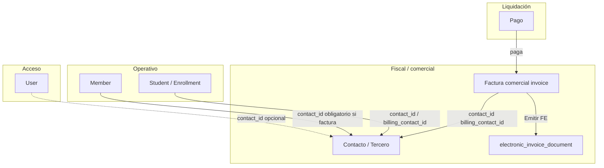

# Plan maestro EN1 — Contactos, Facturación Comercial y FE

**Versión:** 1.0 · **Fecha:** 2026-05-28  
**Repo:** `/opt/easynodeone/dev/app` (rama `develop`)  
**Relacionado:** [ERP plan contable](ERP_PLAN_MAESTRO_POR_FASES.md) · [FE efacturapty (detalle técnico)](PLAN_MODULO_EFACTURA_EN1.md) · Módulo FE Fase A ya en código (`nodeone/modules/efactura/`)

---

## Decisión principal

EN1 debe evolucionar como **ERP**, no como checkout con FE pegada al pago.

| Concepto | Rol |
|----------|-----|
| **Usuario** | Acceso al sistema (login, permisos) |
| **Contacto / Tercero** | Sujeto fiscal (cliente, proveedor, consumidor final, pagador) |
| **Miembro / Estudiante** | Perfil operativo (membresía, campus, matrícula) |
| **Factura comercial** | Documento comercial base (líneas, impuestos, totales) |
| **FE** | Capa fiscal autorizada (CUFE vía PAC) |
| **Pago** | Liquidación de la factura (no origen fiscal directo) |

**Regla de oro:** no facturar contra `user`, `member` ni `student`. Siempre contra `contact_id` (o `billing_contact_id` cuando el pagador ≠ receptor fiscal).

---

## Objetivo general

Comportamiento tipo **Odoo**:

```
Usuarios ≠ Contactos ≠ Miembros/Estudiantes
Factura comercial EN1 → (opcional) FE efacturapty
Pago → liquida factura (y puede disparar FE según modo configurado)
```

La FE **no** sale directamente del pago en el diseño objetivo; sale de la **factura comercial** (manual o generada al confirmar pago).

---

## Diagrama de capas



---

## Fases del plan (1–12)

### Fase 1 — Contactos / Terceros

Módulo central **Contactos / Terceros** (evolución de `tenant_crm_contact` o tabla nueva `contact`).

| Ámbito | Detalle |
|--------|---------|
| Tipos | Personas, empresas, clientes, proveedores, miembros facturables, estudiantes facturables, pagadores, contactos fiscales |
| Campos mínimos | nombre/razón social, nombre comercial, tipo persona (natural/jurídica/consumidor final), tipo identificación, RUC, DV, cédula/pasaporte, email fiscal, teléfono, dirección fiscal, país, provincia, distrito, corregimiento, flags cliente/proveedor, exento ITBMS, activo/inactivo, `organization_id` |

**Reglas:**

- No facturar contra `user` / `member` / `student`.
- Facturar siempre contra `contact_id`.

### Fase 2 — Vincular usuarios, miembros y estudiantes

Mantener modelos separados; relaciones opcionales/obligatorias:

| Modelo | Campo | Regla |
|--------|-------|-------|
| `User` | `contact_id` | Opcional |
| `Member` | `contact_id` | Obligatorio si genera factura |
| `Student` / `Enrollment` | `contact_id` o `billing_contact_id` | Estudiante con fiscal propio; empresa que paga por varios |

### Fase 3 — Factura comercial EN1

Módulo **Accounting / Invoicing** (evolucionar `invoices` + `invoice_lines` existentes).

**Tablas:** `invoice`, `invoice_line`

**Estados:** `draft` → `confirmed` → `posted` → `paid` | `cancelled` | `credited`

**Cabecera (campos principales):**

`organization_id`, `contact_id`, `billing_contact_id`, `invoice_number`, `date`, `due_date`, `currency`, `subtotal`, `tax_total`, `discount_total`, `total`, `payment_status`, `invoice_status`, `source_model`, `source_id`, `notes`

**Líneas:** `description`, `quantity`, `unit_price`, `discount`, `tax_rate`, `tax_amount`, `line_total`, `product_type`, `source_model`, `source_id`

### Fase 4 — Impuestos básicos

Configuración fiscal Panamá (extender `taxes`):

- ITBMS 7% / 10% / 15%
- Exento / no sujeto
- Retención (fase posterior)

Cada línea: ITBMS sí/no, exenta, monto impuesto, total línea.

### Fase 5 — Módulo FE configurable

Módulo **Facturación Electrónica** (parcialmente implementado — ver [estado actual](#estado-actual-vs-plan)).

**3 interruptores:**

1. `NODEONE_EFACTURA_MODULE_ENABLED` (global)
2. SaaS `efactura` por organización
3. Configuración fiscal activa/inactiva por org

**Config por org (`electronic_invoice_provider_config`):**

| Campo | Notas |
|-------|--------|
| `provider` | `efacturapty` (futuro: HKA, etc.) |
| `environment` | sandbox / production |
| `api_base_url`, `api_token` | ya en Fase A |
| sucursal, punto emisión | `default_branch`, `default_pos` |
| **modo emisión** | manual / automática *(nuevo)* |
| **emitir al confirmar factura** | sí/no *(nuevo)* |
| **emitir al pago confirmado** | sí/no *(nuevo)* |

### Fase 6 — Documento FE

Tabla `electronic_invoice_document` (existe; ampliar):

| Campo | Estado Fase A |
|-------|----------------|
| `organization_id`, `provider`, `document_type`, `status`, `cufe`, payloads, URLs, errores, fechas | ✅ |
| **`invoice_id`** (FK factura comercial) | ❌ pendiente |
| `source_model` / `source_id` | ✅ (hoy para prueba/pago futuro) |

**Estados:** `draft`, `pending`, `sent`, `accepted`, `rejected`, `error`, `cancelled`, `credited`

### Fase 7 — Adapter efacturapty

`EFacturaPTYAdapter` (Fase A: `test_connection`, `emit_invoice`).

Pendiente: `emit_credit_note`, `emit_debit_note`, `query_status`, `download_pdf`, `download_xml`.

**Regla:** EN1 genera **factura comercial** → mapper **invoice → JSON efacturapty** → PAC devuelve CUFE → historial EN1.

### Fase 8 — Flujo manual (tipo Odoo)

Desde factura comercial EN1:

```
Factura confirmada → Botón «Emitir FE» → efacturapty → CUFE → estado fiscal en pantalla
```

**Idempotencia:** una factura no puede tener dos FE activas (`accepted` / `pending` / `sent`).

Hoy existe solo **Emitir prueba** en Admin → Fact. electrónica (sin `invoice_id`).

### Fase 9 — Flujo automático

| Escenario | Flujo |
|-----------|--------|
| **Contado** | Checkout → pago confirmado → **crear factura comercial** → emitir FE (si config) → CUFE |
| **Crédito** | Factura confirmada → emitir FE **aunque no esté pagada** → CxC abierta |
| **Yappy manual** | Recibo subido → **no** FE → admin aprueba → crear/actualizar factura → emitir FE |

Los flags de Fase 5 (`emitir al confirmar` / `emitir al pago`) gobiernan cada caso.

### Fase 10 — Notas crédito y débito

- NCR: factura FE aceptada → nota crédito comercial → NCR electrónica → CUFE NCR → marcar factura `credited`
- ND: ajuste sobre factura aceptada → ND electrónica

No usar «factura negativa».

### Fase 11 — Admin UI

| Menú | Fase |
|------|------|
| Admin → **Contactos** | 1 |
| Admin → Contabilidad → **Facturas** | 3 (parcial: `/admin/accounting/invoices`) |
| Admin → Contabilidad → **Pagos** | existente pagos |
| Admin → **Fact. electrónica** → Config / Emisiones / Logs | 5–8 (Fase A) |
| Botón **Emitir FE** en detalle de factura | 8 |

### Fase 12 — Reportes mínimos

Facturas por cliente, pagadas/pendientes, FE aceptadas/rechazadas, ventas por período, ITBMS generado, CxC, historial por CUFE.

---

## Orden de desarrollo recomendado

| # | Entregable | Depende de |
|---|------------|------------|
| 1 | Contactos / Terceros + campos fiscales PA | — |
| 2 | Vincular user / member / student → contact | 1 |
| 3 | Factura comercial (`contact_id`, estados) | 1 |
| 4 | Líneas e impuestos | 3, 4 |
| 5 | Config FE + flags emisión | Fase A FE |
| 6 | `invoice_id` en `electronic_invoice_document` | 3, 5 |
| 7 | Mapper invoice → efacturapty | 3–6 |
| 8 | Emitir FE manual desde factura | 7 |
| 9 | FE automática (checkout / confirm / Yappy) | 8 |
| 10 | NCR / ND | 8 |
| 11 | Reportes | 3, 6 |
| 12 | Seguridad, cifrado token, producción | 5 |

---

## Estado actual vs plan

| Componente | Hoy en EN1 | Gap respecto al plan |
|------------|------------|----------------------|
| Contactos | `tenant_crm_contact` (CRM, sin RUC/DV/PA completo) | Fase 1: módulo terceros fiscal |
| Factura comercial | `invoices` / `invoice_lines` (`customer_id` → **User**) | Migrar a `contact_id` + estados `confirmed`/`posted` |
| Impuestos | `taxes` básico | Fase 4 ITBMS PA por línea |
| Módulo FE | `efactura` Fase A: config, adapter, emisión **manual prueba** | Sin `invoice_id`; sin botón en factura |
| FE desde pago | **No implementado** (correcto según nuevo plan) | Fase 9 vía factura, no directo |
| Contabilidad ERP | `accounting_core` (asientos, plan de cuentas) | Alinear posting con factura `posted` |

**Lo ya hecho (commit `917d139`) sigue siendo válido** como base de Fases 5–7: adapter, tablas FE, admin, SaaS toggle. Hay que **reorientar** la emisión automática (antigua Fase C «desde pago») a **Fase 9 «desde factura»**.

---

## Cambio respecto al plan FE anterior

| Antes (docs `docs/efactura/FASE_C_PAGOS.md`) | Ahora (este plan) |
|---------------------------------------------|-------------------|
| `issue_einvoice()` desde pago confirmado | Pago → crea/actualiza **factura** → `issue_einvoice_from_invoice(invoice_id)` |
| Mapper desde payment/cart | Mapper desde **invoice + lines + contact** |
| `source_model=payment` | `invoice_id` + opcional `source_model` del origen comercial |

Actualizar instrucciones de programador en `docs/efactura/` cuando se aborde Fase 9.

---

## Criterios de aceptación globales

- [ ] Toda factura comercial tiene `contact_id` (y `billing_contact_id` si aplica).
- [ ] Ninguna emisión FE usa `user_id` como receptor fiscal.
- [ ] Una factura → máximo una FE activa.
- [ ] Yappy: FE solo tras aprobación admin.
- [ ] Crédito: FE puede emitirse en `confirmed` sin pago.
- [ ] Contado: FE tras pago y factura generada.
- [ ] Fallo FE no revierte pago ni deshace factura comercial.

---

## Referencias de código actuales

| Área | Ruta |
|------|------|
| Facturas ventas | `nodeone/modules/accounting/models.py` (`Invoice`, `InvoiceLine`) |
| CRM contacto | `models/saas.py` (`TenantCrmContact`) |
| FE módulo | `nodeone/modules/efactura/` |
| FE modelos | `models/efactura.py` |
| Prueba API PAC | `nodeone/devtools/efacturapty_test/` |

---

## Próximo paso sugerido

**Fase 1 + 3 en paralelo acotado:** diseño DDL `contact` (o evolución `tenant_crm_contact`) y migración `invoices.customer_id` → `contact_id` con script de backfill desde usuarios/CRM existentes.

No iniciar Fase 9 automática hasta tener Fase 8 (emitir FE desde factura confirmada) estable en sandbox.
