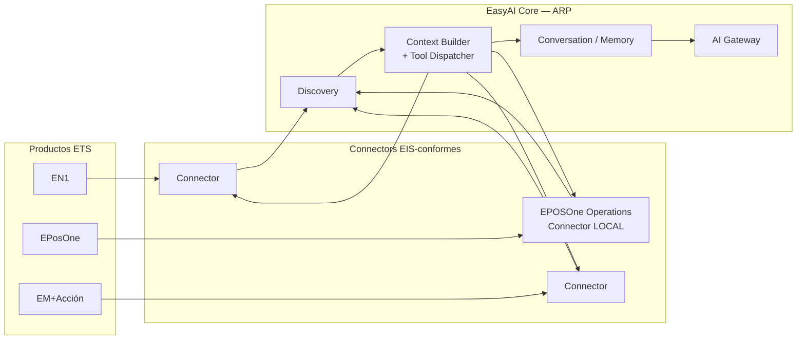

# Diagrama — Integración EIS (overview)

```mermaid
flowchart LR
  subgraph Products["Productos ETS"]
    EN1["EN1"]
    POS["EPosOne"]
    ARP_P["EM+Acción"]
  end

  subgraph Connectors["Connectors EIS-conformes"]
    C1["Connector"]
    C2["EPOSOne Operations\nConnector LOCAL"]
    C3["Connector"]
  end

  subgraph EasyAI["EasyAI Core — ARP"]
    Disc["Discovery"]
    Orch["Context Builder\n+ Tool Dispatcher"]
    Mem["Conversation / Memory"]
    GW["AI Gateway"]
  end

  EN1 --> C1
  POS --> C2
  ARP_P --> C3
  C1 --> Disc
  C2 --> Disc
  C3 --> Disc
  Disc --> Orch
  Orch --> C1
  Orch --> C2
  Orch --> C3
  Orch --> Mem
  Mem --> GW
```

Norma única: **EIS v1.0** (Connector SDK = contratos dentro del EIS).
