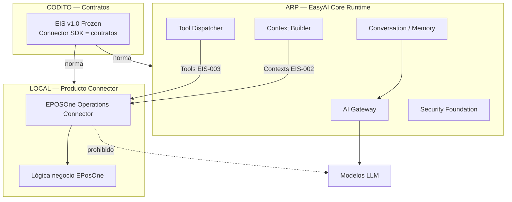

# Diagrama — Roles ARP · CODITO · LOCAL

```mermaid
flowchart TB
  subgraph CODITO["CODITO — Contratos"]
    EIS["EIS v1.0 Frozen\nConnector SDK = contratos"]
  end

  subgraph ARP["ARP — EasyAI Core Runtime"]
    GW[AI Gateway]
    CB[Context Builder]
    TD[Tool Dispatcher]
    CV[Conversation / Memory]
    SF[Security Foundation]
  end

  subgraph LOCAL["LOCAL — Producto Connector"]
    OPC["EPOSOne Operations Connector"]
    POS[Lógica negocio EPosOne]
  end

  EIS -->|norma| ARP
  EIS -->|norma| LOCAL
  CB -->|Contexts EIS-002| OPC
  TD -->|Tools EIS-003| OPC
  OPC --> POS
  CV --> GW
  GW --> Models[Modelos LLM]
  OPC -.->|prohibido| Models
```
