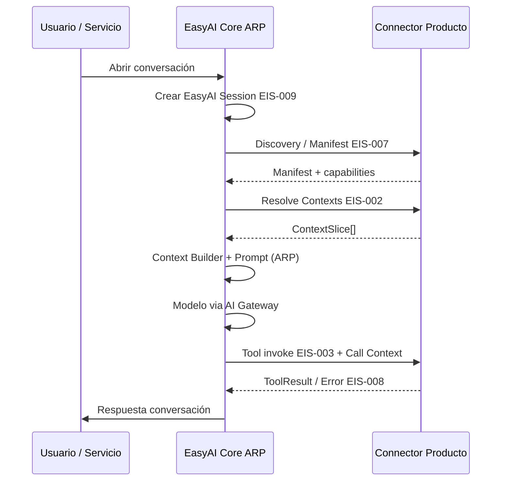

# Diagrama — Session EasyAI + Invoke Tool

```mermaid
sequenceDiagram
  participant U as Usuario / Servicio
  participant Core as EasyAI Core ARP
  participant Conn as Connector Producto

  U->>Core: Abrir conversación
  Core->>Core: Crear EasyAI Session EIS-009
  Core->>Conn: Discovery / Manifest EIS-007
  Conn-->>Core: Manifest + capabilities
  Core->>Conn: Resolve Contexts EIS-002
  Conn-->>Core: ContextSlice[]
  Core->>Core: Context Builder + Prompt (ARP)
  Core->>Core: Modelo via AI Gateway
  Core->>Conn: Tool invoke EIS-003 + Call Context
  Conn-->>Core: ToolResult / Error EIS-008
  Core->>U: Respuesta conversación
```

Nota: el Connector no habla con el modelo.
