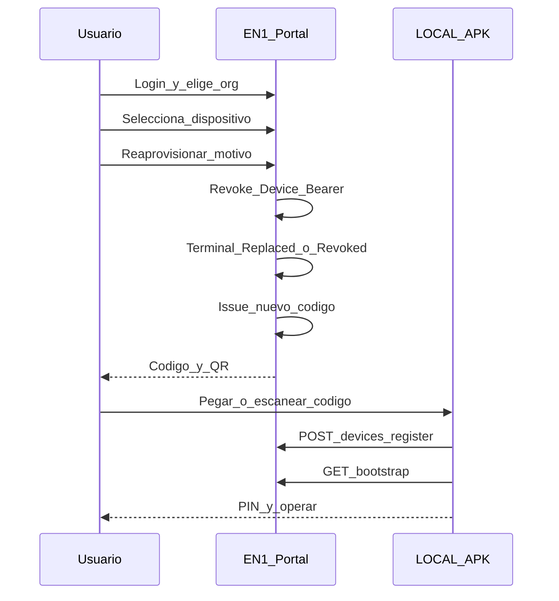

# P0.17 — Reaprovisionamiento (plan de implementación)

| Campo | Valor |
|-------|--------|
| ID | **EPOSONE-P0-17-REPROVISIONING** |
| Prioridad | **P0 crítico** — antes de P0.18 y UX menor |
| Contexto | [P0_CONTEXTO_EN1_LOCAL.md](P0_CONTEXTO_EN1_LOCAL.md) |
| Contratos base | [DEVICE_LIFECYCLE_V1.md](DEVICE_LIFECYCLE_V1.md) · [RESTORE_CONTRACT_V1.md](RESTORE_CONTRACT_V1.md) · [LOGIN_CONTRACT_V1.md](LOGIN_CONTRACT_V1.md) |
| Código EN1 hoy | [`device_provisioning.py`](../../backend/nodeone/modules/eposone/device_provisioning.py) (`EVENT_REPROVISIONED`, register con `reprovision`) · portal [`/admin/eposone/install`](../../templates/eposone/install.html) |
| Estado | **Plan de implementación** — 6 ago 2026 · sin GO de código en este doc |

---

## 1. Problema

Hoy el reaprovisionamiento **no funciona de punta a punta** para el comerciante.

Casos que dejan al cliente bloqueado:

| Caso | Resultado esperado |
|------|-------------------|
| Cambia de celular / tablet | Replace Device + nuevo código |
| Reinstala la APK | Re-Provision o Replace según `device_uuid` |
| Factory reset | Igual |
| Equipo perdido / robado | Invalidar bearer + marcar Replaced/Revoked + nuevo código |
| Código vencido | Emitir nuevo; rechazar el viejo |
| Código ya utilizado | No reutilizar; emitir nuevo |

---

## 2. Flujo de producto (normativo)

```text
Login EN1
  → Seleccionar Organización
  → Ver dispositivos / cajas autorizados
  → Seleccionar dispositivo (o caja a recuperar)
  → Reaprovisionar (motivo: lost | stolen | replaced | reinstall | factory_reset)
  → Invalidar Device Bearer anterior
  → Emitir nuevo Provision Code (single-use, TTL)
  → LOCAL: Register → Bootstrap → Operar
```



---

## 3. Responsabilidades

### EN1 (CODITO)

1. UI portal: listar terminales/cajas de la org con estado lifecycle.
2. Acción **Reaprovisionar** con motivo obligatorio (auditoría).
3. Invalidar Device Bearer del terminal seleccionado (hash token / status).
4. Marcar terminal anterior: `Replaced` (nueva tablet) o flujo `Re-Provision` (mismo uuid recuperable).
5. Emitir nuevo `EposoneProvisioningCode` (active, TTL, single-use); revocar códigos active previos de esa caja.
6. Publicar eventos: `eposone.device.reprovisioned` / revoke / `provisioning_code.issued`.
7. No consumir cupo POS extra en Replace de la **misma** caja (sí en alta de caja nueva).

### LOCAL

1. Camino Restore / Re-Provision sin pedir alta comercial (`/start`).
2. Consumir el **nuevo** código → Register → Bootstrap.
3. Si bearer viejo falla (401/revoked) → UI clara: “Pedí un código nuevo en el portal”.
4. No reutilizar código `used` / `expired` (mostrar error de EN1).

---

## 4. Alcance de implementación EN1 (checklist)

### 4.1 API / dominio

| # | Entrega | Notas |
|---|---------|--------|
| A1 | Endpoint (o acción portal) `POST …/devices/{id}/reprovision` o equivalente por `register_ref` | Body: `reason`, opcional `mode=replace|reprovision` |
| A2 | Revocar bearer del terminal target | Invalidar token hash; status no operable |
| A3 | Issue código fresco ligado a la caja | Reusar `DeviceProvisioningService` + TTL policy |
| A4 | Auditoría con `reason` + `actor_user_id` | Domain events ya parcialmente cableados |
| A5 | Errores HTTP estables | `code_expired`, `code_used`, `device_revoked`, `not_entitled`, `cupo` |

Archivos ancla:

- [`backend/nodeone/modules/eposone/device_provisioning.py`](../../backend/nodeone/modules/eposone/device_provisioning.py)
- [`backend/nodeone/modules/eposone/routes.py`](../../backend/nodeone/modules/eposone/routes.py) (`issue` / `rotate` hoy)
- [`backend/nodeone/modules/eposone/onboarding_auth_service.py`](../../backend/nodeone/modules/eposone/onboarding_auth_service.py)

### 4.2 Portal UX

| # | Entrega |
|---|---------|
| U1 | Lista: caja / terminal / estado / última actividad |
| U2 | Botón Reaprovisionar → modal motivo |
| U3 | Mostrar código + QR nuevos (mismo patrón install) |
| U4 | Copy: “El dispositivo anterior dejará de funcionar” |

Template ancla: [`templates/eposone/install.html`](../../templates/eposone/install.html).

### 4.3 Contrato HTTP para LOCAL

| # | Entrega |
|---|---------|
| H1 | Extender pack Gate1 / Restore con sección **Reprovision HTTP** (request/response, códigos error) |
| H2 | Tag/handoff nuevo solo tras freeze (no inventar paths en APK) |
| H3 | Actualizar [HANDOFF-LOCAL.md](HANDOFF-LOCAL.md) cuando el freeze esté listo |

---

## 5. Alcance LOCAL (checklist)

| # | Entrega |
|---|---------|
| L1 | UI Restore alineada a [RESTORE_CONTRACT_V1.md](RESTORE_CONTRACT_V1.md) |
| L2 | Tras reinstall/factory: flujo “Tengo cuenta” → org → código nuevo |
| L3 | Manejo explícito `provisioning_code_expired` / `invalid` / `used` |
| L4 | No pedir plan/org/correo si viene de onboarding EN1 (coordina con P0.18) |
| L5 | Pruebas: reinstall misma tablet; tablet nueva; código vencido; bearer revocado |

---

## 6. Criterios de hecho (DoD)

1. Usuario autorizado puede recuperar operación **sin** soporte técnico en los 6 casos de §1.
2. Bearer anterior **no** autentica tras Reaprovisionar.
3. Código nuevo es single-use; el anterior `used`/`revoked` falla con error estable.
4. Evento de auditoría con motivo y actor.
5. LOCAL documenta consumo del freeze HTTP (Gate 2).
6. E2E manual en prod/appdev: reinstall APK → portal → código → Register → Bootstrap → PIN.

---

## 7. Fuera de alcance P0.17

- Asistente visual Android / QR ayuda OEM → **P0.18**
- Overrides comerciales / precios
- Verificación de correo / fortaleza de password
- Cambiar modelo Standalone vs Connected

---

## 8. Orden sugerido de PRs (EN1)

1. Dominio: revoke bearer + issue code + audit (API/tests).
2. Portal UI Reaprovisionar.
3. Doc HTTP freeze + handoff LOCAL.
4. Smoke E2E + GO deploy.

**Siguiente doc:** [P0_18_ANDROID_INSTALL_ASSISTANT.md](P0_18_ANDROID_INSTALL_ASSISTANT.md) (después de cerrar P0.17).
