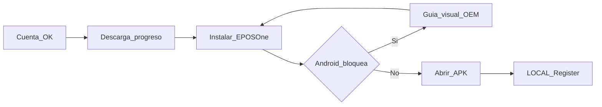

# P0.18 — Asistente de instalación Android + QR de ayuda

| Campo | Valor |
|-------|--------|
| ID | **EPOSONE-P0-18-ANDROID-INSTALL-ASSISTANT** |
| Prioridad | **P0** — inmediatamente **después** de [P0.17](P0_17_REPROVISIONING.md) |
| Contexto | [P0_CONTEXTO_EN1_LOCAL.md](P0_CONTEXTO_EN1_LOCAL.md) |
| Depende de | APK hospedado EN1 (`/static/apk/eposone/EPosOne.apk`) · `/start` wow screen |
| Estado | **Plan de implementación** — 6 ago 2026 · sin GO de código en este doc |

---

## 1. Problema

En prueba real, Android bloquea la instalación de APK (“orígenes desconocidos” / por fabricante). El comerciante no sabe qué hacer y **abandona**.

Hoy EN1 ofrece CTA “Descargar APK” + texto mínimo. Eso es insuficiente.

**Regla de producto:** el QR de esta fase es de **asistencia**, no de re-descarga de la APK.

---

## 2. Objetivo UX

Tras verificar correo (cuando exista) — o en la pantalla post-`/start` mientras tanto — abrir un **Asistente de Instalación EPosOne**, no un enlace suelto.

---

## 3. Pasos del asistente (EN1)

| Paso | UI | Comportamiento |
|------|-----|----------------|
| 1 | Cuenta creada / correo verificado | Checks verdes; “Estamos preparando EPosOne…” |
| 2 | Descargando | Barra de progreso (fetch/XHR o `download` + polling de estado); no solo `<a href>` |
| 3 | Instalar | Botón grande **INSTALAR EPOSONE** (intent `application/vnd.android.package-archive` o abrir archivo descargado) |
| 4 | Bloqueo Android | Pantalla “Android protegió su dispositivo” + pasos Configuración → Seguridad → Permitir desde este navegador → Regresar → Instalar |
| 5 | Ayuda | QR enorme de soporte + botón **No puedo instalar** → selector de marca |

### Selector OEM (“No puedo instalar”)

- Samsung  
- Honor  
- Xiaomi / Redmi  
- Motorola  
- Huawei  
- Realme  
- Otros  

Cada opción muestra guía ilustrada (y, si hay, video corto / FAQ / WhatsApp soporte).

### QR de ayuda

Destino único (página EN1), p. ej. `/start/install-help` o `/eposone/install-help`:

- Guía ilustrada genérica  
- Video 1 min (cuando exista asset)  
- FAQ instalación  
- Selector de marca  
- Contacto soporte  

**Prohibido:** que el QR solo apunte otra vez al `.apk`.

---

## 4. Compatibilidad a documentar

| Android | Nota de producto |
|---------|------------------|
| 10 | Fuentes desconocidas (ajuste global / por app) |
| 11 | Permitir desde esta fuente (Chrome/Files) |
| 12 | Igual; UI Settings varía por OEM |
| 13 | Restricciones más visibles |
| 14 | Flujo “Instalar apps desconocidas” por app |
| 15 | Validar en dispositivos reales al implementar |

Documentar diferencias OEM en la misma página de ayuda (no solo versión AOSP).

---

## 5. Responsabilidades

### EN1

| # | Entrega |
|---|---------|
| E1 | Pantallas del asistente en `/start` (post-complete) y/o ruta dedicada |
| E2 | Estados de descarga: preparing / downloading / completed / failed |
| E3 | Guía bloqueo + assets ilustrados (mínimo genérico P0) |
| E4 | Página ayuda + QR (URL estable, cache-bust controlado) |
| E5 | Selector OEM con copy por marca (P0: texto; P1: capturas reales) |
| E6 | Deep link / query para LOCAL: señal “vengo del onboarding” (ver §6) |

Anclas actuales:

- [`templates/eposone_start/start.html`](../../templates/eposone_start/start.html)
- [`static/eposone_start/start.js`](../../static/eposone_start/start.js)
- [`static/apk/eposone/README.md`](../../static/apk/eposone/README.md)

### LOCAL

| # | Entrega |
|---|---------|
| L1 | Al abrir desde onboarding: **no** pedir de nuevo correo / org / plan |
| L2 | Ir directo a aprovisionamiento (código / QR install / Restore) |
| L3 | Detectar señal EN1 (deeplink, intent extra, o primer launch flag acordado en freeze) |

---

## 6. Señal onboarding → APK (contrato mínimo)

Acordar en freeze HTTP/docs (sin inventar en APK antes de tiempo):

| Mecanismo (elegir uno en GO impl) | Descripción |
|-----------------------------------|-------------|
| Query en portal post-install | Usuario abre APK y pega código ya mostrado — mínimo viable |
| App Link / Intent | `eposone://onboarding?org=…&hint=1` (si LOCAL soporta) |
| Flag en bootstrap session | Tras login EN1 en APK camino B |

P0 mínimo aceptable: código + PIN ya visibles en EN1 + LOCAL camino C sin re-alta comercial.

---

## 7. Criterios de hecho (DoD)

1. Tras `/start`, el usuario ve asistente por pasos (no solo “Descargar”).
2. “No puedo instalar” abre ayuda por marca.
3. QR de ayuda **no** descarga el APK; abre guía/soporte.
4. Documentadas rutas Android 10–15 + al menos copy OEM para Samsung y Xiaomi.
5. LOCAL no reinicia el wizard comercial si el usuario ya completó `/start`.
6. Medible: menos abandonos en pantalla de bloqueo (seguimiento manual en pruebas).

---

## 8. Fuera de alcance P0.18

- Reaprovisionamiento (P0.17)
- Play Store listing
- Videos profesionales por cada OEM (puede ser P1)
- Fortaleza de password / verificación correo (prioridad 3–4 del contexto)

---

## 9. Orden sugerido de PRs (EN1)

1. Ruta/página `install-help` + QR estático apuntando a ella.
2. Wizard pasos 1–4 en `/start` wow (progreso descarga + INSTALAR + bloqueo).
3. Selector OEM + copy.
4. Contrato señal onboarding → LOCAL + handoff.
5. Smoke en tablet Samsung + Xiaomi reales.

**Prerrequisito:** P0.17 cerrado o al menos bearer/código recuperable, para que quien logra instalar no quede bloqueado al reintentar.
