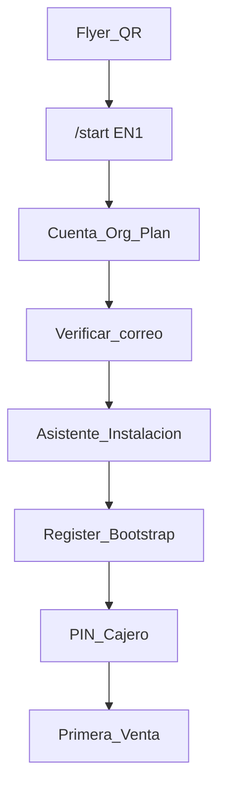

# EPOSOne P0 — Contexto Consolidado EN1 + LOCAL

| Campo | Valor |
|-------|--------|
| ID | **EPOSONE-P0-CONTEXTO-EN1-LOCAL** |
| Estado | **Oficial** — 6 ago 2026 |
| Audiencia | CODITO (EN1) · LOCAL (APK) |
| ADR marco | [ADR-027](../ADR-027-EPOSONE-ONBOARDING-UNIFICADO-V1.md) |
| Pack | [README.md](README.md) |

Documento de handoff: arquitectura, flujo oficial, estado real vs backlog, y orden de prioridad post-prueba (reaprovisionamiento + asistente Android).

---

## 1. Objetivo de producto

Flyer QR → `/start` → cuenta/org/plan → (verificar correo) → descargar/instalar APK con ayuda → Register → Bootstrap → PIN → Abrir Caja → Primera venta.

**EN1** = identidad, org, suscripción, plan, entitlements, overrides, licencias comerciales, portal install, provision code, QR, reaprovisionamiento, APK hosting, auditoría.

**LOCAL (APK)** = Register, Bootstrap, PIN, config técnica, operar POS. **Una sola APK**; Standalone vs Connected lo decide EN1 (nunca pregunta Local/Cloud).



---

## 2. Flujo oficial (congelado)

1. Flyer → QR → `/start`
2. Crear cuenta + organización
3. Seleccionar plan (**sin precios**): Standalone / Starter / Business / Enterprise
4. Suscripción + recursos default del plan
5. Verificar correo (pendiente UX)
6. Asistente de instalación (descarga → instalar → permisos)
7. APK: Register → Bootstrap → PIN → Abrir caja → Operar

Overrides comerciales: **no cambian el plan**; gerencia aplica cupos/módulos auditados ([ADR-028](../ADR-028-EPOSONE-PLAN-DEFAULTS-COMMERCIAL-OVERRIDES.md)).

---

## 3. Frontera de responsabilidades

| Dominio | EN1 | LOCAL |
|---------|-----|-------|
| Usuarios / org / plan / precios / overrides | Sí | No |
| Provision code / QR install / cupos POS | Sí | Consume |
| Invalidar Device Bearer / re-provision | Sí | Consume nuevo código |
| Register / Bootstrap / PIN / POS | API | UI + sync |
| Hosting APK + guía “Instalar desconocidas” | Sí | Detectar onboarding → ir a provision |
| QR de ayuda (marca/video/soporte) | Sí | No (no re-descargar APK) |

---

## 4. Estado real vs backlog

### Hecho en EN1 (parcial / prod)

| Item | Estado |
|------|--------|
| `/start` asistente comercial | Prod |
| Sin precios en planes (ADR-028 UI) | Prod |
| Seed cajero + PIN post-`/start` | Prod |
| Organization Resolver + `pending_initial_*` (ADR-029) | Prod (P0.1) |
| Portal instalación básico | Prod |
| APK hospedado EN1 | Prod: `/static/apk/eposone/EPosOne.apk` · CTA “Descargar APK” |
| Pack docs onboarding | Este directorio · ADRs 027–030 |

### Contrato escrito, código incompleto

| Item | Doc | Código |
|------|-----|--------|
| Device lifecycle / Re-Provision / Replace | [DEVICE_LIFECYCLE_V1.md](DEVICE_LIFECYCLE_V1.md) | **P0.17 — roto / incompleto** |
| Restore camino D | [RESTORE_CONTRACT_V1.md](RESTORE_CONTRACT_V1.md) | Pendiente E2E |
| Cupos POS en portal | [INSTALLATION_PORTAL_V2.md](INSTALLATION_PORTAL_V2.md) | Parcial |
| UI Admin “Ajustes comerciales” + audit | ADR-028 | Pendiente |
| Menú por entitlement | ADR-016 / [ENTITLEMENTS.md](ENTITLEMENTS.md) | Pendiente |
| Verificación de correo bloqueante | — | Pendiente |
| Asistente instalación Android + QR ayuda | [P0_18_ANDROID_INSTALL_ASSISTANT.md](P0_18_ANDROID_INSTALL_ASSISTANT.md) | **No existe** |

### Hallazgos de prueba real

- Loop install APK tras código → Gate 2 LOCAL + re-provision EN1.
- Login a org equivocada → mitigado P0.1 ADR-029; validar E2E.
- Android bloquea APK side-load → abandono; QR de install no basta; hace falta asistente + QR de **ayuda** (no re-descarga).
- Usuario típico no sabe: Descargas → Instalar → “orígenes desconocidos” por OEM.

---

## 5. Orden de trabajo acordado (post-prueba)

1. **P0.17** Reaprovisionamiento — [P0_17_REPROVISIONING.md](P0_17_REPROVISIONING.md)
2. **P0.18** Asistente instalación Android + QR ayuda OEM — [P0_18_ANDROID_INSTALL_ASSISTANT.md](P0_18_ANDROID_INSTALL_ASSISTANT.md)
3. Mejorar contraseña (`/start`)
4. Verificación de correo bloqueante
5. Optimizar UX de descarga (progreso, estados)

Luego: overrides UI admin, cupos portal, menú por entitlement, auditoría completa.

---

## 6. LOCAL — flujo único

```text
Register → Bootstrap (con progreso) → Configuración → PIN → Abrir Caja → Operar
```

Además: reaprovisionamiento; detectar origen onboarding; no inventar modalidad.

Handoff HTTP freeze: tag `eposone-onboarding-p0-v1.3` · [HANDOFF-LOCAL.md](HANDOFF-LOCAL.md).

---

## 7. Docs SoT

| Tema | Doc |
|------|-----|
| Marco onboarding | [ADR-027](../ADR-027-EPOSONE-ONBOARDING-UNIFICADO-V1.md) |
| Plan / overrides sin precio | [ADR-028](../ADR-028-EPOSONE-PLAN-DEFAULTS-COMMERCIAL-OVERRIDES.md) |
| Org resolver | [ADR-029](../ADR-029-ORGANIZATION-CONTEXT-RESOLVER-V2.md) |
| Pack índice | [README.md](README.md) |
| APK path | [static/apk/eposone/README.md](../../static/apk/eposone/README.md) |
| Reaprovisionamiento | [P0_17_REPROVISIONING.md](P0_17_REPROVISIONING.md) |
| Asistente Android | [P0_18_ANDROID_INSTALL_ASSISTANT.md](P0_18_ANDROID_INSTALL_ASSISTANT.md) |
