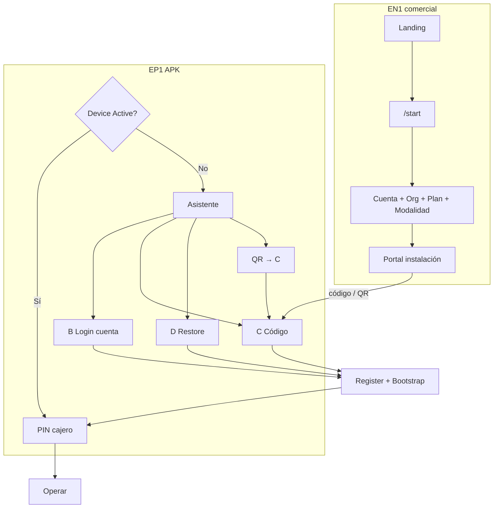

# EPosOne Onboarding — Pack P0 (contratos oficiales)

| Campo | Valor |
|-------|--------|
| Estado | **P0 contratos + contexto** — 6 ago 2026 · implementación parcial en prod |
| ADR marco | [`ADR-027`](../ADR-027-EPOSONE-ONBOARDING-UNIFICADO-V1.md) |
| **Contexto consolidado** | [`P0_CONTEXTO_EN1_LOCAL.md`](P0_CONTEXTO_EN1_LOCAL.md) — leer primero |
| **Sprint EN1 (Ana)** | [`P0_SPRINT_EN1_CODITO.md`](P0_SPRINT_EN1_CODITO.md) — P0.17–P0.30 + gate |
| As-is previo | [`EPOSONE_EP1_INSTALLATION_ACTIVATION_AS_IS_V1.md`](../EPOSONE_EP1_INSTALLATION_ACTIVATION_AS_IS_V1.md) |
| Implementa UI APK | **LOCAL** tras GO |
| Exposición API | **EN1** |

---

## Índice de contratos

| Doc | Contenido |
|-----|-----------|
| **[P0_CONTEXTO_EN1_LOCAL.md](P0_CONTEXTO_EN1_LOCAL.md)** | **Contexto consolidado EN1 + LOCAL · prioridades P0.17 / P0.18** |
| **[P0_SPRINT_EN1_CODITO.md](P0_SPRINT_EN1_CODITO.md)** | **Sprint EN1 Ana · P0.17–P0.30 · mapa estado · gate aceptación** |
| [P0_17_REPROVISIONING.md](P0_17_REPROVISIONING.md) | Plan implementación reaprovisionamiento |
| [P0_18_ANDROID_INSTALL_ASSISTANT.md](P0_18_ANDROID_INSTALL_ASSISTANT.md) | Plan asistente instalación Android + QR ayuda |
| [ONBOARDING_FLOW_V2.md](ONBOARDING_FLOW_V2.md) | Flujo oficial P0 (sin login en `/start`) |
| [ORGANIZATION_RESOLVER_V2.md](ORGANIZATION_RESOLVER_V2.md) | Orden de resolución + pending |
| [COMMERCIAL_OVERRIDE_MODEL.md](COMMERCIAL_OVERRIDE_MODEL.md) | Plan vs overrides (ADR-028) |
| [INSTALLATION_PORTAL_V2.md](INSTALLATION_PORTAL_V2.md) | Cupos POS en panel install |
| [SUBSCRIPTION_STATE_MACHINE.md](SUBSCRIPTION_STATE_MACHINE.md) | Estados ↔ provision |
| [DEVICE_LIFECYCLE_V1.md](DEVICE_LIFECYCLE_V1.md) | Estados + eventos device |
| [ONBOARDING_CONTRACT_V2.md](ONBOARDING_CONTRACT_V2.md) | Ciclo único + caminos A–D |
| [LOGIN_CONTRACT_V1.md](LOGIN_CONTRACT_V1.md) | Login EN1 = resolver contexto |
| [RESTORE_CONTRACT_V1.md](RESTORE_CONTRACT_V1.md) | Camino D |
| [QR_CONTRACT_V1.md](QR_CONTRACT_V1.md) | QR → solo provision code |

ADRs P0: [ADR-028](../ADR-028-EPOSONE-PLAN-DEFAULTS-COMMERCIAL-OVERRIDES.md) · [ADR-029](../ADR-029-ORGANIZATION-CONTEXT-RESOLVER-V2.md) · [ADR-030](../ADR-030-SUBSCRIPTION-LIFECYCLE-V2.md) · entitlements SoT [ADR-016](../ADR-016-COMMERCIAL-LICENSING-V2-ENTITLEMENT.md).

---

## Modelo de producto (congelado)

```text
Cuenta EN1 → Organización → Suscripción EPosOne → Modalidad
                                              ├─ Standalone  (sin sync cloud operativa)
                                              └─ Connected   (con sync)
```

**Eliminado como flujo de usuario:** “Modo Local” / crear negocio sin EN1.

---

## Diagrama oficial — convergencia



---

## Gates de implementación

### Gate 0 — Contratos (este P0)

| Criterio | Owner |
|----------|-------|
| ADR-027 aprobado / pack publicado | CODITO |
| ADR-014 enmendado (modalidad) | CODITO |
| LOCAL acusa recibo del pack | LOCAL |
| Sin quinto flujo Local en specs APK | LOCAL |

### Gate 1 — EN1 exposición

| Criterio | Owner | Estado |
|----------|-------|--------|
| `modality` + `plan_code` comercial en Device `/config` (+ bootstrap) | EN1 | ✅ 6 ago 2026 — ver [DEVICE_CONFIG_COMMERCIAL_V1.md](DEVICE_CONFIG_COMMERCIAL_V1.md) |
| Portal instalación mínimo (código, QR, regenerar, devices) | EN1 | ✅ 6 ago 2026 — `/admin/eposone/install` |
| API Login onboarding (payload § Login Contract) | EN1 | ✅ 6 ago 2026 — [`ONBOARDING_LOGIN_HTTP_V1.md`](ONBOARDING_LOGIN_HTTP_V1.md) |
| Trial 15 / Grace 7 sin tercer período | EN1 | ✅ (sin cambio) |

### Gate 2 — APK onboarding (LOCAL)

| Criterio | Owner |
|----------|-------|
| Gate Active → cajero | LOCAL |
| Caminos B, C, D (+ QR→C) | LOCAL |
| Sin UI “crear negocio sin EN1” | LOCAL |
| Register + Bootstrap reutilizados 100 % | LOCAL |

### Gate 3 — Operar

| Criterio | Owner |
|----------|-------|
| PIN + turno + cobro (Hito 4) | LOCAL + EN1 ya listo |
| Manual instalación alineado a V2 | Docs |

---

## Qué no hace este pack (aún)

- Pasarela de pago en `/start`
- UI completa de overrides comerciales (ADR-028 admin)
- Menú dinámico 100 % por entitlement
- P0.17 / P0.18 en código (ver planes de implementación abajo)

**Ya fuera del “no hace”:** hosting APK en EN1 (`/static/apk/eposone/EPosOne.apk`).

---

## Confirmación de recepción (LOCAL)

*Onboarding Contract V2 + Device Lifecycle + Login/Restore/QR recibidos — ADR-027.*
